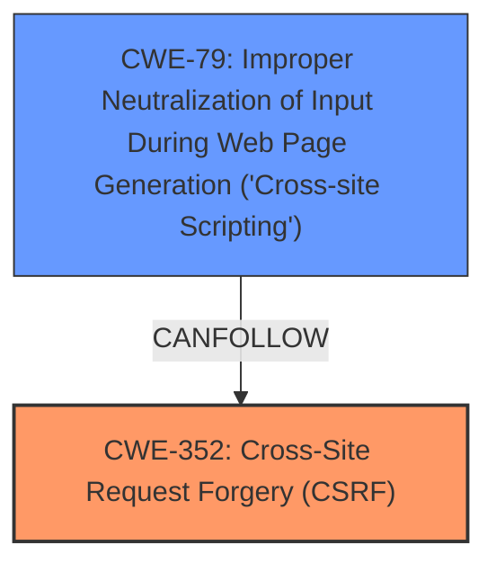

# Analysis for CVE-2022-1626

# Summary
| CWE ID | CWE Name | Confidence | CWE Abstraction Level | CWE Vulnerability Mapping Label | CWE-Vulnerability Mapping Notes |
|---|---|---|---|---|---|
| CWE-352 | Cross-Site Request Forgery (CSRF) | 1.0 | Compound | Allowed | Primary CWE |
| CWE-79 | Improper Neutralization of Input During Web Page Generation ('Cross-site Scripting') | 1.0 | Base | Allowed | Secondary CWE |

## Evidence and Confidence

*   **Confidence Score:** 1.0
*   **Evidence Strength:** HIGH

## Relationship Analysis
The primary weakness is CWE-352 [Cross-Site Request Forgery (CSRF)], which is a Compound CWE. It requires several conditions to be met. The secondary weakness is CWE-79 [Improper Neutralization of Input During Web Page Generation ('Cross-site Scripting')], which is a Base CWE. CWE-352 can lead to tricking the user into submitting requests containing XSS payloads.

## Vulnerability Chain
The vulnerability chain starts with the **lack of CSRF protection**, which allows an attacker to trick a logged-in administrator into performing actions they did not intend. This action includes updating settings with unsanitized input, leading to a stored XSS vulnerability. The chain is: **Lack of CSRF protection** (CWE-352) -> **Improper Neutralization of Input** (CWE-79).

## Summary of Analysis
The initial analysis correctly identifies the primary and secondary weaknesses based on the vulnerability description. The key phrase "lack of CSRF protection" clearly points to CWE-352 [Cross-Site Request Forgery (CSRF)]. The phrase "stored Cross-Site Scripting issue due to the lack of sanitisation and escaping" clearly points to CWE-79 [Improper Neutralization of Input During Web Page Generation ('Cross-site Scripting')].

The evidence from the vulnerability description, especially the **rootcause** and **weakness** key phrases, and the CVE Reference Links Content Summary, strongly supports the selection of CWE-352 as the primary CWE and CWE-79 as a secondary CWE.

The selected CWEs are at the optimal level of specificity, with CWE-352 being a Compound CWE representing the CSRF vulnerability and CWE-79 being a Base CWE representing the XSS vulnerability.

Relevant CWE Information:
*   **CWE-352 [Cross-Site Request Forgery (CSRF)]**: The vulnerability description clearly states the **lack of CSRF protection**, which is the defining characteristic of CWE-352. This allows attackers to make a logged-in admin change settings via a CSRF attack. The CWE description matches this scenario, stating that the web application doesn't sufficiently verify whether a request was intentionally provided by the user.
*   **CWE-79 [Improper Neutralization of Input During Web Page Generation ('Cross-site Scripting')]**: The vulnerability description also mentions a Stored Cross-Site Scripting issue due to the lack of sanitisation and escaping in some settings. The CWE description aligns with this, indicating that the product does not neutralize user-controllable input before placing it in output used as a web page.
*   **CWE-862 [Missing Authorization]**: While the vulnerability involves unauthorized actions, the **rootcause** is the **lack of CSRF protection** rather than a missing authorization check. The user is already authenticated, but the request itself is not validated for its origin. Therefore, CWE-862 is not the most appropriate mapping.
*   **CWE-434 [Unrestricted Upload of File with Dangerous Type]**: This CWE is not applicable as the vulnerability does not involve file uploads.
*   **CWE-116 [Improper Encoding or Escaping of Output]**: This CWE could be considered, but CWE-79 is more specific to the context of web page generation and XSS.
*   **CWE-472 [External Control of Assumed-Immutable Web Parameter]**: This CWE is less relevant because while settings are being modified, the **rootcause** isn't the external control of parameters assumed to be immutable, but the **lack of CSRF protection**.
*   **CWE-863 [Incorrect Authorization]**: Similar to CWE-862, the issue is not an incorrect authorization check, but the absence of CSRF protection.