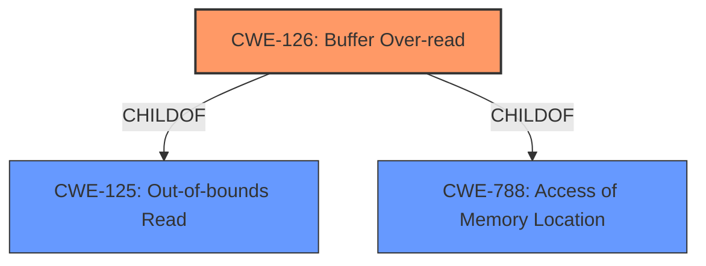

# Enhanced Analysis for CVE-2022-1629

# Summary
| CWE ID | CWE Name | Confidence | CWE Abstraction Level | CWE Vulnerability Mapping Label | CWE-Vulnerability Mapping Notes |
|---|---|---|---|---|---|
| CWE-126 | Buffer Over-read | 1.0 | Variant | Allowed | Primary CWE |

## Evidence and Confidence

*   **Confidence Score:** 1.0
*   **Evidence Strength:** HIGH

## Relationship Analysis
The primary CWE is CWE-126, which is a variant of CWE-125 (Out-of-bounds Read) and CWE-788 (Access of Memory Location).



## Vulnerability Chain
The vulnerability chain starts with a **Buffer Over-read**, leading to crashing software, memory modification, and possible remote execution.

## Summary of Analysis
The vulnerability is a **Buffer Over-read in function find_next_quote** in GitHub repository vim/vim prior to 8.2.4925. The provided information indicates a **rootcause** of "**Buffer Over-read**" and the "**trailing backslash may cause reading past end of line**". The impact is "crashing software and Modify Memory and possible remote execution".

The CVE Reference Links Content Summary confirms the presence of a "**Buffer over-read**" weakness, with the "**trailing backslash may cause reading past end of line**".

Given the **rootcause** evidence and the confirmation in the CVE Reference Links, CWE-126 (Buffer Over-read) is the most appropriate CWE. It is a Variant-level CWE, which is a preferred level of abstraction. The description of CWE-126, "The product reads from a buffer using buffer access mechanisms such as indexes or pointers that reference memory locations after the targeted buffer," aligns with the vulnerability description. The MITRE mapping guidance allows for this mapping.

CWE-122 (Heap-based Buffer Overflow) and CWE-124 (Buffer Underwrite ('Buffer Underflow')) were considered but ultimately deemed less relevant. The description specifically indicates an over-read, not an overflow or underwrite.
CWE-190 (Integer Overflow or Wraparound), CWE-193 (Off-by-one Error), CWE-1284 (Improper Validation of Specified Quantity in Input), CWE-770 (Allocation of Resources Without Limits or Throttling) and CWE-786 (Access of Memory Location Before Start of Buffer) were also considered, but the primary issue is reading beyond the bounds of the buffer, making CWE-126 the most accurate and specific mapping. The other options do not precisely describe the vulnerability.
CWE-20 (Improper Input Validation) is too general.

The selection of CWE-126 is at the optimal level of specificity, accurately representing the weakness.


## CWE Relationship Analysis

Current CWEs represent these abstraction levels: .


### Vulnerability Chain Analysis

**Chain starting from CWE-190:**
- 190 (Integer Overflow or Wraparound) - ROOT


**Chain starting from CWE-786:**
- 786 (Access of Memory Location Before Start of Buffer) - ROOT


### CWE Relationship Diagram

```mermaid
graph TD
    classDef primary fill:#f96,stroke:#333,stroke-width:2px
    classDef secondary fill:#69f,stroke:#333
    classDef tertiary fill:#9e9,stroke:#333
```