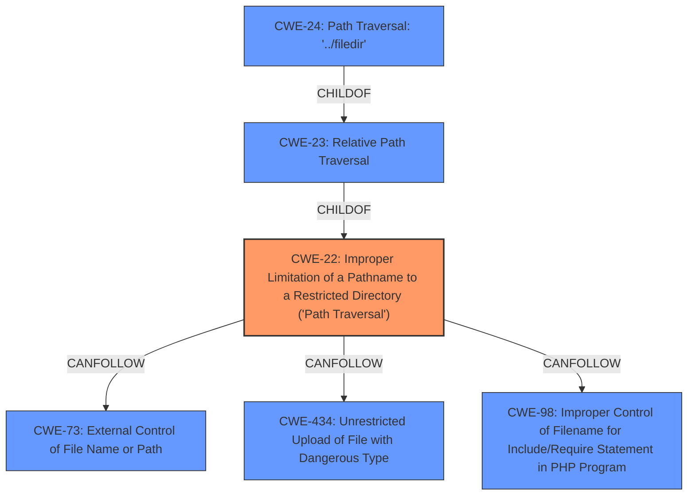

# Raw Analyzer Response for CVE-2022-1648

# Summary
| CWE ID | CWE Name | Confidence | CWE Abstraction Level | CWE Vulnerability Mapping Label | CWE-Vulnerability Mapping Notes |
|---|---|---|---|---|---|
| CWE-22 | Improper Limitation of a Pathname to a Restricted Directory ('Path Traversal') | 1.0 | Base | Allowed | Primary CWE |
| CWE-434 | Unrestricted Upload of File with Dangerous Type | 0.7 | Base | Allowed | Secondary Candidate |

## Evidence and Confidence

*   **Confidence Score:** 0.85
*   **Evidence Strength:** HIGH

## Relationship Analysis
The primary relationship influencing the CWE selection is the parent-child relationship between CWE-22, and its variants. CWE-22 is the most accurate base-level representation of the **path traversal** vulnerability, while CWE-23 and CWE-24 are more specific variants. Additionally, the CANFOLLOW relationship between CWE-22 and CWE-73, CWE-434, CWE-98 helped to expand the understanding of potential vulnerability chains. I chose CWE-22 because it is a base class that encompasses the type of path traversal that is occuring, without being overly specific.

## Vulnerability Chain
The vulnerability chain begins with a **relative path traversal** (CWE-22) that allows a privileged user to upload a .php file outside the intended images directory. This **improper limitation of a pathname** can then lead to Remote Code Execution (RCE) due to the ability to execute the uploaded .php file. The **unrestricted upload of a file with a dangerous type** (CWE-434) is also a part of the chain because the system does not prevent the upload of executable files.

## Summary of Analysis
The initial assessment, focusing on the **relative path traversal** as the root cause, aligns well with the retriever results, which identified CWE-22 as the top candidate. The vulnerability description explicitly states the **relative path traversal** issue, "Pandora FMS v7.0NG.760 and below allows a **relative path traversal** in File Manager," supporting the selection of CWE-22. The CVE Reference Links Content Summary also highlights the **relative path traversal** as a key weakness, "The vulnerability is due to a relative path traversal issue in the File Manager component of Pandora FMS."

CWE-22 (Improper Limitation of a Pathname to a Restricted Directory ('Path Traversal')) is chosen as the primary CWE because it accurately describes the **root cause** of the vulnerability: the software **fails to properly restrict** user-controlled input when constructing file paths, allowing the attacker to **traverse** outside the intended directory. The fact that the attacker can upload a PHP file and then execute it points towards the impact, Remote Code Execution.

CWE-434 (Unrestricted Upload of File with Dangerous Type) is considered as a secondary CWE because the vulnerability involves the ability to upload a .php file, which is a dangerous file type. The description states, "a privileged user could upload a .php file outside the intended images directory which is restricted to execute the .php file," indicating that the system does not properly restrict the upload of such files.

The selected CWEs are at the optimal level of specificity. CWE-22 is a base CWE that accurately captures the general issue of path traversal, while CWE-434 provides additional context about the dangerous file type being uploaded. Choosing more specific variants of CWE-22 (e.g., CWE-23, CWE-24) would not add significant value, as the core issue is the **improper limitation of the pathname**, regardless of the specific traversal technique used.