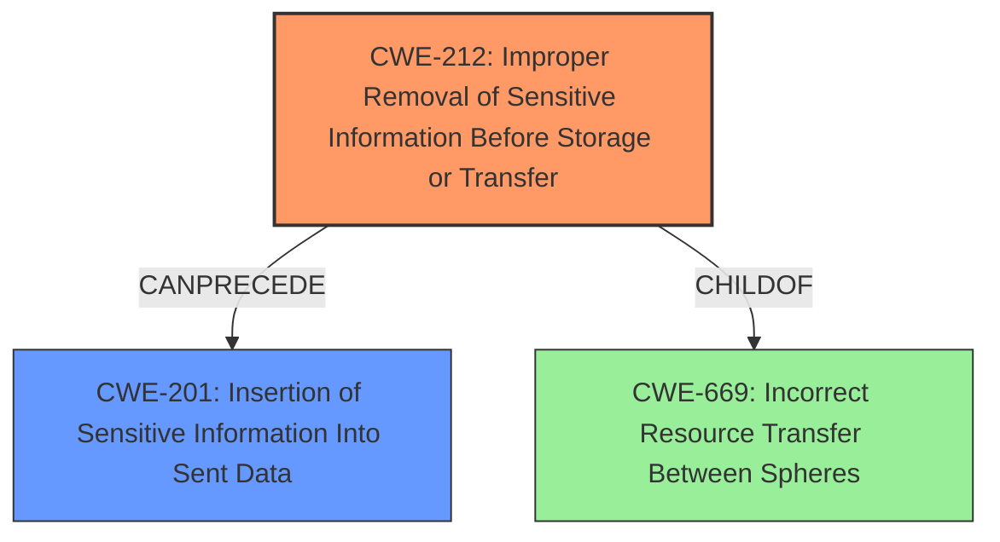

# Enhanced Analysis for CVE-2022-1650

# Summary
| CWE ID  | CWE Name                                                                     | Confidence | CWE Abstraction Level | CWE Vulnerability Mapping Label | CWE-Vulnerability Mapping Notes |
| :-------- | :--------------------------------------------------------------------------- | :--------- | :---------------------- | :------------------------------ | :------------------------------ |
| CWE-212   | Improper Removal of Sensitive Information Before Storage or Transfer        | 1.0        | Base                    | Primary                       | Allowed                       |
| CWE-201   | Insertion of Sensitive Information Into Sent Data                           | 0.7        | Base                    | Secondary                     | Allowed                       |

## Evidence and Confidence

*   **Confidence Score:** 0.85
*   **Evidence Strength:** HIGH

## Relationship Analysis
The primary CWE selected is CWE-212, which directly addresses the **improper removal of sensitive information** before transfer, aligning with the vulnerability description. CWE-201, *Insertion of Sensitive Information Into Sent Data*, is considered as a secondary weakness because the data is ultimately sent to another actor, but the **rootcause** is the **improper removal**. CWE-212 can precede CWE-201 in a vulnerability chain. Both CWEs are at the Base level, which is the preferred level of abstraction.



## Vulnerability Chain
The vulnerability chain starts with the **improper removal of sensitive information** (CWE-212). Because the information is not removed, it's then sent as part of the data (CWE-201) to an unintended recipient.

## Summary of Analysis
The analysis is based on the explicit evidence provided in the vulnerability description and the CVE reference links. The description clearly states "**Improper Removal of Sensitive Information Before Storage or Transfer**" which directly corresponds to CWE-212.

The CVE reference links elaborate that the vulnerability is caused by the `node-eventsource` module not properly enforcing the same-origin policy during HTTP redirects, and failing to strip sensitive headers like "Authorization" and "Cookie" from the subsequent request. This confirms that sensitive information is being sent due to the **lack of proper removal**, further supporting CWE-212.

CWE-201 is a secondary consideration because it represents the outcome of the initial failure to remove the sensitive data.

The selected CWEs are at the optimal level of specificity, as they directly address the **rootcause** and the immediate consequence of the vulnerability. Other CWEs, such as CWE-285 (Improper Authorization) and CWE-639 (Authorization Bypass Through User-Controlled Key), were considered but deemed less relevant as the primary issue is not related to authorization mechanisms but rather the **failure to remove sensitive data**.

Relevant CWE Information:

# Enhanced Context (25 CWEs)

## CWE-212: Improper Removal of Sensitive Information Before Storage or Transfer
**Abstraction Level**: Base
**Similarity Score**: 0.79
**Source**: dense

**Description**:
The product stores, transfers, or shares a resource that contains sensitive information, but it does not properly remove that information before the product makes the resource available to unauthorized actors.

**Mapping Guidance**:
- Usage: Allowed
- Rationale: This CWE entry is at the Base level of abstraction, which is a preferred level of abstraction for mapping to the root causes of vulnerabilities.

## CWE-201: Insertion of Sensitive Information Into Sent Data
**Abstraction Level**: Base
**Similarity Score**: 5541.32
**Source**: sparse

**Description**:
The code transmits data to another actor, but a portion of the data includes sensitive information that should not be accessible to that actor.

**Mapping Guidance**:
- Usage: Allowed
- Rationale: This CWE entry is at the Base level of abstraction, which is a preferred level of abstraction for mapping to the root causes of vulnerabilities.


## CWE Relationship Analysis

Current CWEs represent these abstraction levels: .


### Vulnerability Chain Analysis

**Chain starting from CWE-201:**
- 201 (Insertion of Sensitive Information Into Sent Data) - ROOT


**Chain starting from CWE-285:**
- 285 (Improper Authorization) - ROOT


### CWE Relationship Diagram

```mermaid
graph TD
    classDef primary fill:#f96,stroke:#333,stroke-width:2px
    classDef secondary fill:#69f,stroke:#333
    classDef tertiary fill:#9e9,stroke:#333
```