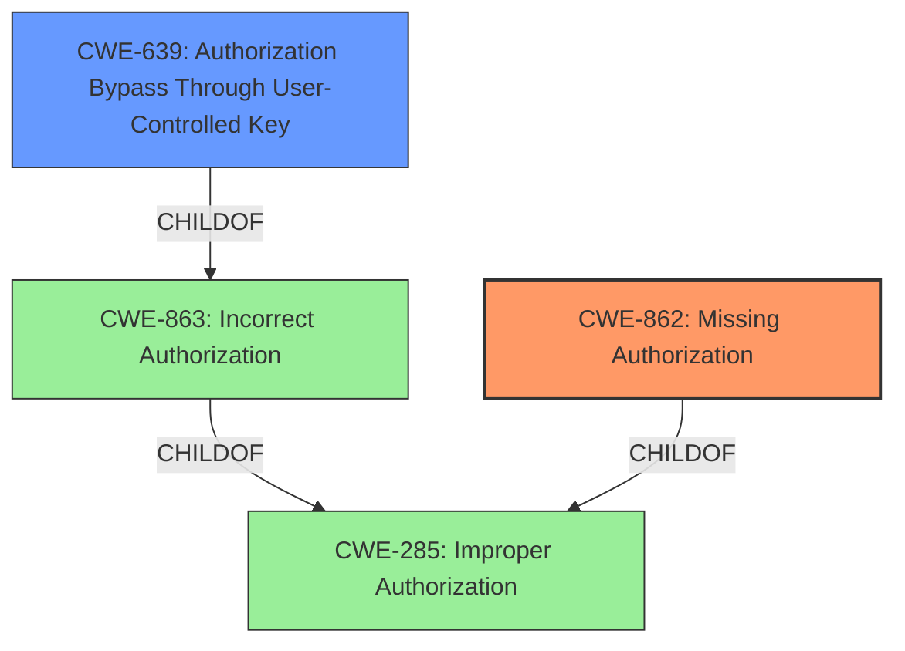

# Analysis Report for CVE-2022-1656

# Vulnerability Analysis Report: CVE-2022-1656

## Description


## Analysis (with Relationship Data)

# Summary
| CWE ID | CWE Name | Confidence | CWE Abstraction Level | CWE Vulnerability Mapping Label | CWE-Vulnerability Mapping Notes |
|---|---|---|---|---|---|
| CWE-862 | Missing Authorization | 0.9 | Class | Primary | Allowed-with-Review |
| CWE-639 | Authorization Bypass Through User-Controlled Key | 0.7 | Base | Secondary | Allowed |

## Evidence and Confidence

*   **Confidence Score:** 0.8
*   **Evidence Strength:** HIGH

## Relationship Analysis
The primary CWE, CWE-862, is a class-level weakness describing the absence of an authorization check. CWE-639 is a base-level weakness that is a child of CWE-863 (Incorrect Authorization) and describes a specific type of authorization bypass where a user-controlled key is used to access another user's data. The relationship between CWE-862 and CWE-639 is that CWE-639 can be a specific instance of a broader authorization issue, although in this case, it is not a direct child of CWE-862.



## Vulnerability Chain
The vulnerability chain starts with the **insufficient access control**, leading to missing authorization checks. This allows any logged-in user to access functions they should not, resulting in the ability to deactivate arbitrary plugins and update the themes API key.

## Summary of Analysis
The initial assessment, based on the provided evidence, points towards a primary weakness related to missing authorization checks. The vulnerability description explicitly states **insufficient access control** as the root cause, with the impact being unauthorized access to sensitive functions. The retriever results also highlight CWE-862 (Missing Authorization) and CWE-863 (Incorrect Authorization) as potential candidates.

The evidence from the "Vulnerability Description Key Phrases" section states:
*   **rootcause:** **insufficient access control**
*   **impact:** access any of the functions registered in lib/api/api/ajax.php and deactivate arbitrary plugins and update themes API key
*   **attacker:** any logged-in user

The vulnerability allows any logged-in user (even subscriber-level users) to access functions that should be restricted, indicating a **lack of proper authorization checks**.

CWE-862 (Missing Authorization) is selected as the primary CWE because the vulnerability description and CVE summary both highlight a **lack of authorization checks** for critical functions. This aligns with the definition of CWE-862: "The product does not perform an authorization check when an actor attempts to access a resource or perform an action." The impact of this weakness is significant, as it allows unauthorized users to deactivate plugins and modify the theme's API key.

CWE-639 (Authorization Bypass Through User-Controlled Key) is considered a secondary CWE because the vulnerability allows any logged-in user to access functions registered in `lib/api/api/ajax.php`. This suggests that the user ID or some other key is not properly validated, allowing users to potentially access resources or functions associated with other users or administrative functions. However, the description does not explicitly mention user-controlled keys, so the confidence is lower.

Other CWEs considered but not selected:

*   CWE-352 (Cross-Site Request Forgery (CSRF)): While CSRF could be a potential attack vector, the root cause of the vulnerability is **insufficient access control**, not a failure to validate the origin of requests.
*   CWE-306 (Missing Authentication for Critical Function): The issue is not a lack of authentication, as users are logged in. The problem is that logged-in users are not properly authorized to perform certain actions.
*   CWE-285 (Improper Authorization): This is a high-level class, and more specific CWEs like CWE-862 and CWE-639 are more appropriate.
*   CWE-79 (Improper Neutralization of Input During Web Page Generation ('Cross-site Scripting')): There is no indication of XSS in the vulnerability description.
*   CWE-184 (Incomplete List of Disallowed Inputs): This CWE is not relevant as the problem is not related to a denylist of inputs.

The selection of CWE-862 as the primary CWE and CWE-639 as the secondary CWE provides the most accurate and specific representation of the vulnerability, based on the available evidence.


## CWE Relationship Analysis

Current CWEs represent these abstraction levels: .


### Vulnerability Chain Analysis

**Chain starting from CWE-862:**
- 862 (Missing Authorization) - ROOT


**Chain starting from CWE-184:**
- 184 (Incomplete List of Disallowed Inputs) - ROOT


### CWE Relationship Diagram

```mermaid
graph TD
    classDef primary fill:#f96,stroke:#333,stroke-width:2px
    classDef secondary fill:#69f,stroke:#333
    classDef tertiary fill:#9e9,stroke:#333
```


*Report generated on 2025-03-30 11:47:47*
