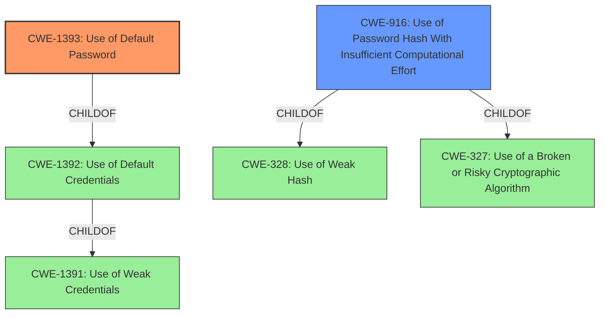

# Analysis for CVE-2022-1666

# Summary
| CWE ID | CWE Name | Confidence | CWE Abstraction Level | CWE Vulnerability Mapping Label | CWE-Vulnerability Mapping Notes |
|---|---|---|---|---|---|
| CWE-1393 | Use of Default Password | 1.0 | Base | Allowed | Primary CWE |
| CWE-916 | Use of Password Hash With Insufficient Computational Effort | 0.8 | Base | Allowed | Secondary Candidate |

## Evidence and Confidence

*   **Confidence Score:** 0.9
*   **Evidence Strength:** HIGH

## Relationship Analysis
The primary CWE is CWE-1393, which is a `CHILDOF` CWE-1392 (Use of Default Credentials). CWE-1392 is a `CHILDOF` CWE-1391 (Use of Weak Credentials). CWE-916 is a `CHILDOF` CWE-328 (Use of Weak Hash) and CWE-327 (Use of a Broken or Risky Cryptographic Algorithm). These hierarchical relationships show how the specific weakness (default password) fits into broader categories of credential and cryptographic weaknesses. Choosing CWE-1393 provides the most specific classification for this vulnerability.

## Vulnerability Chain
The vulnerability chain starts with the **use of a default password (CWE-1393)**, which is a type of **weak credential (CWE-1391)**. The password was stored as an MD5 hash, which is easily cracked, contributing to **insufficient protection of credentials (CWE-522)**. This allows an attacker with network access to gain unauthorized access to the web interface, potentially leading to further exploits.

## Summary of Analysis
The primary assessment is based on the provided evidence, specifically the **root cause** being a "**weak password**" and the summary stating "**insufficiently Protected Credentials (CWE-522)**: The vendor's private account used a weak default password." The use of MD5 hashing further weakens the security, as stated: "The password was stored as an MD5 hash which is easily cracked using widely available open-source tools."

The graph relationships influenced the final selection by highlighting the hierarchical structure of the weaknesses, leading to the choice of CWE-1393 as the most specific and accurate representation of the vulnerability.

CWE-1393 is the optimal level of specificity because it directly addresses the **root cause** of the vulnerability, which is the **use of a default password**. While CWE-1391 (Use of Weak Credentials) is more general, CWE-1393 pinpoints the exact nature of the weakness. CWE-916 is also relevant because of the MD5 hashing, but the initial **weak password** is the starting point of the vulnerability.

Relevant CWE Information:

# Enhanced Context (25 CWEs)
The following CWEs were identified as potentially relevant to this vulnerability:

## CWE-916: Use of Password Hash With Insufficient Computational Effort
**Abstraction Level**: Base
**Similarity Score**: 0.80
**Source**: dense

**Description**:
The product generates a hash for a password, but it uses a scheme that does not provide a sufficient level of computational effort that would make password cracking attacks infeasible or expensive.

**Mapping Guidance**:
- Usage: Allowed
- Rationale: This CWE entry is at the Base level of abstraction, which is a preferred level of abstraction for mapping to the root causes of vulnerabilities.

**Technical Explanation for CWE-1393 (Use of Default Password):**

*   How the vulnerability's details match the CWE's characteristics: The vulnerability description explicitly states that the web application used a default password for its root user account. This aligns directly with the definition of CWE-1393, which describes the use of default passwords for critical functionality.
*   The security implications and potential impact: The security implication is that an attacker can easily gain unauthorized access to the web application's root user account by using the well-known default password. The impact is primarily confidentiality, as the attacker can then access sensitive information.
*   Any parent-child relationships or chain patterns that influenced your mapping: CWE-1393 is a child of CWE-1392 (Use of Default Credentials), which in turn is a child of CWE-1391 (Use of Weak Credentials). This hierarchical relationship shows how the specific weakness (default password) fits into broader categories of credential weaknesses.
*   Whether the weakness is primary or secondary in the vulnerability: This weakness is primary, as the use of a default password is the direct cause of the vulnerability.
*   How the official MITRE mapping guidance influenced your decision: The MITRE mapping guidance for CWE-1393 states that it is at the Base level of abstraction, which is a preferred level for mapping to the **root causes** of vulnerabilities. The guidance also advises careful reading of the name and description to ensure an appropriate fit, which is the case here.

**Technical Explanation for CWE-916 (Use of Password Hash With Insufficient Computational Effort):**

*   How the vulnerability's details match the CWE's characteristics: The vulnerability description indicates that the default password was stored as an MD5 hash, which is easily cracked using widely available open-source tools. This aligns with the description of CWE-916, which refers to the use of password hashes that do not provide sufficient computational effort to prevent cracking attacks.
*   The security implications and potential impact: The security implication is that an attacker can easily crack the password hash and gain unauthorized access to the web application's root user account. This can lead to information disclosure and other malicious activities.
*   Any parent-child relationships or chain patterns that influenced your mapping: CWE-916 is a child of both CWE-328 (Use of Weak Hash) and CWE-327 (Use of a Broken or Risky Cryptographic Algorithm). This shows that the insufficient computational effort is related to broader categories of cryptographic weaknesses.
*   Whether the weakness is primary or secondary in the vulnerability: This weakness is secondary. The primary weakness is using a default password in the first place (CWE-1393). CWE-916 contributes to the ease of exploiting the default password.
*   How the official MITRE mapping guidance influenced your decision: The MITRE mapping guidance for CWE-916 states that it is at the Base level of abstraction, which is a preferred level for mapping to the **root causes** of vulnerabilities.

**CWEs Considered But Not Used:**

*   CWE-1391 (Use of Weak Credentials): While this is a valid general category, CWE-1393 is more specific and directly addresses the use of default passwords.
*   CWE-328 (Use of Weak Hash): This is related to the MD5 hashing, but it is more of a contributing factor than the primary cause. The initial use of a default password is the main vulnerability.
*   CWE-522 (Insufficiently Protected Credentials): While this is mentioned in the CVE summary, it is a high-level description of the impact, rather than the **root cause**. The specific cause is the **use of a default password**.
*   CWE-759 (Use of a One-Way Hash without a Salt): This could be applicable if the MD5 hash wasn't salted. However, the description doesn't mention anything about salting, so I can't make that conclusion.