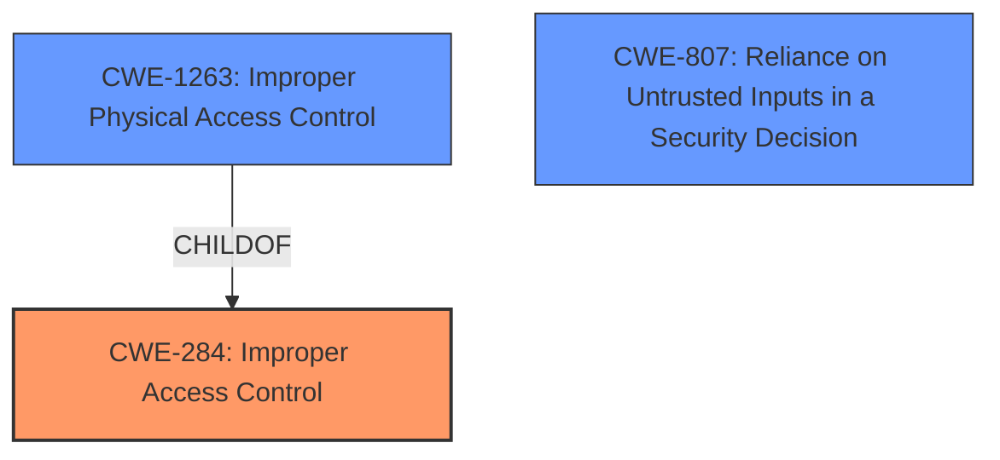

# Analysis for CVE-2022-1716

# Summary
| CWE ID    | CWE Name                                                        | Confidence | CWE Abstraction Level | CWE Vulnerability Mapping Label | CWE-Vulnerability Mapping Notes |
| :--------- | :-------------------------------------------------------------- | :--------- | :---------------------- | :------------------------------ | :------------------------------ |
| CWE-284 | Improper Access Control                                               | 0.85       | Pillar           | Primary  | Discouraged                      |
| CWE-1263    | Improper Physical Access Control                               | 0.70       | Class                   | Secondary                       | Allowed-with-Review           |
| CWE-807  | Reliance on Untrusted Inputs in a Security Decision                | 0.60       | Base                    | Secondary                       | Allowed                       |

## Evidence and Confidence

*   **Confidence Score:** 0.80
*   **Evidence Strength:** HIGH

## Relationship Analysis
The primary CWE is CWE-284 Improper Access Control (Pillar). CWE-1263 Improper Physical Access Control (Class) is a child of CWE-284. CWE-807 Reliance on Untrusted Inputs in a Security Decision (Base) is related because dynamic code manipulation relies on the application trusting input (code) that it shouldn't. The vulnerability description indicates a **lack of adequate security controls to prevent dynamic code manipulation**, so the highest level, CWE-284, captures the essence of the weakness, with CWE-1263 specifying it is physical access and CWE-807 related to dynamic code manipulation.

## Vulnerability Chain
The vulnerability chain starts with the **lack of adequate security controls to prevent dynamic code manipulation**, leading to **improper access control**, and ultimately allowing an attacker with physical access to bypass the application's password/PIN lock and access user data.

## Summary of Analysis
The initial assessment focused on the **lack of adequate security controls to prevent dynamic code manipulation** as the root cause. The evidence directly supports this, as the "Vulnerability Description Key Phrases" section identifies this as the root cause.

CWE-284, Improper Access Control, is chosen as the primary CWE because the description explicitly states that the application's password/PIN lock is bypassed due to the **lack of security controls**. While CWE-284 is a high-level Pillar, the provided information doesn't give enough specificity to select a more granular CWE. The weakness is not about missing authentication (CWE-306) or weak authentication (CWE-1390), but about the general failure to control access by preventing dynamic code manipulation.

CWE-1263, Improper Physical Access Control, is selected as a secondary CWE. The attack requires physical access to the device.

CWE-807, Reliance on Untrusted Inputs in a Security Decision, is selected as a secondary CWE, since code injection and hooking (as performed via Frida) is possible.

Relevant CWE Information:

# Enhanced Context (25 CWEs)

## CWE-1390: Weak Authentication
**Abstraction Level**: Class
**Similarity Score**: 0.74
**Source**: dense

**Description**:
The product uses an authentication mechanism to restrict access to specific users or identities, but the mechanism does not sufficiently prove that the claimed identity is correct.

**Mapping Guidance**:
- Usage: Allowed-with-Review
- Rationale: This CWE entry is a Class and might have Base-level children that would be more appropriate

**Why it was not selected**: The application does have authentication (password/pin), but it is being bypassed. It is not necessarily *weak*, but bypassed due to **lack of adequate security controls to prevent dynamic code manipulation.**

## CWE-41: Improper Resolution of Path Equivalence
**Abstraction Level**: Base
**Similarity Score**: 0.73
**Source**: dense

**Description**:
The product is vulnerable to file system contents disclosure through path equivalence. Path equivalence involves the use of special characters in file and directory names. The associated manipulations are intended to generate multiple names for the same object.

**Mapping Guidance**:
- Usage: Allowed
- Rationale: This CWE entry is at the Base level of abstraction, which is a preferred level of abstraction for mapping to the root causes of vulnerabilities.

**Why it was not selected**: This CWE doesn't apply here, since the vulnerability isn't about pathnames.

## CWE-23: Relative Path Traversal
**Abstraction Level**: Base
**Similarity Score**: 0.73
**Source**: dense

**Description**:
The product uses external input to construct a pathname that should be within a restricted directory, but it does not properly neutralize sequences such as ".." that can resolve to a location that is outside of that directory.

**Mapping Guidance**:
- Usage: Allowed
- Rationale: This CWE entry is at the Base level of abstraction, which is a preferred level of abstraction for mapping to the root causes of vulnerabilities.

**Why it was not selected**: This CWE doesn't apply here, since the vulnerability isn't about pathnames.

## CWE-668: Exposure of Resource to Wrong Sphere
**Abstraction Level**: Class
**Similarity Score**: 0.73
**Source**: dense

**Description**:
The product exposes a resource to the wrong control sphere, providing unintended actors with inappropriate access to the resource.

**Mapping Guidance**:
- Usage: Discouraged
- Rationale: CWE-668 is high-level and is often misused as a catch-all when lower-level CWE IDs might be applicable. It is sometimes used for low-information vulnerability reports [REF-1287]. It is a level-1 Class (i.e., a child of a Pillar). It is not useful for trend analysis.

**Why it was not selected**: CWE-284 Improper Access Control is a better fit, and CWE-668 is discouraged.

## CWE-807: Reliance on Untrusted Inputs in a Security Decision
**Abstraction Level**: Base
**Similarity Score**: 0.73
**Source**: dense

**Description**:
The product uses a protection mechanism that relies on the existence or values of an input, but the input can be modified by an untrusted actor in a way that bypasses the protection mechanism.

**Mapping Guidance**:
- Usage: Allowed
- Rationale: This CWE entry is at the Base level of abstraction, which is a preferred level of abstraction for mapping to the root causes of vulnerabilities.

**Why it was selected**: Dynamic code manipulation allows for the application to use untrusted inputs, such as modified code.

## CWE-798: Use of Hard-coded Credentials
**Abstraction Level**: Base
**Similarity Score**: 0.73
**Source**: dense

**Description**:
The product contains hard-coded credentials, such as a password or cryptographic key.

**Mapping Guidance**:
- Usage: Allowed
- Rationale: This CWE entry is at the Base level of abstraction, which is a preferred level of abstraction for mapping to the root causes of vulnerabilities.

**Why it was not selected**: This CWE doesn't apply here, since the vulnerability isn't about hardcoded credentials.

## CWE-1391: Use of Weak Credentials
**Abstraction Level**: Class
**Similarity Score**: 0.73
**Source**: dense

**Description**:
The product uses weak credentials (such as a default key or hard-coded password) that can be calculated, derived, reused, or guessed by an attacker.

**Mapping Guidance**:
- Usage: Allowed-with-Review
- Rationale: This CWE entry is a Class and might have Base-level children that would be more appropriate

**Why it was not selected**: The vulnerability isn't about the credentials themselves being weak.

## CWE-653: Improper Isolation or Compartmentalization
**Abstraction Level**: Class
**Similarity Score**: 0.73
**Source**: dense

**Description**:
The product does not properly compartmentalize or isolate functionality, processes, or resources that require different privilege levels, rights, or permissions.

**Mapping Guidance**:
- Usage: Allowed
- Rationale: This CWE entry is at the Base level of abstraction, which is a preferred level of abstraction for mapping to the root causes of vulnerabilities.

**Why it was not selected**: This vulnerability isn't specifically about isolation.

## CWE-274: Improper Handling of Insufficient Privileges
**Abstraction Level**: Base
**Similarity Score**: 0.72
**Source**: dense

**Description**:
The product does not handle or incorrectly handles when it has insufficient privileges to perform an operation, leading to resultant weaknesses.

**Mapping Guidance**:
- Usage: Discouraged
- Rationale: This CWE entry could be deprecated in a future version of CWE.

**Why it was not selected**: