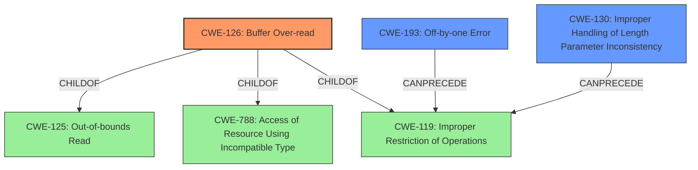

# Analysis Report for CVE-2022-1720

# Vulnerability Analysis Report: CVE-2022-1720

## Description


## Analysis (with Relationship Data)

# Summary
| CWE ID | CWE Name | Confidence | CWE Abstraction Level | CWE Vulnerability Mapping Label | CWE-Vulnerability Mapping Notes |
|---|---|---|---|---|---|
| CWE-126 | Buffer Over-read | 1.0 | Variant | Allowed | Primary CWE |
| CWE-193 | Off-by-one Error | 0.6 | Base | Allowed | Secondary Candidate |
| CWE-130 | Improper Handling of Length Parameter Inconsistency | 0.6 | Base | Allowed | Secondary Candidate |

## Evidence and Confidence

*   **Confidence Score:** 0.8
*   **Evidence Strength:** HIGH

## Relationship Analysis
The primary CWE selected was CWE-126, which is a variant of CWE-125 (Out-of-bounds Read). CWE-126 is specifically for over-reads, while CWE-125 is a more general case. CWE-126 is also a child of CWE-788 (Access of Resource Using Incompatible Type ('Type Confusion')). CWE-193 and CWE-130 were considered as contributing factors leading to the over-read. They can precede CWE-119 (Improper Restriction of Operations within the Bounds of a Memory Buffer), a parent of CWE-126. The selection favored the variant CWE-126 for its specificity regarding the "over-read" condition, aligning with the vulnerability description.



## Vulnerability Chain
The vulnerability chain starts with a possible **improper length handling (CWE-130)** or an **off-by-one error (CWE-193)**. This leads to accessing data beyond the buffer's boundaries during a read operation resulting in a **buffer over-read (CWE-126)**, potentially causing a crash, memory disclosure, or even remote execution.

## Summary of Analysis
Initially, the **rootcause** "**Buffer Over-read**" made CWE-126 the most obvious choice and after analyzing the "CVE Reference Links Content Summary" confirmed my choice. The summary states:  "This source provides specific vulnerability information: \"CVE-2022-1720 vim: buffer over-read in grab_file_name() in findfile.c\"."

The evidence explicitly identifies a **Buffer Over-read** in the `grab_file_name` function, directly corresponding to CWE-126. The vulnerability occurs when processing a file with the 'gf' command, where the length is incorrectly calculated, leading to reading past the end of the buffer. The fix involves improved checks and excluding the NUL character, further supporting the improper length calculation. This aligns perfectly with CWE-126's description of reading memory locations after the targeted buffer.

CWE-193 and CWE-130 are considered as potential contributing factors but are not the primary weakness. CWE-193 could be involved in the incorrect calculation of the buffer size and CWE-130 in inconsistent handling of the length parameter.

The selection of CWE-126 is at the optimal level of specificity because it directly describes the **rootcause** of the vulnerability, as described in the vulnerability description.

Relevant CWE Information:

# Enhanced Context (25 CWEs)
The following CWEs were identified as potentially relevant to this vulnerability:

## CWE-124: Buffer Underwrite ('Buffer Underflow')
**Abstraction Level**: Base
**Similarity Score**: 0.78
**Source**: dense

**Description**:
The product writes to a buffer using an index or pointer that references a memory location prior to the beginning of the buffer.
## CWE-131: Incorrect Calculation of Buffer Size
**Abstraction Level**: Base
**Similarity Score**: 0.78
**Source**: dense

**Description**:
The product does not correctly calculate the size to be used when allocating a buffer, which could lead to a buffer overflow.
## CWE-805: Buffer Access with Incorrect Length Value
**Abstraction Level**: Base
**Similarity Score**: 0.78
**Source**: dense

**Description**:
The product uses a sequential operation to read or write a buffer, but it uses an incorrect length value that causes it to access memory that is outside of the bounds of the buffer.
## CWE-191: Integer Underflow (Wrap or Wraparound)
**Abstraction Level**: Base
**Similarity Score**: 0.77
**Source**: dense

**Description**:
The product subtracts one value from another, such that the result is less than the minimum allowable integer value, which produces a value that is not equal to the correct result.
## CWE-193: Off-by-one Error
**Abstraction Level**: Base
**Similarity Score**: 0.77
**Source**: dense

**Description**:
A product calculates or uses an incorrect maximum or minimum value that is 1 more, or 1 less, than the correct value.
## CWE-786: Access of Memory Location Before Start of Buffer
**Abstraction Level**: Base
**Similarity Score**: 0.76
**Source**: dense

**Description**:
The product reads or writes to a buffer using an index or pointer that references a memory location prior to the beginning of the buffer.
## CWE-127: Buffer Under-read
**Abstraction Level**: Variant
**Similarity Score**: 0.76
**Source**: dense

**Description**:
The product reads from a buffer using buffer access mechanisms such as indexes or pointers that reference memory locations prior to the targeted buffer.
## CWE-126: Buffer Over-read
**Abstraction Level**: Variant
**Similarity Score**: 0.76
**Source**: dense

**Description**:
The product reads from a buffer using buffer access mechanisms such as indexes or pointers that reference memory locations after the targeted buffer.
## CWE-130: Improper Handling of Length Parameter Inconsistency
**Abstraction Level**: Base
**Similarity Score**: 0.75
**Source**: dense

**Description**:
The product parses a formatted message or structure, but it does not handle or incorrectly handles a length field that is inconsistent with the actual length of the associated data.
## CWE-197: Numeric Truncation Error
**Abstraction Level**: Base
**Similarity Score**: 0.75
**Source**: dense

**Description**:
Truncation errors occur when a primitive is cast to a primitive of a smaller size and data is lost in the conversion.
## CWE-125: Out-of-bounds Read
**Abstraction Level**: Base
**Similarity Score**: 6341.27
**Source**: sparse

**Description**:
The product reads data past the end, or before the beginning, of the intended buffer.
## CWE-193: Off-by-one Error
**Abstraction Level**: Base
**Similarity Score**: 6280.77
**Source**: sparse

**Description**:
A product calculates or uses an incorrect maximum or minimum value that is 1 more, or 1 less, than the correct value.
## CWE-124: Buffer Underwrite ('Buffer Underflow')
**Abstraction Level**: Base
**Similarity Score**: 6279.24
**Source**: sparse

**Description**:
The product writes to a buffer using an index or pointer that references a memory location prior to the beginning of the buffer.
## CWE-190: Integer Overflow or Wraparound
**Abstraction Level**: Base
**Similarity Score**: 6258.88
**Source**: sparse

**Description**:
The product performs a calculation that can
         produce an integer overflow or wraparound when the logic
         assumes that the resulting value will always be larger than
         the original value. This occurs when an integer value is
         incremented to a value that is too large to store in the
         associated representation. When this occurs, the value may
         become a very small or negative number.
## CWE


## CWE Relationship Analysis

Current CWEs represent these abstraction levels: .


### Vulnerability Chain Analysis

**Chain starting from CWE-131:**
- 131 (Incorrect Calculation of Buffer Size) - ROOT


**Chain starting from CWE-190:**
- 190 (Integer Overflow or Wraparound) - ROOT


### CWE Relationship Diagram

```mermaid
graph TD
    classDef primary fill:#f96,stroke:#333,stroke-width:2px
    classDef secondary fill:#69f,stroke:#333
    classDef tertiary fill:#9e9,stroke:#333
```


*Report generated on 2025-03-31 04:14:21*
