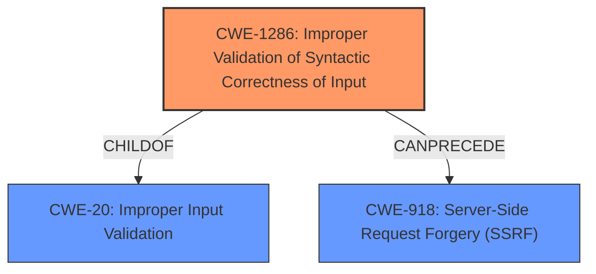

# Analysis for CVE-2022-1727

# Summary
| CWE ID | CWE Name | Confidence | CWE Abstraction Level | CWE Vulnerability Mapping Label | CWE-Vulnerability Mapping Notes |
|---|---|---|---|---|---|
| CWE-1286 | Improper Validation of Syntactic Correctness of Input | 0.9 | Base | Primary | Allowed |
| CWE-918 | Server-Side Request Forgery (SSRF) | 0.6 | Base | Secondary | Allowed |
| CWE-20 | Improper Input Validation | 0.5 | Class | Secondary | Discouraged |

## Evidence and Confidence

*   **Confidence Score:** 0.7
*   **Evidence Strength:** HIGH

## Relationship Analysis
The primary CWE is CWE-1286 (**Improper Validation of Syntactic Correctness of Input**), which is a child of CWE-20 (**Improper Input Validation**). CWE-1286 focuses on the lack of or incorrect validation of input syntax, aligning with the vulnerability's improper URL filtering. CWE-918 (**Server-Side Request Forgery (SSRF)**) is considered a potential secondary CWE if the improperly validated URL leads to server-side requests to unintended destinations, but the provided information focuses more on the initial validation failure rather than confirming exploitation as an SSRF. The abstraction levels influenced the selection by prioritizing the base-level CWE-1286 for its specific representation of the weakness.

## Vulnerability Chain
The chain of weaknesses starts with **Improper Input Validation** (potentially CWE-20), specifically the **Improper Validation of Syntactic Correctness of Input** (CWE-1286), which leads to **Improper URL Filtering**. If this filtering failure results in the application making requests to unintended servers, it can then lead to a Server-Side Request Forgery (SSRF) (CWE-918). The initial flaw is the incorrect or missing validation, the intermediate weakness is improper filtering, and the potential impact is SSRF.

## Summary of Analysis
The initial analysis focused on **Improper Input Validation** as the root cause, based on the vulnerability description key phrases. However, the CVE reference links content summary provides more specific details about the **weakness** being **Improper URL Filtering** and **Inadequate Input Sanitization**.

The "fixes" section in the CVE reference link content summary highlights the specific measures taken to address the **weakness**, such as checking against an allowedUrls regular expression.

The Retriever Results listed CWE-1286 (**Improper Validation of Syntactic Correctness of Input**) as a strong candidate, and after reviewing the Complete CWE Specifications, it aligns well with the **weakness** of **Improper URL Filtering**. Therefore, CWE-1286 is selected as the primary CWE.

CWE-918 (**Server-Side Request Forgery (SSRF)**) is a potential secondary CWE because the improper validation could lead to requests being sent to unintended destinations. However, the provided information primarily focuses on the initial validation failure, so CWE-918 is assigned a lower confidence score.

CWE-20 (**Improper Input Validation**) is a more general classification, and while it's technically accurate, CWE-1286 provides a more specific and detailed representation of the vulnerability. Because CWE-20 is a Class level CWE, it is discouraged.

The selected CWEs are at the optimal level of specificity because they directly address the **rootcause** of the vulnerability which is the **Improper URL Filtering** due to the **Improper Validation of Syntactic Correctness of Input**.