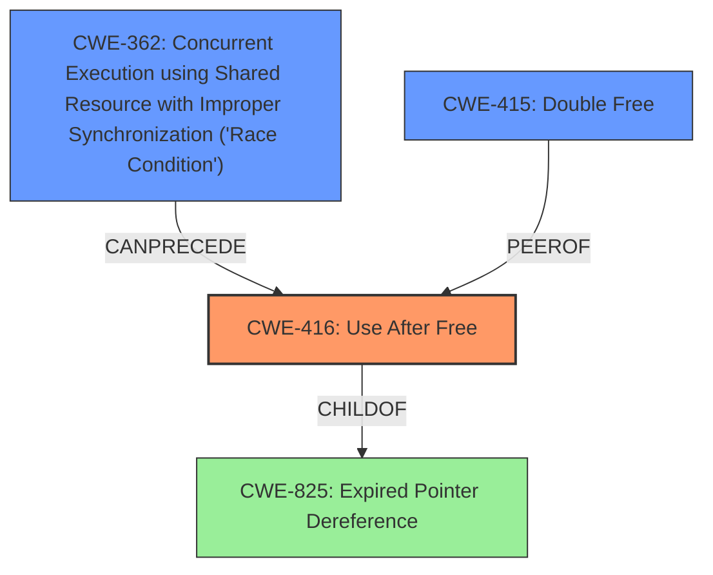

# Raw Analyzer Response for CVE-2022-1734

# Summary
| CWE ID | CWE Name | Confidence | CWE Abstraction Level | CWE Vulnerability Mapping Label | CWE-Vulnerability Mapping Notes |
|---|---|---|---|---|---|
| CWE-416 | Use After Free | 1.0 | Variant | Allowed | Primary CWE |
| CWE-362 | Concurrent Execution using Shared Resource with Improper Synchronization ('Race Condition') | 0.7 | Class | Allowed-with-Review | Secondary Candidate |
| CWE-415 | Double Free | 0.6 | Variant | Allowed | Secondary Candidate |

## Evidence and Confidence

*   **Confidence Score:** 0.9
*   **Evidence Strength:** HIGH

## Relationship Analysis
The primary weakness is **CWE-416 (Use After Free)**. This is often caused by concurrent execution issues like **CWE-362 (Race Condition)** or can lead to memory corruption issues such as **CWE-415 (Double Free)**.

## Vulnerability Chain
The vulnerability chain starts with a **race condition** (**CWE-362**) due to unsynchronized cleanup and firmware download routines. This leads to a **use-after-free** (**CWE-416**) vulnerability, where memory is accessed after it has been freed. The use-after-free can further lead to a **double free** (**CWE-415**) or a **null pointer dereference**.

## Summary of Analysis
The analysis indicates a **use-after-free** vulnerability in the Linux kernel due to a lack of synchronization between cleanup and firmware download routines. The primary CWE is **CWE-416 (Use After Free)**, with **CWE-362 (Race Condition)** and **CWE-415 (Double Free)** as secondary contributing factors.

The evidence from the vulnerability description and CVE reference links strongly supports this classification:

*   "A flaw in Linux Kernel found in nfcmrvl_nci_unregister_dev() in drivers/nfc/nfcmrvl/main.c can lead to **use after free** both read or write when non synchronized between cleanup routine and firmware download routine."
*   "**weakness:** **use after free**"
*   CVE Reference Links Content Summary lists "Use-after-free", "Double-free", and "Null pointer dereference" as weaknesses.
*   The root cause is identified as "Destructive operations such as `nfcmrvl_fw_dnld_abort` and `gpio_free` in `nfcmrvl_nci_unregister_dev`. Resources such as firmware, gpio, etc. could be destructed while upper layer functions such as `nfcmrvl_fw_dnld_start` and `nfcmrvl_nci_recv_frame` are executing." This indicates a potential race condition.
*    "Race conditions in the nfcmrvl NFC driver"

**CWE-416 (Use After Free):** This is the primary weakness, as the vulnerability description explicitly mentions it. The re-use of memory after it has been freed is the core issue. The security implication is that an attacker can potentially control the contents of the freed memory, leading to arbitrary code execution or other malicious activities. The abstraction level is Variant, which is appropriate for a specific type of memory corruption.

**CWE-362 (Concurrent Execution using Shared Resource with Improper Synchronization ('Race Condition'))**: The vulnerability occurs due to missing synchronization between different routines which can lead to race conditions, making this a contributing factor. The abstraction level is Class, which is a higher level of abstraction, but still relevant given the context.

**CWE-415 (Double Free):** The CVE reference links mention "Double-free" as a related weakness. While not explicitly stated in the vulnerability description, it is a potential consequence of the use-after-free, increasing its relevance. The abstraction level is Variant.

Other CWEs considered but not used:

*   CWE-911 (Improper Update of Reference Count): This was considered because reference counting might be involved in memory management. However, the primary issue is the use of freed memory, not necessarily the incorrect updating of reference counts.
*   CWE-667 (Improper Locking): While locking issues can contribute to race conditions, the description focuses more on the use of freed memory than the locking mechanism itself.
*   CWE-909 (Missing Initialization of Resource): This is not the primary issue, as the problem arises after the resource has been used and freed, not during initialization.
*   CWE-123 (Write-what-where Condition): This could be a consequence of the use-after-free, but it is not the root cause.
*   CWE-367 (Time-of-check Time-of-use (TOCTOU) Race Condition): While a race condition exists, it doesn't specifically involve a check and subsequent use, making CWE-362 a better fit.
*   CWE-908 (Use of Uninitialized Resource): Similar to CWE-909, this is not the primary issue.
*   CWE-401 (Missing Release of Memory after Effective Lifetime): This is a memory leak, which is different from using memory after it has been freed.

The selection of **CWE-416** as the primary CWE is based on direct evidence from the vulnerability description. **CWE-362** and **CWE-415** are included as secondary CWEs due to their potential contribution to the vulnerability and their presence in the CVE reference links. The chosen CWEs are at the optimal level of specificity, with **CWE-416** being a Variant and **CWE-362** being a Class (due to the race condition context).