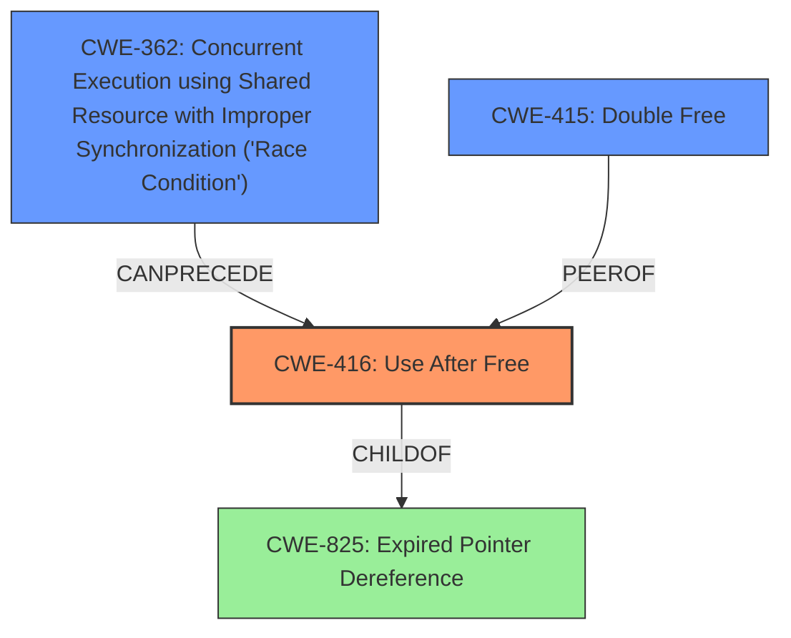

# Analysis for CVE-2022-1734

# Summary
| CWE ID | CWE Name | Confidence | CWE Abstraction Level | CWE Vulnerability Mapping Label | CWE-Vulnerability Mapping Notes |
|---|---|---|---|---|---|
| CWE-416 | Use After Free | 1.0 | Variant | Allowed | Primary CWE |
| CWE-362 | Concurrent Execution using Shared Resource with Improper Synchronization ('Race Condition') | 0.7 | Class | Allowed-with-Review | Secondary Candidate |
| CWE-415 | Double Free | 0.6 | Variant | Allowed | Secondary Candidate |

## Evidence and Confidence

*   **Confidence Score:** 0.9
*   **Evidence Strength:** HIGH

## Relationship Analysis
The primary weakness is **CWE-416 (Use After Free)**. This is often caused by concurrent execution issues like **CWE-362 (Race Condition)** or can lead to memory corruption issues such as **CWE-415 (Double Free)**.



## Vulnerability Chain
The vulnerability chain starts with a **race condition** (**CWE-362**) due to unsynchronized cleanup and firmware download routines. This leads to a **use-after-free** (**CWE-416**) vulnerability, where memory is accessed after it has been freed. The use-after-free can further lead to a **double free** (**CWE-415**) or a **null pointer dereference**.

## Summary of Analysis
The analysis indicates a **use-after-free** vulnerability in the Linux kernel due to a lack of synchronization between cleanup and firmware download routines. The primary CWE is **CWE-416 (Use After Free)**, with **CWE-362 (Race Condition)** and **CWE-415 (Double Free)** as secondary contributing factors.

The evidence from the vulnerability description and CVE reference links strongly supports this classification:

*   "A flaw in Linux Kernel found in nfcmrvl_nci_unregister_dev() in drivers/nfc/nfcmrvl/main.c can lead to **use after free** both read or write when non synchronized between cleanup routine and firmware download routine."
*   "**weakness:** **use after free**"
*   CVE Reference Links Content Summary lists "Use-after-free", "Double-free", and "Null pointer dereference" as weaknesses.
*   The root cause is identified as "Destructive operations such as `nfcmrvl_fw_dnld_abort` and `gpio_free` in `nfcmrvl_nci_unregister_dev`. Resources such as firmware, gpio, etc. could be destructed while upper layer functions such as `nfcmrvl_fw_dnld_start` and `nfcmrvl_nci_recv_frame` are executing." This indicates a potential race condition.
*    "Race conditions in the nfcmrvl NFC driver"

**CWE-416 (Use After Free):** This is the primary weakness, as the vulnerability description explicitly mentions it. The re-use of memory after it has been freed is the core issue. The security implication is that an attacker can potentially control the contents of the freed memory, leading to arbitrary code execution or other malicious activities. The abstraction level is Variant, which is appropriate for a specific type of memory corruption.

**CWE-362 (Concurrent Execution using Shared Resource with Improper Synchronization ('Race Condition'))**: The vulnerability occurs due to missing synchronization between different routines which can lead to race conditions, making this a contributing factor. The abstraction level is Class, which is a higher level of abstraction, but still relevant given the context.

**CWE-415 (Double Free):** The CVE reference links mention "Double-free" as a related weakness. While not explicitly stated in the vulnerability description, it is a potential consequence of the use-after-free, increasing its relevance. The abstraction level is Variant.

Other CWEs considered but not used:

*   CWE-911 (Improper Update of Reference Count): This was considered because reference counting might be involved in memory management. However, the primary issue is the use of freed memory, not necessarily the incorrect updating of reference counts.
*   CWE-667 (Improper Locking): While locking issues can contribute to race conditions, the description focuses more on the use of freed memory than the locking mechanism itself.
*   CWE-909 (Missing Initialization of Resource): This is not the primary issue, as the problem arises after the resource has been used and freed, not during initialization.
*   CWE-123 (Write-what-where Condition): This could be a consequence of the use-after-free, but it is not the root cause.
*   CWE-367 (Time-of-check Time-of-use (TOCTOU) Race Condition): While a race condition exists, it doesn't specifically involve a check and subsequent use, making CWE-362 a better fit.
*   CWE-908 (Use of Uninitialized Resource): Similar to CWE-909, this is not the primary issue.
*   CWE-401 (Missing Release of Memory after Effective Lifetime): This is a memory leak, which is different from using memory after it has been freed.

The selection of **CWE-416** as the primary CWE is based on direct evidence from the vulnerability description. **CWE-362** and **CWE-415** are included as secondary CWEs due to their potential contribution to the vulnerability and their presence in the CVE reference links. The chosen CWEs are at the optimal level of specificity, with **CWE-416** being a Variant and **CWE-362** being a Class (due to the race condition context).

# Enhanced Query for CVE-2022-1734

## Vulnerability Description
A flaw in Linux Kernel found in nfcmrvl_nci_unregister_dev() in drivers/nfc/nfcmrvl/main.c can lead to **use after free** both read or write when non synchronized between cleanup routine and firmware download routine.

### Vulnerability Description Key Phrases
- **weakness:** **use after free**
- **product:** Linux Kernel
- **component:** nfcmrvl_nci_unregister_dev() in drivers/nfc/nfcmrvl/main.c

## CVE Reference Links Content Summary
```
{
  "vulnerability_details": [
    {
      "source": "security.netapp.com_0e40f2f9_20250108_120037.html",
      "root_cause": "Linux Kernel versions prior to 5.18:rc5 are susceptible to a vulnerability.",
      "weaknesses": [
        "Use-after-free",
        "Double-free",
	"Null pointer dereference"
      ],
      "impact": "Successful exploitation of this vulnerability could lead to disclosure of sensitive information, addition or modification of data, or Denial of Service (DoS).",
      "attack_vectors": "Local access to a vulnerable system",
      "attacker_capabilities": "Local access"
    },
    {
      "source": "github.com_7b0057b8_20250108_120037.html",
       "root_cause": "Destructive operations such as `nfcmrvl_fw_dnld_abort` and `gpio_free` in `nfcmrvl_nci_unregister_dev`. Resources such as firmware, gpio, etc. could be destructed while upper layer functions such as `nfcmrvl_fw_dnld_start` and `nfcmrvl_nci_recv_frame` are executing.",
      "weaknesses": [
        "Double-free",
        "Use-after-free",
        "Null-pointer-deref"
      ],
       "impact": "Crashes due to double-free, use-after-free and null-ptr-deref bugs",
      "attack_vectors": "NFC device simulation from user-space.",
      "attacker_capabilities": "Ability to simulate NFC device from user-space."
    },
    {
      "source": "www.openwall.com_64cb6486_20250108_120036.html",
      "root_cause": "Destructive operations such as `nfcmrvl_fw_dnld_abort` and `gpio_free` in `nfcmrvl_nci_unregister_dev`. The resources such as firmware, gpio and so on could be destructed while the upper layer functions such as `nfcmrvl_fw_dnld_start` and `nfcmrvl_nci_recv_frame` is executing.",
      "weaknesses": [
        "Double-free",
        "Use-after-free",
        "Null-ptr-deref"
      ],
      "impact": "Kernel crash",
     "attack_vectors": "Simulating NFC device from userspace",
      "attacker_capabilities": "Local user with ability to simulate an NFC device."
    },
    {
     "source": "www.debian.org_0b91a609_20250108_120038.html",
      "root_cause": "Race conditions in the nfcmrvl NFC driver",
      "weaknesses": [
        "Use-after-free",
        "Double-free",
        "Null pointer dereference"
      ],
       "impact": "Denial of service (crash or memory corruption) or possibly for privilege escalation.",
       "attack_vectors": "Local access to a vulnerable system",
      "attacker_capabilities": "Local user"
    },
    {
      "source": "www.openwall.com_a8283f6f_20250108_120036.html",
       "root_cause": "Destructive operations in `nfcmrvl_nci_unregister_dev` such as `nfcmrvl_fw_dnld_abort` and `gpio_free` can be executed concurrently with upper layer functions such as `nfcmrvl_fw_dnld_start` and `nfcmrvl_nci_recv_frame`.",
      "weaknesses": [
        "Double-free",
        "Use-after-free",
        "Null-ptr-deref"
      ],
      "impact": "Kernel crash",
       "attack_vectors": "Simulating NFC device from userspace",
       "attacker_capabilities":"Local user with ability to simulate an NFC device."
    }
  ]
}
```

## Retriever Results

### Top Combined Results

| Rank | CWE ID | Name | Abstraction | Usage  | Retrievers | Individual Scores |
|------|--------|------|-------------|-------|------------|-------------------|
| 1 | 362 | Concurrent Execution using Shared Resource with Improper Synchronization ('Race Condition') | Class | Allowed-with-Review | sparse | 0.211 |
| 2 | 415 | Double Free | Variant | Allowed | sparse | 0.209 |
| 3 | 911 | Improper Update of Reference Count | Base | Allowed | sparse | 0.205 |
| 4 | 667 | Improper Locking | Class | Allowed-with-Review | sparse | 0.199 |
| 5 | 416 | Use After Free | Variant | Allowed | sparse | 0.197 |
| 6 | 909 | Missing Initialization of Resource | Class | Allowed-with-Review | dense | 0.559 |
| 7 | 123 | Write-what-where Condition | Base | Allowed | graph | 0.003 |
| 8 | 367 | Time-of-check Time-of-use (TOCTOU) Race Condition | Base | Allowed | sparse | 0.192 |
| 9 | 908 | Use of Uninitialized Resource | Base | Allowed | sparse | 0.186 |
| 10 | 401 | Missing Release of Memory after Effective Lifetime | Variant | Allowed | sparse | 0.183 |


# Complete CWE Specifications


## CWE-362: Concurrent Execution using Shared Resource with Improper Synchronization ('Race Condition')
**Abstraction:** Class
**Status:** Draft

### Description
The product contains a concurrent code sequence that requires temporary, exclusive access to a shared resource, but a timing window exists in which the shared resource can be modified by another code sequence operating concurrently.

### Extended Description


A race condition occurs within concurrent environments, and it is effectively a property of a code sequence. Depending on the context, a code sequence may be in the form of a function call, a small number of instructions, a series of program invocations, etc.


A race condition violates these properties, which are closely related:


  - Exclusivity - the code sequence is given exclusive access to the shared resource, i.e., no other code sequence can modify properties of the shared resource before the original sequence has completed execution.

  - Atomicity - the code sequence is behaviorally atomic, i.e., no other thread or process can concurrently execute the same sequence of instructions (or a subset) against the same resource.

A race condition exists when an "interfering code sequence" can still access the shared resource, violating exclusivity.

The interfering code sequence could be "trusted" or "untrusted." A trusted interfering code sequence occurs within the product; it cannot be modified by the attacker, and it can only be invoked indirectly. An untrusted interfering code sequence can be authored directly by the attacker, and typically it is external to the vulnerable product.


### Alternative Terms
Race Condition

### Relationships
ChildOf -> CWE-691
CanPrecede -> CWE-416
CanPrecede -> CWE-476

### Mapping Guidance
**Usage:** Allowed-with-Review
**Rationale:** This CWE entry is a Class and might have Base-level children that would be more appropriate
**Comments:** Examine children of this entry to see if there is a better fit
**Reasons:**
- Abstraction


### Additional Notes
**[Maintenance]** The relationship between race conditions and synchronization problems (CWE-662) needs to be further developed. They are not necessarily two perspectives of the same core concept, since synchronization is only one technique for avoiding race conditions, and synchronization can be used for other purposes besides race condition prevention.

**[Research Gap]** Race conditions in web applications are under-studied and probably under-reported. However, in 2008 there has been growing interest in this area.

**[Research Gap]** Much of the focus of race condition research has been in Time-of-check Time-of-use (TOCTOU) variants (CWE-367), but many race conditions are related to synchronization problems that do not necessarily require a time-of-check.

**[Research Gap]** From a classification/taxonomy perspective, the relationships between concurrency and program state need closer investigation and may be useful in organizing related issues.


### Observed Examples
- **CVE-2022-29527:** Go application for cloud management creates a world-writable sudoers file that allows local attackers to inject sudo rules and escalate privileges to root by winning a race condition.
- **CVE-2021-1782:** Chain: improper locking (CWE-667) leads to race condition (CWE-362), as exploited in the wild per CISA KEV.
- **CVE-2021-0920:** Chain: mobile platform race condition (CWE-362) leading to use-after-free (CWE-416), as exploited in the wild per CISA KEV.


## CWE-415: Double Free
**Abstraction:** Variant
**Status:** Draft

### Description
The product calls free() twice on the same memory address, potentially leading to modification of unexpected memory locations.

### Extended Description
When a program calls free() twice with the same argument, the program's memory management data structures become corrupted. This corruption can cause the program to crash or, in some circumstances, cause two later calls to malloc() to return the same pointer. If malloc() returns the same value twice and the program later gives the attacker control over the data that is written into this doubly-allocated memory, the program becomes vulnerable to a buffer overflow attack.

### Alternative Terms
Double-free

### Relationships
ChildOf -> CWE-825
ChildOf -> CWE-1341
ChildOf -> CWE-672
ChildOf -> CWE-672
ChildOf -> CWE-672
ChildOf -> CWE-666
PeerOf -> CWE-416
PeerOf -> CWE-123

### Mapping Guidance
**Usage:** Allowed
**Rationale:** This CWE entry is at the Variant level of abstraction, which is a preferred level of abstraction for mapping to the root causes of vulnerabilities.
**Comments:** Carefully read both the name and description to ensure that this mapping is an appropriate fit. Do not try to 'force' a mapping to a lower-level Base/Variant simply to comply with this preferred level of abstraction.
**Reasons:**
- Acceptable-Use


### Additional Notes
**[Relationship]** This is usually resultant from another weakness, such as an unhandled error or race condition between threads. It could also be primary to weaknesses such as buffer overflows.

**[Theoretical]** It could be argued that Double Free would be most appropriately located as a child of "Use after Free", but "Use" and "Release" are considered to be distinct operations within vulnerability theory, therefore this is more accurately "Release of a Resource after Expiration or Release", which doesn't exist yet.


### Observed Examples
- **CVE-2006-5051:** Chain: Signal handler contains too much functionality (CWE-828), introducing a race condition (CWE-362) that leads to a double free (CWE-415).
- **CVE-2004-0642:** Double free resultant from certain error conditions.
- **CVE-2004-0772:** Double free resultant from certain error conditions.


## CWE-911: Improper Update of Reference Count
**Abstraction:** Base
**Status:** Incomplete

### Description
The product uses a reference count to manage a resource, but it does not update or incorrectly updates the reference count.

### Extended Description
Reference counts can be used when tracking how many objects contain a reference to a particular resource, such as in memory management or garbage collection. When the reference count reaches zero, the resource can be de-allocated or reused because there are no more objects that use it. If the reference count accidentally reaches zero, then the resource might be released too soon, even though it is still in use. If all objects no longer use the resource, but the reference count is not zero, then the resource might not ever be released.

### Alternative Terms
None

### Relationships
ChildOf -> CWE-664
CanPrecede -> CWE-672
CanPrecede -> CWE-772

### Mapping Guidance
**Usage:** Allowed
**Rationale:** This CWE entry is at the Base level of abstraction, which is a preferred level of abstraction for mapping to the root causes of vulnerabilities.
**Comments:** Carefully read both the name and description to ensure that this mapping is an appropriate fit. Do not try to 'force' a mapping to a lower-level Base/Variant simply to comply with this preferred level of abstraction.
**Reasons:**
- Acceptable-Use


### Observed Examples
- **CVE-2002-0574:** chain: reference count is not decremented, leading to memory leak in OS by sending ICMP packets.
- **CVE-2004-0114:** Reference count for shared memory not decremented when a function fails, potentially allowing unprivileged users to read kernel memory.
- **CVE-2006-3741:** chain: improper reference count tracking leads to file descriptor consumption


## CWE-667: Improper Locking
**Abstraction:** Class
**Status:** Draft

### Description
The product does not properly acquire or release a lock on a resource, leading to unexpected resource state changes and behaviors.

### Extended Description


Locking is a type of synchronization behavior that ensures that multiple independently-operating processes or threads do not interfere with each other when accessing the same resource. All processes/threads are expected to follow the same steps for locking. If these steps are not followed precisely - or if no locking is done at all - then another process/thread could modify the shared resource in a way that is not visible or predictable to the original process. This can lead to data or memory corruption, denial of service, etc.


### Alternative Terms
None

### Relationships
ChildOf -> CWE-662
ChildOf -> CWE-662
ChildOf -> CWE-662
ChildOf -> CWE-662

### Mapping Guidance
**Usage:** Allowed-with-Review
**Rationale:** This CWE entry is a Class and might have Base-level children that would be more appropriate
**Comments:** Examine children of this entry to see if there is a better fit
**Reasons:**
- Abstraction


### Additional Notes
**[Maintenance]** Deeper research is necessary for synchronization and related mechanisms, including locks, mutexes, semaphores, and other mechanisms. Multiple entries are dependent on this research, which includes relationships to concurrency, race conditions, reentrant functions, etc. CWE-662 and its children - including CWE-667, CWE-820, CWE-821, and others - may need to be modified significantly, along with their relationships.


### Observed Examples
- **CVE-2021-1782:** Chain: improper locking (CWE-667) leads to race condition (CWE-362), as exploited in the wild per CISA KEV.
- **CVE-2009-0935:** Attacker provides invalid address to a memory-reading function, causing a mutex to be unlocked twice
- **CVE-2010-4210:** function in OS kernel unlocks a mutex that was not previously locked, causing a panic or overwrite of arbitrary memory.


## CWE-416: Use After Free
**Abstraction:** Variant
**Status:** Stable

### Description
The product reuses or references memory after it has been freed. At some point afterward, the memory may be allocated again and saved in another pointer, while the original pointer references a location somewhere within the new allocation. Any operations using the original pointer are no longer valid because the memory "belongs" to the code that operates on the new pointer.

### Extended Description
Not provided

### Alternative Terms
Dangling pointer: a pointer that no longer points to valid memory, often after it has been freed
UAF: commonly used acronym for Use After Free
Use-After-Free

### Relationships
ChildOf -> CWE-825
ChildOf -> CWE-672
ChildOf -> CWE-672
ChildOf -> CWE-672
CanPrecede -> CWE-120
CanPrecede -> CWE-123

### Mapping Guidance
**Usage:** Allowed
**Rationale:** This CWE entry is at the Variant level of abstraction, which is a preferred level of abstraction for mapping to the root causes of vulnerabilities.
**Comments:** Carefully read both the name and description to ensure that this mapping is an appropriate fit. Do not try to 'force' a mapping to a lower-level Base/Variant simply to comply with this preferred level of abstraction.
**Reasons:**
- Acceptable-Use


### Observed Examples
- **CVE-2022-20141:** Chain: an operating system kernel has insufficent resource locking (CWE-413) leading to a use after free (CWE-416).
- **CVE-2022-2621:** Chain: two threads in a web browser use the same resource (CWE-366), but one of those threads can destroy the resource before the other has completed (CWE-416).
- **CVE-2021-0920:** Chain: mobile platform race condition (CWE-362) leading to use-after-free (CWE-416), as exploited in the wild per CISA KEV.


## CWE-909: Missing Initialization of Resource
**Abstraction:** Class
**Status:** Incomplete

### Description
The product does not initialize a critical resource.

### Extended Description
Many resources require initialization before they can be properly used. If a resource is not initialized, it could contain unpredictable or expired data, or it could be initialized to defaults that are invalid. This can have security implications when the resource is expected to have certain properties or values.

### Alternative Terms
None

### Relationships
ChildOf -> CWE-665
ChildOf -> CWE-665
CanPrecede -> CWE-908

### Mapping Guidance
**Usage:** Allowed-with-Review
**Rationale:** This CWE entry is a Class and might have Base-level children that would be more appropriate
**Comments:** Examine children of this entry to see if there is a better fit
**Reasons:**
- Abstraction


### Observed Examples
- **CVE-2020-20739:** A variable that has its value set in a conditional statement is sometimes used when the conditional fails, sometimes causing data leakage
- **CVE-2005-1036:** Chain: Bypass of access restrictions due to improper authorization (CWE-862) of a user results from an improperly initialized (CWE-909) I/O permission bitmap


## CWE-123: Write-what-where Condition
**Abstraction:** Base
**Status:** Draft

### Description
Any condition where the attacker has the ability to write an arbitrary value to an arbitrary location, often as the result of a buffer overflow.

### Extended Description
Not provided

### Alternative Terms
None

### Relationships
ChildOf -> CWE-787
ChildOf -> CWE-119
ChildOf -> CWE-119

### Mapping Guidance
**Usage:** Allowed
**Rationale:** This CWE entry is at the Base level of abstraction, which is a preferred level of abstraction for mapping to the root causes of vulnerabilities.
**Comments:** Carefully read both the name and description to ensure that this mapping is an appropriate fit. Do not try to 'force' a mapping to a lower-level Base/Variant simply to comply with this preferred level of abstraction.
**Reasons:**
- Acceptable-Use


### Observed Examples
- **CVE-2022-21668:** Chain: Python library does not limit the resources used to process images that specify a very large number of bands (CWE-1284), leading to excessive memory consumption (CWE-789) or an integer overflow (CWE-190).
- **CVE-2022-0545:** Chain: 3D renderer has an integer overflow (CWE-190) leading to write-what-where condition (CWE-123) using a crafted image.


## CWE-367: Time-of-check Time-of-use (TOCTOU) Race Condition
**Abstraction:** Base
**Status:** Incomplete

### Description
The product checks the state of a resource before using that resource, but the resource's state can change between the check and the use in a way that invalidates the results of the check. This can cause the product to perform invalid actions when the resource is in an unexpected state.

### Extended Description
This weakness can be security-relevant when an attacker can influence the state of the resource between check and use. This can happen with shared resources such as files, memory, or even variables in multithreaded programs.

### Alternative Terms
TOCTTOU: The TOCTTOU acronym expands to "Time Of Check To Time Of Use".
TOCCTOU: The TOCCTOU acronym is most likely a typo of TOCTTOU, but it has been used in some influential documents, so the typo is repeated fairly frequently.

### Relationships
ChildOf -> CWE-362
ChildOf -> CWE-362

### Mapping Guidance
**Usage:** Allowed
**Rationale:** This CWE entry is at the Base level of abstraction, which is a preferred level of abstraction for mapping to the root causes of vulnerabilities.
**Comments:** Carefully read both the name and description to ensure that this mapping is an appropriate fit. Do not try to 'force' a mapping to a lower-level Base/Variant simply to comply with this preferred level of abstraction.
**Reasons:**
- Acceptable-Use


### Additional Notes
**[Relationship]** TOCTOU issues do not always involve symlinks, and not every symlink issue is a TOCTOU problem.

**[Research Gap]** Non-symlink TOCTOU issues are not reported frequently, but they are likely to occur in code that attempts to be secure.


### Observed Examples
- **CVE-2015-1743:** TOCTOU in sandbox process allows installation of untrusted browser add-ons by replacing a file after it has been verified, but before it is executed
- **CVE-2003-0813:** A multi-threaded race condition allows remote attackers to cause a denial of service (crash or reboot) by causing two threads to process the same RPC request, which causes one thread to use memory after it has been freed.
- **CVE-2004-0594:** PHP flaw allows remote attackers to execute arbitrary code by aborting execution before the initialization of key data structures is complete.


## CWE-908: Use of Uninitialized Resource
**Abstraction:** Base
**Status:** Incomplete

### Description
The product uses or accesses a resource that has not been initialized.

### Extended Description
When a resource has not been properly initialized, the product may behave unexpectedly. This may lead to a crash or invalid memory access, but the consequences vary depending on the type of resource and how it is used within the product.

### Alternative Terms
None

### Relationships
ChildOf -> CWE-665
ChildOf -> CWE-665

### Mapping Guidance
**Usage:** Allowed
**Rationale:** This CWE entry is at the Base level of abstraction, which is a preferred level of abstraction for mapping to the root causes of vulnerabilities.
**Comments:** Carefully read both the name and description to ensure that this mapping is an appropriate fit. Do not try to 'force' a mapping to a lower-level Base/Variant simply to comply with this preferred level of abstraction.
**Reasons:**
- Acceptable-Use


### Observed Examples
- **CVE-2019-9805:** Chain: Creation of the packet client occurs before initialization is complete (CWE-696) resulting in a read from uninitialized memory (CWE-908), causing memory corruption.
- **CVE-2008-4197:** Use of uninitialized memory may allow code execution.
- **CVE-2008-2934:** Free of an uninitialized pointer leads to crash and possible code execution.


## CWE-401: Missing Release of Memory after Effective Lifetime
**Abstraction:** Variant
**Status:** Draft

### Description
The product does not sufficiently track and release allocated memory after it has been used, which slowly consumes remaining memory.

### Extended Description
This is often triggered by improper handling of malformed data or unexpectedly interrupted sessions. In some languages, developers are responsible for tracking memory allocation and releasing the memory. If there are no more pointers or references to the memory, then it can no longer be tracked and identified for release.

### Alternative Terms
Memory Leak

### Relationships
ChildOf -> CWE-772
ChildOf -> CWE-404
ChildOf -> CWE-404

### Mapping Guidance
**Usage:** Allowed
**Rationale:** This CWE entry is at the Variant level of abstraction, which is a preferred level of abstraction for mapping to the root causes of vulnerabilities.
**Comments:** Carefully read both the name and description to ensure that this mapping is an appropriate fit. Do not try to 'force' a mapping to a lower-level Base/Variant simply to comply with this preferred level of abstraction.
**Reasons:**
- Acceptable-Use


### Additional Notes
**[Relationship]** This is often a resultant weakness due to improper handling of malformed data or early termination of sessions.

**[Terminology]** "memory leak" has sometimes been used to describe other kinds of issues, e.g. for information leaks in which the contents of memory are inadvertently leaked (CVE-2003-0400 is one such example of this terminology conflict).


### Observed Examples
- **CVE-2005-3119:** Memory leak because function does not free() an element of a data structure.
- **CVE-2004-0427:** Memory leak when counter variable is not decremented.
- **CVE-2002-0574:** chain: reference count is not decremented, leading to memory leak in OS by sending ICMP packets.

