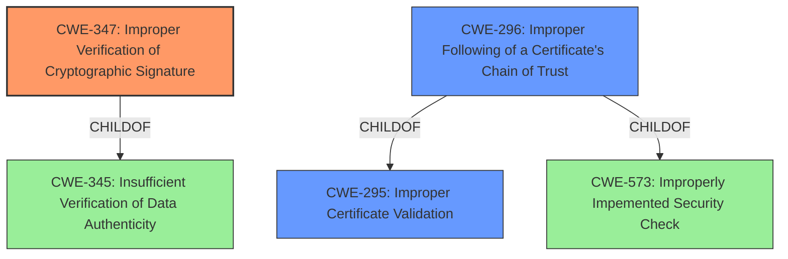

# Raw Analyzer Response for CVE-2022-1739

# Summary
| CWE ID | CWE Name | Confidence | CWE Abstraction Level | CWE Vulnerability Mapping Label | CWE-Vulnerability Mapping Notes |
|---|---|---|---|---|---|
| CWE-347 | Improper Verification of Cryptographic Signature | 1.0 | Base | Allowed | Primary CWE |
| CWE-296 | Improper Following of a Certificate's Chain of Trust | 0.7 | Base | Allowed | Secondary Candidate |
| CWE-295 | Improper Certificate Validation | 0.6 | Base | Allowed | Secondary Candidate |

## Evidence and Confidence

*   **Confidence Score:** 0.9
*   **Evidence Strength:** HIGH

## Relationship Analysis
The primary CWE, CWE-347, is a base-level weakness that directly reflects the **improper** or **missing verification** of cryptographic signatures. It is a child of the class CWE-345, Insufficient Verification of Data Authenticity, which is a broader category.

CWE-296, Improper Following of a Certificate's Chain of Trust, is also relevant as the description mentions a "trusted root certificate," implying that the chain of trust is not being properly validated. CWE-296 is a child of CWE-295 and CWE-573.

CWE-295, Improper Certificate Validation, is a more general weakness that could also apply, as the vulnerability involves a failure to properly validate certificates. CWE-295 is a parent of CWE-296.

## Vulnerability Chain
The vulnerability chain starts with the **failure to validate application signatures to a trusted root certificate** (CWE-347). This leads to the possibility of installing malicious code. The malicious code could then be spread to other vulnerable devices via removable media.

## Summary of Analysis
The primary assessment is based on the explicit statement in the vulnerability description that the ImageCast X **does not validate application signatures to a trusted root certificate**. This aligns directly with the definition of CWE-347, Improper Verification of Cryptographic Signature.

The "CVE Reference Links Content Summary" section confirms this by stating: "The ImageCast X **does not validate application signatures to a trusted root certificate**," and lists "Improper Verification of Cryptographic Signature (CWE-347)" as a weakness.

The graph relationships influenced the selection by highlighting the connection between CWE-347 and its parent CWE-345 and child CWE-296.

CWE-347 is chosen as the primary CWE because it is the most specific and accurate representation of the **root cause** described in the vulnerability. The other CWEs were considered as secondary issues that could be present because of the primary CWE-347.

Relevant CWE Information:
- CWE-347: Improper Verification of Cryptographic Signature: This is the primary CWE because the system **does not validate application signatures**.
- CWE-296: Improper Following of a Certificate's Chain of Trust: This is a secondary CWE because the system **does not follow the chain of trust back to the root certificate**.
- CWE-295: Improper Certificate Validation: This is a secondary CWE because the system **does not validate certificates**.