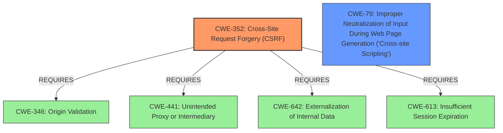

# Enhanced Analysis for CVE-2022-1764

# Summary
| CWE ID | CWE Name | Confidence | CWE Abstraction Level | CWE Vulnerability Mapping Label | CWE-Vulnerability Mapping Notes |
|---|---|---|---|---|---|
| CWE-352 | Cross-Site Request Forgery (CSRF) | 1.0 | Compound | Allowed | Primary CWE |
| CWE-79 | Improper Neutralization of Input During Web Page Generation ('Cross-site Scripting') | 1.0 | Base | Allowed | Secondary Candidate |

## Evidence and Confidence

*   **Confidence Score:** 1.0
*   **Evidence Strength:** HIGH

## Relationship Analysis
The primary weakness identified is CWE-352 [CWE-352: Cross-Site Request Forgery (CSRF)], which is a Compound weakness. This weakness **requires** CWE-346, CWE-441, CWE-642 and CWE-613. The secondary weakness is CWE-79 [CWE-79: Improper Neutralization of Input During Web Page Generation ('Cross-site Scripting')], which is a Base level weakness.



## Vulnerability Chain
The vulnerability chain starts with the **lack of CSRF protection**, leading to the possibility of attackers tricking logged-in admins into changing settings. This leads to Stored Cross-Site Scripting due to the **lack of sanitization and escaping**.

## Summary of Analysis
The analysis is based on the provided evidence, specifically the "Vulnerability Description Key Phrases" and the "CVE Reference Links Content Summary." The description clearly states the **root cause** as the **lack of CSRF protection** and the resulting **weakness** as Cross-Site Scripting.

The selection of CWE-352 [CWE-352: Cross-Site Request Forgery (CSRF)] is strongly supported by the "CVE Reference Links Content Summary," which mentions the **lack of CSRF protection** when updating settings. This aligns perfectly with the description of CWE-352 [CWE-352: Cross-Site Request Forgery (CSRF)], which describes a scenario where a web application doesn't sufficiently verify if a request was intentionally provided by the user.

The selection of CWE-79 [CWE-79: Improper Neutralization of Input During Web Page Generation ('Cross-site Scripting')] is based on the **lack of sanitisation and escaping**, which leads to Stored Cross-Site Scripting. The attacker can inject malicious JavaScript code into the plugin's settings, which will then be executed in the context of the admin's browser.

The selected CWEs are at the optimal level of specificity. CWE-352 [CWE-352: Cross-Site Request Forgery (CSRF)] is a Compound weakness representing the **lack of CSRF protection**, and CWE-79 [CWE-79: Improper Neutralization of Input During Web Page Generation ('Cross-site Scripting')] is a Base weakness representing the **lack of sanitization and escaping**.

Other CWEs Considered but Not Used:

*   CWE-116 [CWE-116: Improper Encoding or Escaping of Output]: While related to the XSS aspect, it's a more general class. CWE-79 [CWE-79: Improper Neutralization of Input During Web Page Generation ('Cross-site Scripting')] is more specific to the context of web page generation.
*   CWE-434 [CWE-434: Unrestricted Upload of File with Dangerous Type]: Not applicable as the vulnerability doesn't involve file uploads.
*   CWE-472 [CWE-472: External Control of Assumed-Immutable Web Parameter]: While settings are being modified this is related to the CSRF attack vector and not a MAID attack vector.
*   CWE-862 [CWE-862: Missing Authorization] and CWE-425 [CWE-425: Direct Request ('Forced Browsing')]: These are not appropriate because the issue isn't about missing authorization checks in general, but specifically about the **lack of CSRF protection**. The logged-in admin has authorization, but is tricked into making unwanted changes.


## CWE Relationship Analysis

Current CWEs represent these abstraction levels: .


### Vulnerability Chain Analysis

**Chain starting from CWE-862:**
- 862 (Missing Authorization) - ROOT


**Chain starting from CWE-425:**
- 425 (Direct Request ('Forced Browsing')) - ROOT


### CWE Relationship Diagram

```mermaid
graph TD
    classDef primary fill:#f96,stroke:#333,stroke-width:2px
    classDef secondary fill:#69f,stroke:#333
    classDef tertiary fill:#9e9,stroke:#333
```