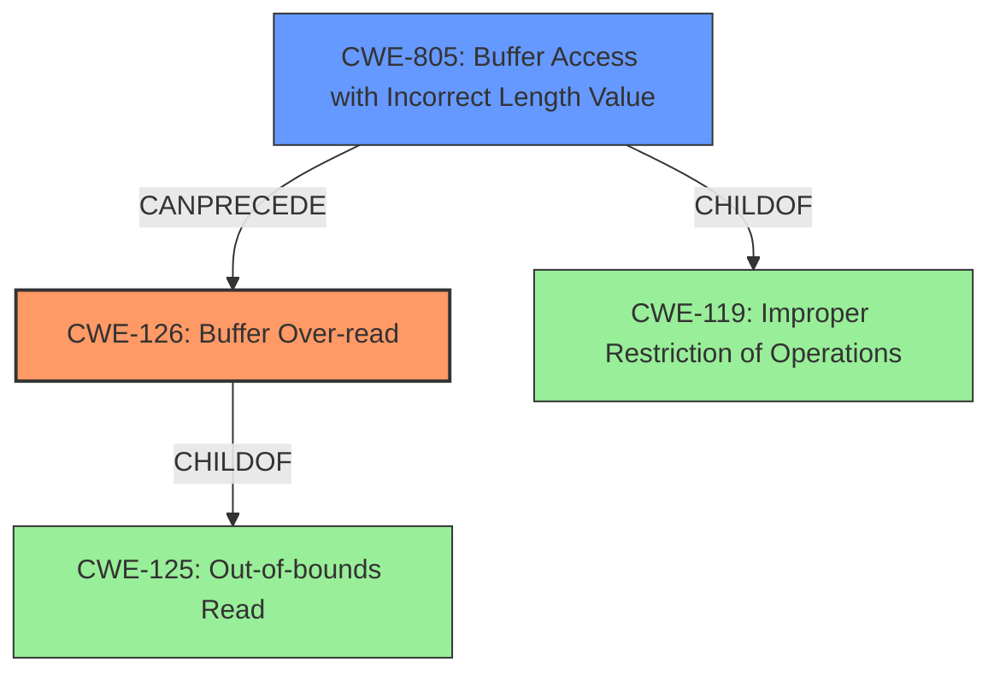

# Analysis for CVE-2022-1769

# Summary
| CWE ID | CWE Name | Confidence | CWE Abstraction Level | CWE Vulnerability Mapping Label | CWE-Vulnerability Mapping Notes |
|---|---|---|---|---|---|
| CWE-126 | Buffer Over-read | 1.0 | Variant | Allowed | Primary CWE |
| CWE-805 | Buffer Access with Incorrect Length Value | 0.75 | Base | Allowed | Secondary Candidate |

## Evidence and Confidence

*   **Confidence Score:** 0.9
*   **Evidence Strength:** HIGH

## Relationship Analysis
The primary CWE is CWE-126, which is a variant of CWE-125 (Out-of-bounds Read). CWE-805 is a potential contributing factor, representing the **incorrect length value** used during buffer access which is the **root cause** of the **buffer over-read.** CWE-805 is a base CWE and a child of CWE-119 (Improper Restriction of Operations within the Bounds of a Memory Buffer).

## Vulnerability Chain
The vulnerability chain starts with **incorrect length calculation** (potentially CWE-805), which leads to a **buffer over-read** (CWE-126), and finally results in a denial of service or potentially remote code execution.

## Summary of Analysis
The initial analysis clearly points to a **buffer over-read** vulnerability in Vim. The description states, "Buffer Over-read in GitHub repository vim/vim prior to 8.2.4974." The CVE Reference Links Content Summary further supports this by stating, "A **buffer over-read** vulnerability exists in the `scriptfile.c` file of Vim... Specifically, it involves an **improper calculation of the length** of the text being read from the source file."

The retriever results also suggest CWE-126 (Buffer Over-read) as the top candidate. The mapping guidance for CWE-126 allows its usage, and it is at the Variant level of abstraction, which is preferred.

CWE-805 (Buffer Access with Incorrect Length Value) is considered as a secondary CWE because the **improper calculation of the length** is what causes the **buffer over-read.**

CWE-125 (Out-of-bounds Read) was considered but not selected as the primary CWE because CWE-126 is a more specific variant of CWE-125.

The selected CWEs are at the optimal level of specificity, as CWE-126 directly addresses the type of vulnerability (over-read), and CWE-805 explains the root cause (**incorrect length value**).

Relevant CWE Information:

## CWE-805: Buffer Access with Incorrect Length Value
**Abstraction Level**: Base
**Similarity Score**: 0.81
**Source**: dense

**Description**:
The product uses a sequential operation to read or write a buffer, but it uses an **incorrect length value** that causes it to access memory that is outside of the bounds of the buffer.

**Mapping Guidance**:
- Usage: Allowed
- Rationale: This CWE entry is at the Base level of abstraction, which is a preferred level of abstraction for mapping to the root causes of vulnerabilities.

## CWE-126: Buffer Over-read
**Abstraction Level**: Variant
**Similarity Score**: 0.79
**Source**: dense

**Description**:
The product reads from a buffer using buffer access mechanisms such as indexes or pointers that reference memory locations after the targeted buffer.

**Mapping Guidance**:
- Usage: Allowed
- Rationale: This CWE entry is at the Variant level of abstraction, which is a preferred level of abstraction for mapping to the root causes of vulnerabilities.