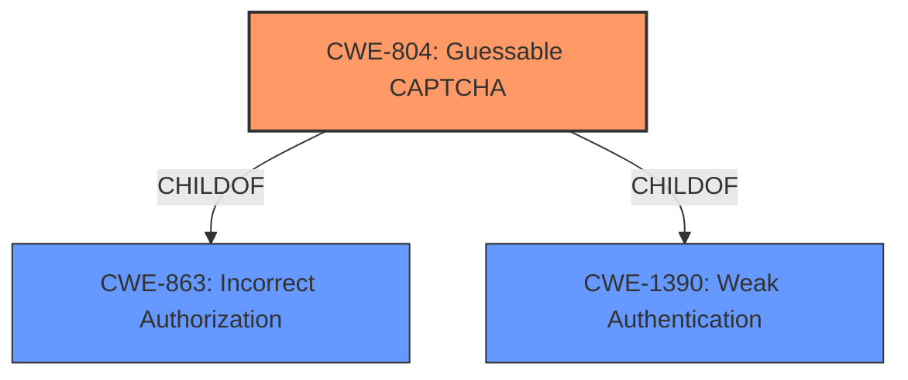

# Analysis for CVE-2022-1801

# Summary
| CWE ID | CWE Name | Confidence | CWE Abstraction Level | CWE Vulnerability Mapping Label | CWE-Vulnerability Mapping Notes |
|---|---|---|---|---|---|
| CWE-804 | Guessable CAPTCHA | 1.0 | Base | Allowed | Primary CWE |

## Evidence and Confidence

*   **Confidence Score:** 1.0
*   **Evidence Strength:** HIGH

## Relationship Analysis
The primary relationship that influenced the selection was the ChildOf relationship where CWE-804 [Guessable CAPTCHA] is a child of CWE-863 [Incorrect Authorization] and CWE-1390 [Weak Authentication]. While the higher level Class CWEs are related to authentication and authorization, the base level CWE is the most specific and relevant.

## Vulnerability Chain
The vulnerability chain is as follows:
1.  **Root Cause:** The plugin exposes the captcha solution as hidden input fields and as plain text within the page's HTML, leading to a **Guessable CAPTCHA (CWE-804)**.
2.  **Impact:** Attackers can bypass the captcha protection.
3.  **Result:** Automated bots submit spam messages through the contact form.

## Summary of Analysis
The initial analysis and resulting conclusion centers on the plugin's **failure** to adequately protect the CAPTCHA solution. This allows attackers to bypass the CAPTCHA and submit spam.

The vulnerability description states: "The Very Simple Contact Form WordPress plugin before 11.6 exposes the solution to the captcha in the rendered contact form, both as hidden input fields and as plain text in the page, making it very easy for bots to bypass the captcha check, rendering the page a likely target for spam bots."

The "CVE Reference Links Content Summary" provides further evidence: "The plugin exposes the captcha solution as hidden input fields and as plain text within the page's HTML," and "Captcha bypass vulnerability. The captcha solution is directly accessible within the HTML source code of the contact form."

The graph relationships show that CWE-804 [Guessable CAPTCHA] is a child of both CWE-863 [Incorrect Authorization] and CWE-1390 [Weak Authentication]. This suggests that the **failure** to protect the CAPTCHA solution leads to a breakdown in both authorization and authentication mechanisms, but the most specific issue is the guessable CAPTCHA.

The selected CWE, CWE-804 [Guessable CAPTCHA], is at the optimal level of specificity because it directly addresses the root cause of the vulnerability: the CAPTCHA is easily bypassed due to its solution being exposed. The other CWEs considered were at a higher level of abstraction.

Relevant CWE Information:

# Enhanced Context (25 CWEs)
The following CWEs were identified as potentially relevant to this vulnerability:

## CWE-472: External Control of Assumed-Immutable Web Parameter
**Abstraction Level**: Base
**Similarity Score**: 0.77
**Source**: dense

**Description**:
The web application does not sufficiently verify inputs that are assumed to be immutable but are actually externally controllable, such as hidden form fields.

**Mapping Guidance**:
- Usage: Allowed
- Rationale: This CWE entry is at the Base level of abstraction, which is a preferred level of abstraction for mapping to the root causes of vulnerabilities.

## CWE-804: Guessable CAPTCHA
**Abstraction Level**: Base
**Status**: Incomplete

### Description
The product uses a CAPTCHA challenge, but the challenge can be guessed or automatically recognized by a non-human actor.

### Extended Description
An automated attacker could bypass the intended protection of the CAPTCHA challenge and perform actions at a higher frequency than humanly possible, such as launching spam attacks.

### Alternative Terms
None

### Relationships
ChildOf -> CWE-863
ChildOf -> CWE-1390

### Mapping Guidance
**Usage**: Allowed
**Rationale**: This CWE entry is at the Base level of abstraction, which is a preferred level of abstraction for mapping to the root causes of vulnerabilities.
**Comments**: Carefully read both the name and description to ensure that this mapping is an appropriate fit. Do not try to 'force' a mapping to a lower-level Base/Variant simply to comply with this preferred level of abstraction.
**Reasons**:
- Acceptable-Use

### Observed Examples
- **CVE-2022-4036**: Chain: appointment booking app uses a weak hash (CWE-328) for generating a CAPTCHA, making it guessable (CWE-804)

### CWE Selection Justification
CWE-804 [Guessable CAPTCHA] is the most appropriate CWE because the captcha solution is directly exposed in the HTML source, making it trivial for bots to bypass the captcha mechanism. The CWE description perfectly matches the vulnerability: "The product uses a CAPTCHA challenge, but the challenge can be guessed or automatically recognized by a non-human actor." This leads to the security implication of allowing automated attackers to bypass the captcha and submit spam.

The other CWEs listed, such as CWE-472 [External Control of Assumed-Immutable Web Parameter], CWE-863 [Incorrect Authorization], CWE-1390 [Weak Authentication], and CWE-306 [Missing Authentication for Critical Function], are less specific to the **root cause** of the vulnerability. While there may be some overlap (e.g., **incorrect authorization** due to the CAPTCHA being bypassed), the most direct and descriptive CWE is CWE-804 [Guessable CAPTCHA].