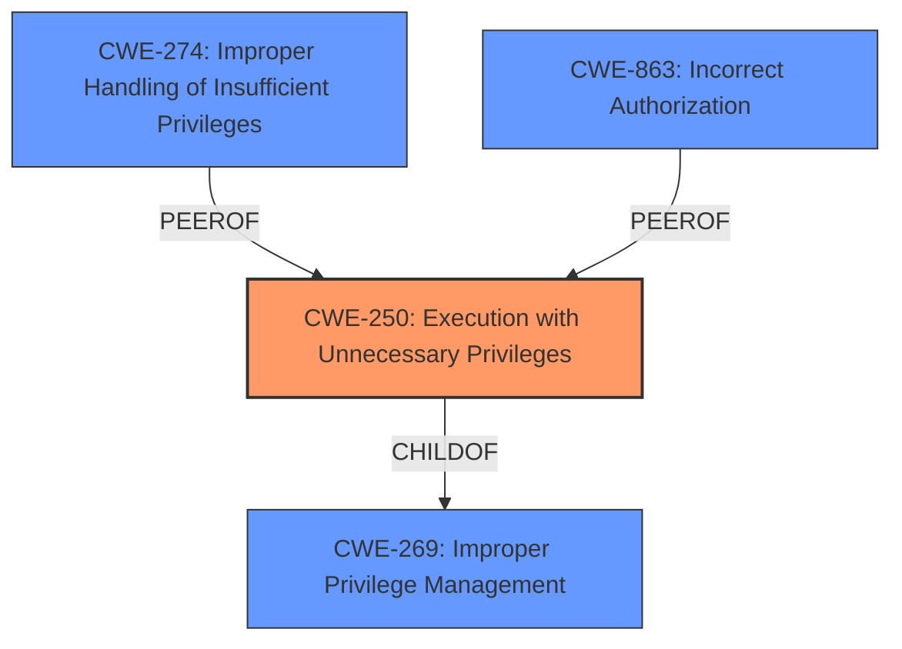

# Enhanced Analysis for CVE-2022-1808

# Summary
| CWE ID | CWE Name | Confidence | CWE Abstraction Level | CWE Vulnerability Mapping Label | CWE-Vulnerability Mapping Notes |
|---|---|---|---|---|---|
| CWE-250 | Execution with Unnecessary Privileges | 0.8 | Base | Allowed | Primary CWE. The code was running with higher privileges than necessary, which allowed the subscription/unsubscription of users to tickets without proper validation. |
| CWE-274 | Improper Handling of Insufficient Privileges | 0.4 | Base | Discouraged | Secondary candidate.  The vulnerability could be seen as the application not properly handling the case where the user did not have sufficient privileges to subscribe or unsubscribe other users, however, the primary issue is the **unnecessary privileges** the code was running under, allowing this action to be attempted in the first place. |
| CWE-863 | Incorrect Authorization | 0.3 | Class | Allowed-with-Review | Secondary candidate. While the code performs a check (after the fix), the underlying issue is the **unnecessary privilege** that allows the code to attempt modifying subscriptions for other users without prior validation of user existence. |

## Evidence and Confidence

*   **Confidence Score:** 0.8
*   **Evidence Strength:** HIGH

## Relationship Analysis
The primary relationship that impacted the decision was the hierarchical relationship between CWE-250 and its parent CWE-269 (Improper Privilege Management). While CWE-269 is a broader category, CWE-250 specifically addresses the scenario where a process is running with **unnecessary privileges**. The chain of events is that the code was executing with privileges that allowed it to attempt actions on user subscriptions without validating if the user exists.



## Vulnerability Chain
The vulnerability chain starts with the **root cause** of **unnecessary privileges**. This leads to the weakness of missing user validation. The impact of this weakness is the potential for unauthorized subscription manipulation.

## Summary of Analysis
The analysis is based on the provided evidence, specifically the "Vulnerability Description Key Phrases" which identifies "**unnecessary privileges**" as the root cause and the "CVE Reference Links Content Summary" which shows that the code was modifying user subscriptions without validating user existence.

The graph relationships highlight that CWE-250 is a more specific case of CWE-269, and addresses the root cause more accurately than just "improper privilege management".

The selected CWE is at the optimal level of specificity because it directly reflects the identified root cause: the code was running with **unnecessary privileges**, allowing the subscription modification to be attempted without user validation. This directly aligns with the description of CWE-250.

Relevant CWE Information:

*   CWE-274: Improper Handling of Insufficient Privileges was considered but not used as the primary CWE because the issue is not about the application failing to handle insufficient privileges, but about the code having more privileges than it needs.
*   CWE-863: Incorrect Authorization was considered but not used as the primary CWE because the authorization check was missing in the first place; the code should not have even attempted to modify other user's subscriptions without existence validation.


## CWE Relationship Analysis

Current CWEs represent these abstraction levels: .


### Vulnerability Chain Analysis

**Chain starting from CWE-269:**
- 269 (Improper Privilege Management) - ROOT


**Chain starting from CWE-250:**
- 250 (Execution with Unnecessary Privileges) - ROOT


### CWE Relationship Diagram

```mermaid
graph TD
    classDef primary fill:#f96,stroke:#333,stroke-width:2px
    classDef secondary fill:#69f,stroke:#333
    classDef tertiary fill:#9e9,stroke:#333
```