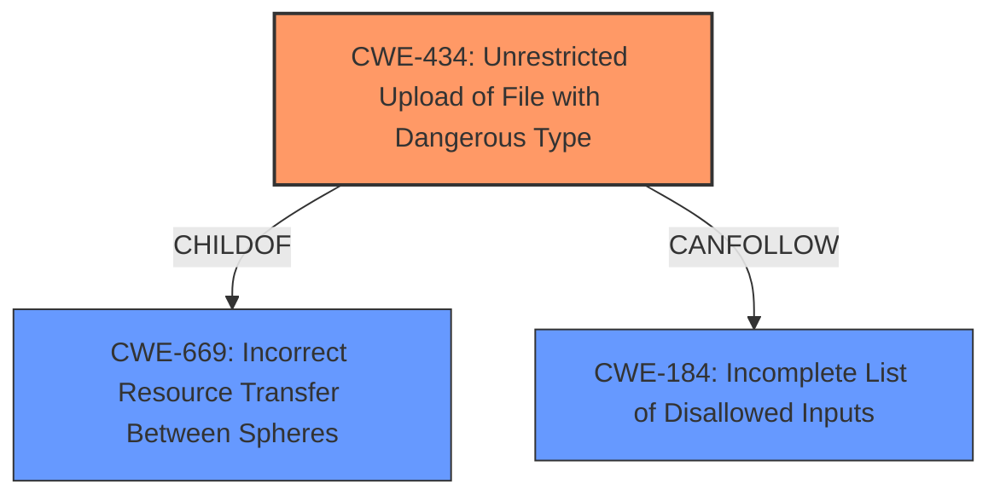

# Analysis Report for CVE-2022-1811

# Vulnerability Analysis Report: CVE-2022-1811

## Description


## Analysis (with Relationship Data)

# Summary

| CWE ID  | CWE Name                                          | Confidence | CWE Abstraction Level | CWE Vulnerability Mapping Label | CWE-Vulnerability Mapping Notes |
| ------- | ------------------------------------------------- | ---------- | --------------------- | ------------------------------- | ------------------------------- |
| CWE-434 | Unrestricted Upload of File with Dangerous Type | 1          | Base                  | Allowed                         | Primary CWE                     |

## Evidence and Confidence

*   **Confidence Score:** 1
*   **Evidence Strength:** HIGH

## Relationship Analysis

The primary relationship influencing the decision is the direct match of the vulnerability description to CWE-434. CWE-434 is a base-level CWE, which is the preferred level of abstraction. Other relationships, such as the chaining relationship of CWE-434 with CWE-184 (Incomplete List of Disallowed Inputs), are relevant but secondary. The absence of more specific Variant-level CWEs that fit the description further supports the selection of CWE-434.



## Vulnerability Chain

The vulnerability chain begins with the **unrestricted upload of a file with a dangerous type** (CWE-434). This is due to **inadequate content type validation**, where the application **does not properly enforce** content type restrictions, particularly for non-image files. This leads to the ability to upload malicious HTML files disguised as text/plain. The potential impact is the injection of malicious HTML content, potentially leading to XSS.

## Summary of Analysis

The analysis is primarily based on the provided evidence, specifically the "Vulnerability Description Key Phrases" and the "CVE Reference Links Content Summary." The key phrase "**unrestricted upload of file with dangerous type**" directly corresponds to CWE-434. The CVE summary details how the application **fails to properly validate** the content type of uploaded files, allowing a bypass of intended restrictions.

The relationship graph influenced the selection by highlighting the direct parent-child relationship between CWE-434 and CWE-669, but CWE-434 is the more specific and relevant root cause. The potential chaining with CWE-184 is noted but not selected as a primary CWE because the core issue is the lack of proper restriction on file types, not necessarily an incomplete list of disallowed inputs.

CWE-434 is at the optimal level of specificity because it directly describes the **root cause** of the vulnerability: the ability to upload dangerous file types without proper restrictions. The evidence clearly supports this classification, and the CWE's description aligns precisely with the vulnerability's characteristics.

Relevant CWE Information:

# Enhanced Context (25 CWEs)

## CWE-434: Unrestricted Upload of File with Dangerous Type
**Abstraction:** Base
**Similarity Score**: 0.79
**Source**: dense

**Description**:
The product allows the upload or transfer of dangerous file types that are automatically processed within its environment.

**Mapping Guidance**:
- Usage: Allowed
- Rationale: This CWE entry is at the Base level of abstraction, which is a preferred level of abstraction for mapping to the root causes of vulnerabilities.

## CWE-23: Relative Path Traversal
**Abstraction Level**: Base
**Similarity Score**: 0.79
**Source**: dense

**Description**:
The product uses external input to construct a pathname that should be within a restricted directory, but it does not properly neutralize sequences such as ".." that can resolve to a location that is outside of that directory.

**Mapping Guidance**:
- Usage: Allowed
- Rationale: This CWE entry is at the Base level of abstraction, which is a preferred level of abstraction for mapping to the root causes of vulnerabilities.

## CWE-22: Improper Limitation of a Pathname to a Restricted Directory ('Path Traversal')
**Abstraction Level**: Base
**Similarity Score**: 4.33
**Source**: graph

**Description**:
CWE-22: Improper Limitation of a Pathname to a Restricted Directory ('Path Traversal')

**Mapping Guidance**:
- Usage: Allowed
- Rationale: This CWE entry is at the Base level of abstraction, which is a preferred level of abstraction for mapping to the root causes of vulnerabilities.

**Relationships**:
- CANFOLLOW -> CWE-73
- PARENTOF -> CWE-36
- PARENTOF -> CWE-23
- CANFOLLOW -> CWE-20
- CANFOLLOW -> CWE-172

**Rationale for Not Using Other CWEs:**

*   **CWE-23 (Relative Path Traversal)** and **CWE-22 (Improper Limitation of a Pathname to a Restricted Directory)**: These CWEs relate to path traversal vulnerabilities, which are not the primary issue in this case. While a malicious file upload could potentially lead to path traversal if the file is mishandled, the root cause is the **lack of restrictions** on the file type itself.
*   **CWE-184 (Incomplete List of Disallowed Inputs)**: While this CWE could be considered, the vulnerability is more directly related to the **absence of proper validation** on file types, rather than an incomplete list. The application **fails to enforce** the content type, not just that it has an incomplete list.
*   **CWE-646 (Reliance on File Name or Extension of Externally-Supplied File)**: This is also related, as the application is bypassing the content type check. But ultimately it is **unrestricted file upload** that is the weakness.
*   **CWE-436 (Interpretation Conflict)**: This CWE is not appropriate because it deals with conflicts in how different products interpret data, not a **failure to validate** file types.
*   **CWE-749 (Exposed Dangerous Method or Function)**: This CWE is about exposing a dangerous method. While file upload functionality could be considered a "method," the core issue is not the exposure of the method itself, but the **lack of validation** on the uploaded file.


## CWE Relationship Analysis

Current CWEs represent these abstraction levels: .


### Vulnerability Chain Analysis

**Chain starting from CWE-646:**
- 646 (Reliance on File Name or Extension of Externally-Supplied File) - ROOT


**Chain starting from CWE-436:**
- 436 (Interpretation Conflict) - ROOT


### CWE Relationship Diagram

```mermaid
graph TD
    classDef primary fill:#f96,stroke:#333,stroke-width:2px
    classDef secondary fill:#69f,stroke:#333
    classDef tertiary fill:#9e9,stroke:#333
```


*Report generated on 2025-03-30 14:18:11*
