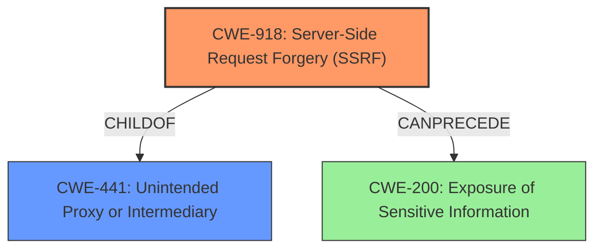

# Raw Analyzer Response for CVE-2022-1815

# Summary
| CWE ID | CWE Name | Confidence | CWE Abstraction Level | CWE Vulnerability Mapping Label | CWE-Vulnerability Mapping Notes |
|---|---|---|---|---|---|
| CWE-918 | Server-Side Request Forgery (SSRF) | 0.9 | Base | Allowed | Primary CWE |
| CWE-200 | Exposure of Sensitive Information to an Unauthorized Actor | 0.6 | Class | Discouraged | Secondary Candidate |

## Evidence and Confidence

*   **Confidence Score:** 0.8
*   **Evidence Strength:** HIGH

## Relationship Analysis
The primary relationship impacting the decision is the parent-child relationship between CWE-441 (Unintended Proxy or Intermediary ('Confused Deputy')) and CWE-918 (Server-Side Request Forgery (SSRF)), where SSRF is a specific type of confused deputy. CWE-200 (Exposure of Sensitive Information) is a class-level weakness that is too general, but related since SSRF can lead to information exposure. The Base abstraction level of CWE-918 is preferred over the Class level of CWE-200.

## Vulnerability Chain
The vulnerability chain starts with **insufficient validation** of the `exportUrl` obtained from environment variables. This leads to **insecure URL handling**, which then results in the potential for **Server-Side Request Forgery (SSRF)**. The SSRF can then lead to **information disclosure**, **denial of service**, and potentially **arbitrary file read**.

## Summary of Analysis
The initial assessment considered CWE-200 due to the "Exposure of Sensitive Information to an Unauthorized Actor" **impact**. However, the root cause is **insecure URL handling** that leads to SSRF. The CVE Reference Links Content Summary explicitly mentions the **lack of validation** of the `exportUrl`, allowing for arbitrary URLs to be used.

>   "Specifically, the code was not verifying that the URL starts with "http://" or "https://", allowing for potentially arbitrary URLs to be used in the export process."

This aligns directly with the description of CWE-918: "The web server receives a URL or similar request from an upstream component and retrieves the contents of this URL, but it does not sufficiently ensure that the request is being sent to the expected destination."

While SSRF can lead to information exposure, the root cause is the **improper handling of the URL**, making CWE-918 the more appropriate primary CWE. The abstraction level of CWE-918 (Base) is also preferred.

CWE-200 is a secondary concern because the SSRF *could* lead to information exposure, but that is a consequence of the SSRF, not the primary weakness. The mapping guidance for CWE-200 also discourages its use as a primary CWE when other more specific options are available.

**CWEs Considered But Not Used:**

*   CWE-200: Exposure of Sensitive Information to an Unauthorized Actor - While information exposure is a possible impact, it's a consequence of the SSRF, not the root cause. The mapping guidance discourages using CWE-200 as a primary weakness when more specific options exist.
*   CWE-359: Exposure of Private Personal Information to an Unauthorized Actor - Too specific; the exposed information isn't necessarily private or personal.
*   CWE-214: Invocation of Process Using Visible Sensitive Information - Doesn't fit; the vulnerability isn't about exposing sensitive information through process invocation.
*   CWE-497: Exposure of Sensitive System Information to an Unauthorized Control Sphere - The SSRF could *potentially* lead to the exposure of system information but the **rootcause** is that the application is making external requests to untrusted URLs.
*   CWE-527: Exposure of Version-Control Repository to an Unauthorized Control Sphere - Irrelevant; the vulnerability doesn't involve exposing a version control repository.
*   CWE-1272: Sensitive Information Uncleared Before Debug/Power State Transition - Irrelevant; no debug or power state transition is involved.
*   CWE-285: Improper Authorization - The authorization itself isn't necessarily incorrect, but the application is making external requests to untrusted URLs.
*   CWE-201: Insertion of Sensitive Information Into Sent Data - Doesn't fit; the vulnerability isn't about inserting sensitive information into sent data.
*   CWE-524: Use of Cache Containing Sensitive Information - Irrelevant; caching isn't involved.