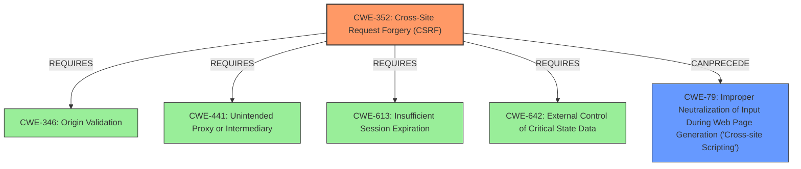

# Analysis for CVE-2022-1842

# Summary
| CWE ID | CWE Name | Confidence | CWE Abstraction Level | CWE Vulnerability Mapping Label | CWE-Vulnerability Mapping Notes |
|---|---|---|---|---|---|
| CWE-352 | Cross-Site Request Forgery (CSRF) | 1.0 | Compound | Allowed | Primary CWE |
| CWE-79 | Improper Neutralization of Input During Web Page Generation ('Cross-site Scripting') | 1.0 | Base | Allowed | Secondary CWE |

## Evidence and Confidence

*   **Confidence Score:** 1.0
*   **Evidence Strength:** HIGH

## Relationship Analysis
The primary weakness is CWE-352 [Cross-Site Request Forgery (CSRF)], a compound weakness. It requires other weaknesses to be present to be successful. The secondary weakness is CWE-79 [Improper Neutralization of Input During Web Page Generation ('Cross-site Scripting')], which can result from the lack of output sanitization. The relationship between these two is that CSRF can be used to inject malicious XSS payloads, leading to the stored XSS vulnerability.

## Vulnerability Chain
The vulnerability chain starts with the **lack of CSRF protection** (CWE-352), which allows an attacker to trick a logged-in admin into updating settings. Due to the **lack of sanitization and escaping** (leading to CWE-79), the attacker can inject malicious JavaScript, resulting in a stored XSS vulnerability. The final impact is the execution of arbitrary JavaScript code in the browsers of other users.

## Summary of Analysis
The initial assessment identified two CWEs: CWE-352 and CWE-79.

The vulnerability description clearly states the **root cause** as the **lack of CSRF protection** when updating plugin settings. The CVE Reference Links Content Summary confirms this, stating, "The plugin **lacks CSRF** (Cross-Site Request Forgery) protection when updating its settings." This aligns perfectly with CWE-352 [Cross-Site Request Forgery (CSRF)], which describes a web application's failure to verify if a request was intentionally provided by the user. The **Vulnerability Description Key Phrases** also highlight the "**lack of CSRF protection**."

The description also mentions that this leads to a stored Cross-Site Scripting vulnerability "due to the **lack of sanitisation and escaping** as well". The CVE Reference Links Content Summary further supports this, indicating "a **lack of sanitization and escaping** of user-supplied input." This directly corresponds to CWE-79 [Improper Neutralization of Input During Web Page Generation ('Cross-site Scripting')], where user-controllable input is not properly neutralized before being placed in a web page.

CWE-352 is a Compound weakness, and the Mapping Guidance states, "This is a well-known Composite of multiple weaknesses that must all occur simultaneously, although it is attack-oriented in nature." CWE-79 is a Base level weakness, and the Mapping Guidance states, "This CWE entry is at the Base level of abstraction, which is a preferred level of abstraction for mapping to the root causes of vulnerabilities."

I considered CWE-116 [Improper Encoding or Escaping of Output] but did not select it because CWE-79 is more specific to the web context. I also considered CWE-862 [Missing Authorization] but did not select it because the core issue is the lack of CSRF protection, which is more accurately represented by CWE-352.

The selected CWEs are at the optimal level of specificity, with CWE-352 capturing the primary weakness and CWE-79 addressing the secondary weakness related to the **lack of sanitization**. Both CWEs are supported by strong evidence from the vulnerability description and the CVE reference links.

Relevant CWE Information:

# Enhanced Context (25 CWEs)
The following CWEs were identified as potentially relevant to this vulnerability:

## CWE-807: Reliance on Untrusted Inputs in a Security Decision
**Abstraction Level**: Base
**Similarity Score**: 0.78
**Source**: dense

**Description**:
The product uses a protection mechanism that relies on the existence or values of an input, but the input can be modified by an untrusted actor in a way that bypasses the protection mechanism.

**Mapping Guidance**:
- Usage: Allowed
- Rationale: This CWE entry is at the Base level of abstraction, which is a preferred level of abstraction for mapping to the root causes of vulnerabilities.

## CWE-472: External Control of Assumed-Immutable Web Parameter
**Abstraction Level**: Base
**Similarity Score**: 0.78
**Source**: dense

**Description**:
The web application does not sufficiently verify inputs that are assumed to be immutable but are actually externally controllable, such as hidden form fields.

**Mapping Guidance**:
- Usage: Allowed
- Rationale: This CWE entry is at the Base level of abstraction, which is a preferred level of abstraction for mapping to the root causes of vulnerabilities.

## CWE-74: Improper Neutralization of Special Elements in Output Used by a Downstream Component ('Injection')
**Abstraction Level**: Class
**Similarity Score**: 0.77
**Source**: dense

**Description**:
The product constructs all or part of a command, data structure, or record using externally-influenced input from an upstream component, but it does not neutralize or incorrectly neutralizes special elements that could modify how it is parsed or interpreted when it is sent to a downstream component.

**Mapping Guidance**:
- Usage: Discouraged
- Rationale: CWE-74 is high-level and often misused when lower-level weaknesses are more appropriate.

## CWE-639: Authorization Bypass Through User-Controlled Key
**Abstraction Level**: Base
**Similarity Score**: 0.77
**Source**: dense

**Description**:
The system's authorization functionality does not prevent one user from gaining access to another user's data or record by modifying the key value identifying the data.

**Mapping Guidance**:
- Usage: Allowed
- Rationale: This CWE entry is at the Base level of abstraction, which is a preferred level of abstraction for mapping to the root causes of vulnerabilities.

## CWE-184: Incomplete List of Disallowed Inputs
**Abstraction Level**: Base
**Similarity Score**: 0.77
**Source**: dense

**Description**:
The product implements a protection mechanism that relies on a list of inputs (or properties of inputs) that are not allowed by policy or otherwise require other action to neutralize before additional processing takes place, but the list is incomplete.

**Mapping Guidance**:
- Usage: Allowed
- Rationale: This CWE entry is at the Base level of abstraction, which is a preferred level of abstraction for mapping to the root causes of vulnerabilities.

## CWE-1289: Improper Validation of Unsafe Equivalence in Input
**Abstraction Level**: Base
**Similarity Score**: 0.76
**Source**: dense

**Description**:
The product receives an input value that is used as a resource identifier or other type of reference, but it does not validate or incorrectly validates that the input is equivalent to a potentially-unsafe value.

**Mapping Guidance**:
- Usage: Allowed
- Rationale: This CWE entry is at the Base level of abstraction, which is a preferred level of abstraction for mapping to the root causes of vulnerabilities.

## CWE-183: Permissive List of Allowed Inputs
**Abstraction Level**: Base
**Similarity Score**: 0.76
**Source**: dense

**Description**:
The product implements a protection mechanism that relies on a list of inputs (or properties of inputs) that are explicitly allowed by policy because the inputs are assumed to be safe, but the list is too permissive - that is, it allows an input that is unsafe, leading to resultant weaknesses.

**Mapping Guidance**:
- Usage: Allowed
- Rationale: This CWE entry is at the Base level of abstraction, which is a preferred level of abstraction for mapping to the root causes of vulnerabilities.

## CWE-41