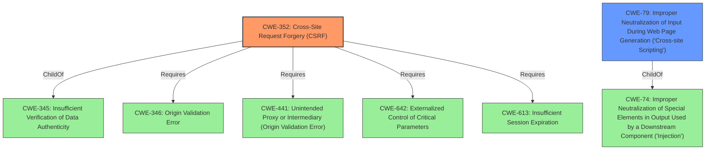

# Analysis for CVE-2022-1844

# Summary
| CWE ID | CWE Name | Confidence | CWE Abstraction Level | CWE Vulnerability Mapping Label | CWE-Vulnerability Mapping Notes |
|---|---|---|---|---|---|
| CWE-352 | Cross-Site Request Forgery (CSRF) | 1.0 | Compound | Allowed | Primary CWE |
| CWE-79 | Improper Neutralization of Input During Web Page Generation ('Cross-site Scripting') | 1.0 | Base | Allowed | Secondary CWE |

## Evidence and Confidence

*   **Confidence Score:** 1.0
*   **Evidence Strength:** HIGH

## Relationship Analysis
The primary weakness is CWE-352, Cross-Site Request Forgery, which is a Compound CWE. The secondary weakness is CWE-79, Improper Neutralization of Input During Web Page Generation ('Cross-site Scripting'), which is a Base CWE. CWE-352 Requires other weaknesses to be present to be exploited like CWE-346, CWE-441, CWE-642, and CWE-613. CWE-79 is a child of CWE-74 (Improper Neutralization of Special Elements in Output Used by a Downstream Component ('Injection')).

## Vulnerability Chain
The vulnerability chain starts with the **lack of CSRF protection** (CWE-352), which allows an attacker to make unauthorized changes to the plugin settings. This, combined with the **lack of sanitization and escaping**, leads to Stored Cross-Site Scripting (CWE-79).

## Summary of Analysis
The analysis identified two key weaknesses in the WP Sentry WordPress plugin: **lack of CSRF protection** (CWE-352) and **improper neutralization of input** leading to Stored Cross-Site Scripting (CWE-79).

The primary vulnerability is the **lack of CSRF protection**, allowing attackers to modify plugin settings without proper authorization. The **CVE Reference Links Content Summary** states, "The vulnerability stems from the **lack of CSRF (Cross-Site Request Forgery) protection** in the WP Sentry plugin when updating its settings." This aligns directly with the description of CWE-352, Cross-Site Request Forgery, which describes a web application that "does not sufficiently verify whether a well-formed, valid, consistent request was intentionally provided by the user who submitted the request."

The secondary vulnerability arises from the **lack of sanitization and escaping** of user input, leading to Stored Cross-Site Scripting. The **CVE Reference Links Content Summary** also notes, "Additionally, the plugin **lacks proper sanitization and escaping** of user-supplied input." This aligns with CWE-79, Improper Neutralization of Input During Web Page Generation ('Cross-site Scripting'), where the product "does not neutralize or incorrectly neutralizes user-controllable input before it is placed in output that is used as a web page that is served to other users."

The retriever results also supports these findings, with CWE-352 and CWE-79 listed as potential matches.

The choice of CWE-352 as the primary weakness is based on the clear evidence of missing CSRF protection. CWE-79 is a secondary weakness that is a consequence of the lack of input validation and output encoding.

The selected CWEs are at the optimal level of specificity. CWE-352 is a Compound weakness that accurately represents the combination of factors required for a CSRF attack. CWE-79 is a Base weakness that directly addresses the improper neutralization of input leading to XSS.

Other CWEs Considered:
- CWE-116 (Improper Encoding or Escaping of Output): Considered, but CWE-79 is more specific to the XSS issue.
- CWE-862 (Missing Authorization) and CWE-863 (Incorrect Authorization): While related, CWE-352 more accurately captures the root cause of the vulnerability.
- CWE-434 (Unrestricted Upload of File with Dangerous Type): Not relevant to this specific vulnerability.