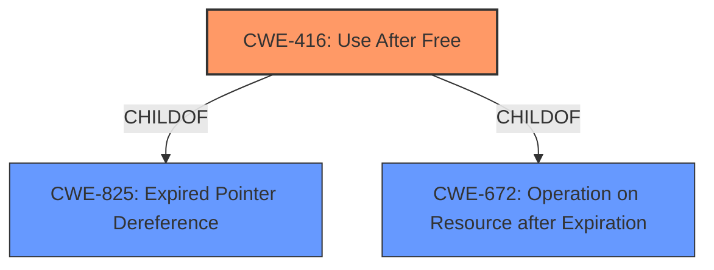

# Enhanced Analysis for CVE-2022-1859

# Summary
| CWE ID | CWE Name | Confidence | CWE Abstraction Level | CWE Vulnerability Mapping Label | CWE-Vulnerability Mapping Notes |
|---|---|---|---|---|---|
| CWE-416 | Use After Free | 1.0 | Variant | Allowed | Primary CWE |

## Evidence and Confidence

*   **Confidence Score:** 1.0
*   **Evidence Strength:** HIGH

## Relationship Analysis
The primary CWE is CWE-416, which is a Variant level CWE. It is a child of CWE-825 (Expired Pointer Dereference) and CWE-672 (Operation on Resource after Expiration). The description explicitly mentions "Use after free" which makes CWE-416 a strong match.



## Vulnerability Chain
The vulnerability chain starts with a **use-after-free** condition which leads to **heap corruption** that can be exploited by a remote attacker.

## Summary of Analysis
The vulnerability description clearly states that the root cause is "use after free." The "CVE Reference Links Content Summary" section also confirms this. The retriever results list CWE-416 as the top candidate. CWE-416 is a Variant level CWE, which is a preferred level of abstraction. The mapping guidance for CWE-416 states that it is ALLOWED and to carefully read the name and description to ensure that the mapping is an appropriate fit. The description of CWE-416 perfectly matches the vulnerability description. Therefore, CWE-416 is the most appropriate CWE.

Relevant CWE Information:

# Enhanced Context (25 CWEs)

## CWE-404: Improper Resource Shutdown or Release
**Abstraction Level**: Class
**Similarity Score**: 0.81
**Source**: dense
This CWE was considered but not selected because the vulnerability is not about improper resource shutdown or release, but rather using memory after it has been freed.

## CWE-226: Sensitive Information in Resource Not Removed Before Reuse
**Abstraction Level**: Base
**Similarity Score**: 0.79
**Source**: dense
This CWE was considered but not selected because the vulnerability is not about sensitive information being leaked, but rather using memory after it has been freed.

## CWE-366: Race Condition within a Thread
**Abstraction Level**: Base
**Similarity Score**: 0.77
**Source**: dense
This CWE was considered but not selected because there is no explicit mention of a race condition in the description, although race conditions can sometimes *lead* to use-after-free vulnerabilities.

## CWE-667: Improper Locking
**Abstraction Level**: Class
**Similarity Score**: 0.77
**Source**: dense
This CWE was considered but not selected because the vulnerability is not related to improper locking mechanisms.

## CWE-664: Improper Control of a Resource Through its Lifetime
**Abstraction Level**: Pillar
**Similarity Score**: 0.76
**Source**: dense
This CWE was considered but not selected because it is too high level.

## CWE-662: Improper Synchronization
**Abstraction Level**: Class
**Similarity Score**: 0.76
**Source**: dense
This CWE was considered but not selected because the vulnerability does not directly involve improper synchronization between threads.

## CWE-362: Concurrent Execution using Shared Resource with Improper Synchronization ('Race Condition')
**Abstraction Level**: Class
**Similarity Score**: 0.75
**Source**: dense
This CWE was considered but not selected because there's no explicit mention of race conditions, even though they can sometimes lead to use-after-free.

## CWE-665: Improper Initialization
**Abstraction Level**: Class
**Similarity Score**: 0.75
**Source**: dense
This CWE was considered but not selected because the vulnerability is not related to improper initialization.

## CWE-772: Missing Release of Resource after Effective Lifetime
**Abstraction Level**: Base
**Similarity Score**: 0.75
**Source**: dense
This CWE was considered but not selected because it's about not releasing resources, not using them after they've been freed.

## CWE-909: Missing Initialization of Resource
**Abstraction Level**: Class
**Similarity Score**: 0.75
**Source**: dense
This CWE was considered but not selected because the vulnerability is not related to missing initialization.

## CWE-451: User Interface (UI) Misrepresentation of Critical Information
**Abstraction Level**: Class
**Similarity Score**: 5835.26
**Source**: sparse
This CWE was considered but not selected because the vulnerability is not related to UI misrepresentation.

## CWE-362: Concurrent Execution using Shared Resource with Improper Synchronization ('Race Condition')
**Abstraction Level**: Class
**Similarity Score**: 5591.61
**Source**: sparse
This CWE was considered but not selected because there is no explicit mention of a race condition.

## CWE-415: Double Free
**Abstraction Level**: Variant
**Similarity Score**: 5585.22
**Source**: sparse
This CWE was considered but not selected because the vulnerability is not about freeing the same memory twice, but rather using memory after it has been freed.

## CWE-364: Signal Handler Race Condition
**Abstraction Level**: Base
**Similarity Score**: 5467.55
**Source**: sparse
This CWE was considered but not selected because the vulnerability is not related to signal handler race conditions.

## CWE-667: Improper Locking
**Abstraction Level**: Class
**Similarity Score**: 5402.98
**Source**: sparse
This CWE was considered but not selected because the vulnerability is not related to improper locking.

## CWE-123: Write-what-where Condition
**Abstraction Level**: base
**Similarity Score**: 5.03
**Source**: graph
This CWE was considered but not selected because while it *can* be a consequence of use-after-free, it is not the primary weakness described.

## CWE-416: Use After Free
**Abstraction Level**: variant
**Similarity Score**: 4.53
**Source**: graph
This is the selected CWE, as justified above.

## CWE-415: Double Free
**Abstraction Level**: variant
**Similarity Score**: 4.53
**Source**: graph
This CWE was considered but not selected because the vulnerability is not about freeing the same memory twice.

## CWE-364: Signal Handler Race Condition
**Abstraction Level**: base
**Similarity Score**: 4.33
**Source**: graph
This CWE was considered but not selected because the vulnerability is not related to signal handlers.

## CWE-120: Buffer Copy without Checking Size of Input ('Classic Buffer Overflow')
**Abstraction Level**: base
**Similarity Score**: 4.33
**Source**: graph
This CWE was considered but not selected because the vulnerability is not a classic buffer overflow.

## CWE-825: Expired Pointer Dereference
**Abstraction Level**: base
**Similarity Score**: 4.33
**Source**: graph
This CWE was considered, but CWE-416 is a child of CWE-825 and is more specific.

## CWE-476: NULL Pointer Dereference
**Abstraction Level**: base
**Similarity Score**: 4.33
**Source**: graph
This CWE was considered but not selected because the vulnerability does not specifically involve a null pointer dereference.

## CWE-252: Unchecked Return Value
**Abstraction Level**: base
**Similarity Score**: 4.33
**Source**: graph
This CWE was considered but not selected because the vulnerability is not related to unchecked return values.

## CWE-787: Out-of-bounds Write
**Abstraction Level**: base
**Similarity Score**: 4.33
**Source**: graph
This CWE was considered but not selected because it's a potential *consequence* of use-after-free, but not the root cause.

## CWE-170: Improper Null Termination
**Abstraction Level**: base
**Similarity Score**: 4.33
**Source**: graph
This CWE was considered but not selected because the vulnerability is not related to null termination issues.


## CWE Relationship Analysis

Current CWEs represent these abstraction levels: .


### Vulnerability Chain Analysis

**Chain starting from CWE-366:**
- 366 (Race Condition within a Thread) - ROOT


**Chain starting from CWE-123:**
- 123 (Write-what-where Condition) - ROOT


### CWE Relationship Diagram

```mermaid
graph TD
    classDef primary fill:#f96,stroke:#333,stroke-width:2px
    classDef secondary fill:#69f,stroke:#333
    classDef tertiary fill:#9e9,stroke:#333
```