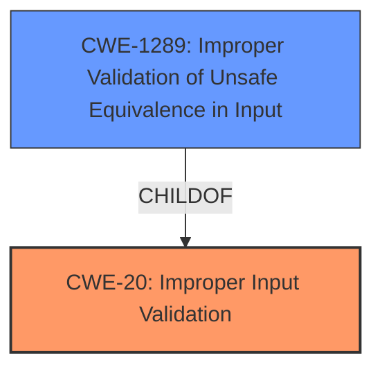

# Raw Analyzer Response for CVE-2022-1867

# Summary
| CWE ID    | CWE Name                                                                          | Confidence | CWE Abstraction Level | CWE Vulnerability Mapping Label | CWE-Vulnerability Mapping Notes |
| :-------- | :-------------------------------------------------------------------------------- | :--------- | :-------------------- | :------------------------------ | :------------------------------ |
| CWE-20  | Improper Input Validation                                                    | 0.90       | Class                  | Primary                          | Allowed |
| CWE-1289 | Improper Validation of Unsafe Equivalence in Input | 0.75      | Base                | Secondary                          | Allowed               |

## Evidence and Confidence

*   **Confidence Score:** 0.85
*   **Evidence Strength:** HIGH

## Relationship Analysis
The primary relationship is that CWE-20 is a high-level **Class** that describes the general problem of **improper input validation**. There are many **ChildOf** CWEs of CWE-20 that provide more specifics. CWE-1289, "Improper Validation of Unsafe Equivalence in Input", is a **Base** CWE, which provides a more specific description.

## Vulnerability Chain
The chain of events starts with untrusted input, followed by **insufficient validation**, leading to a bypass of the same origin policy.
  - The **root cause** is **insufficient input validation** (CWE-20).
  - The vulnerability is exploited through a crafted clipboard content.
  - The impact is bypassing the same origin policy.

## Summary of Analysis
The initial assessment identified **insufficient input validation** as the root cause, leading to the selection of CWE-20 as the primary CWE. The "CVE Reference Links Content Summary" explicitly states that the "**root cause** of vulnerability is: **insufficient validation** of untrusted input in Data Transfer." The **Vulnerability Description Key Phrases** section also states "**rootcause:** **insufficient input validation**."
The relationship analysis helped refine the selection by considering more specific variants and chain relationships. CWE-1289 further specifies that the input validation is related to unsafe equivalence. However, it is not very clear that it is an equivalence issue based on the description provided. Thus, it is a secondary classification.
The selected CWEs are at the optimal level of specificity, balancing accuracy with the available evidence.

Relevant CWE Information:

# Enhanced Context (25 CWEs)
The following CWEs were identified as potentially relevant to this vulnerability:

## CWE-1289: Improper Validation of Unsafe Equivalence in Input
**Abstraction Level**: Base
**Similarity Score**: 0.78
**Source**: dense

**Description**:
The product receives an input value that is used as a resource identifier or other type of reference, but it does not validate or incorrectly validates that the input is equivalent to a potentially-unsafe value.

**Mapping Guidance**:
- Usage: Allowed
- Rationale: This CWE entry is at the Base level of abstraction, which is a preferred level of abstraction for mapping to the root causes of vulnerabilities.

## CWE-20: Improper Input Validation
**Abstraction Level**: Class
**Status:** Stable

### Description
The product does not validate or incorrectly validates input.

### Extended Description
Without sufficient input validation, an attacker is able to craft the input in a form that is not expected by the rest of the application. This will lead to problems in many areas of the application.

### Alternative Terms
Input Sanitization
Data Validation
Data Verification

### Relationships
ParentOf -> CWE-1284
ParentOf -> CWE-1255
ParentOf -> CWE-1236
ParentOf -> CWE-1235
ParentOf -> CWE-1231
ParentOf -> CWE-1230
ParentOf -> CWE-1226
ParentOf -> CWE-1225
ParentOf -> CWE-1223
ParentOf -> CWE-1221
ParentOf -> CWE-1220
ParentOf -> CWE-1219
ParentOf -> CWE-1218
ParentOf -> CWE-1214
ParentOf -> CWE-1213
ParentOf -> CWE-1204
ParentOf -> CWE-1194
ParentOf -> CWE-1193
ParentOf -> CWE-1192
ParentOf -> CWE-1191
ParentOf -> CWE-1189
ParentOf -> CWE-1185
ParentOf -> CWE-1175
ParentOf -> CWE-1174
ParentOf -> CWE-1173
ParentOf -> CWE-1169
ParentOf -> CWE-1167
ParentOf -> CWE-1162
ParentOf -> CWE-1161
ParentOf -> CWE-1159
ParentOf -> CWE-1158
ParentOf -> CWE-1157
ParentOf -> CWE-1156
ParentOf -> CWE-1155
ParentOf -> CWE-1154
ParentOf -> CWE-1153
ParentOf -> CWE-1152
ParentOf -> CWE-1150
ParentOf -> CWE-1149
ParentOf -> CWE-1147
ParentOf -> CWE-1146
ParentOf -> CWE-1145
ParentOf -> CWE-1139
ParentOf -> CWE-1136
ParentOf -> CWE-1132
ParentOf -> CWE-1131
ParentOf -> CWE-1126
ParentOf -> CWE-1125
ParentOf -> CWE-1121
ParentOf -> CWE-1119
ParentOf -> CWE-1117
ParentOf -> CWE-1116
ParentOf -> CWE-1115
ParentOf -> CWE-1108
ParentOf -> CWE-1107
ParentOf -> CWE-1106
ParentOf -> CWE-1098
ParentOf -> CWE-1095
ParentOf -> CWE-1093
ParentOf -> CWE-1092
ParentOf -> CWE-1088
ParentOf -> CWE-1087
ParentOf -> CWE-1086
ParentOf -> CWE-1084
ParentOf -> CWE-1080
ParentOf -> CWE-1079
ParentOf -> CWE-1077
ParentOf -> CWE-1075
ParentOf -> CWE-1074
ParentOf -> CWE-1071
ParentOf -> CWE-1070
ParentOf -> CWE-1069
ParentOf -> CWE-1067
ParentOf -> CWE-1066
ParentOf -> CWE-1061
ParentOf -> CWE-1060
ParentOf -> CWE-1059
ParentOf -> CWE-1058
ParentOf -> CWE-1055
ParentOf -> CWE-1054
ParentOf -> CWE-1052
ParentOf -> CWE-1051
ParentOf -> CWE-1048
ParentOf -> CWE-1047
ParentOf -> CWE-1046
ParentOf -> CWE-1042
ParentOf -> CWE-1041
ParentOf -> CWE-1040
ParentOf -> CWE-1038
ParentOf -> CWE-1037
ParentOf -> CWE-1036
ParentOf -> CWE-1032
ParentOf -> CWE-1031
ParentOf -> CWE-1030
ParentOf -> CWE-1029
ParentOf -> CWE-1028
ParentOf -> CWE-1024
ParentOf -> CWE-1020
ParentOf -> CWE-1018
ParentOf -> CWE-1017
ParentOf -> CWE-1016
ParentOf -> CWE-1011
ParentOf -> CWE-1009
ParentOf -> CWE-1006
ParentOf -> CWE-1003
ParentOf -> CWE-999
ParentOf -> CWE-998
ParentOf -> CWE-997
ParentOf -> CWE-996
ParentOf -> CWE-993
ParentOf -> CWE-992
ParentOf -> CWE-991
ParentOf -> CWE-989
ParentOf -> CWE-986
ParentOf -> CWE-984
ParentOf -> CWE-983
ParentOf -> CWE-982
ParentOf -> CWE-977
ParentOf -> CWE-976
ParentOf -> CWE-9