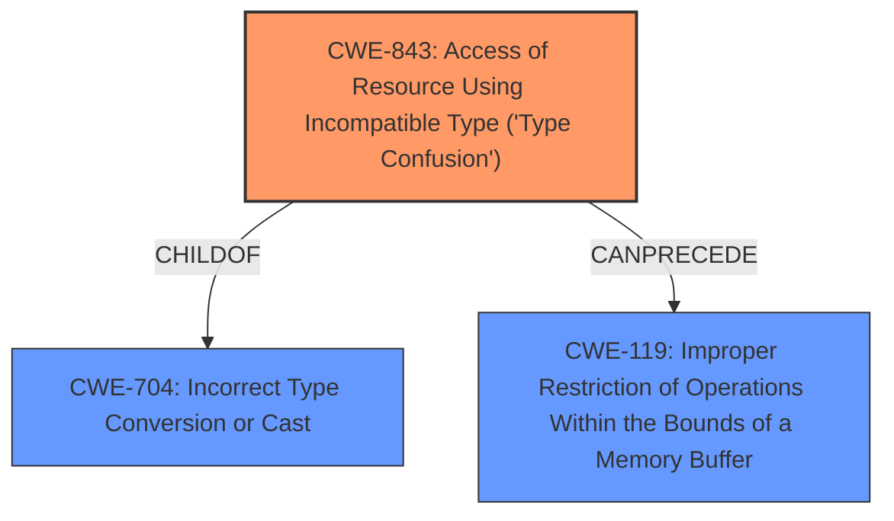

# Enhanced Analysis for CVE-2022-1869

# Summary
| CWE ID    | CWE Name                                                                      | Confidence | CWE Abstraction Level | CWE Vulnerability Mapping Label | CWE-Vulnerability Mapping Notes |
| --------- | ----------------------------------------------------------------------------- | ---------- | --------------------- | ------------------------------- | ------------------------------- |
| CWE-843   | Access of Resource Using Incompatible Type ('Type Confusion')                 | 1          | Base                  | Primary CWE                     | Allowed                        |

## Evidence and Confidence

*   **Confidence Score:** 1
*   **Evidence Strength:** HIGH

## Relationship Analysis
The primary relationship that influenced the decision was the direct match of the vulnerability description to CWE-843, as supported by the "CWE for similar CVE Descriptions" section and the retriever results. CWE-843 is a Base level CWE, which is the preferred level of abstraction.



## Vulnerability Chain
The vulnerability chain starts with a **type confusion** in the V8 JavaScript engine (CWE-843), which leads to potential heap corruption.

## Summary of Analysis
The initial analysis strongly pointed towards CWE-843, which aligns well with the vulnerability description. The "CWE for similar CVE Descriptions" section lists CWE-843 as the primary match, and the retriever results also rank it as the top candidate.

The vulnerability description explicitly mentions "**Type Confusion in V8**" and the "CVE Reference Links Content Summary" confirms a "**Type confusion vulnerability in the V8 JavaScript engine**". This evidence directly supports the selection of CWE-843, "Access of Resource Using Incompatible Type ('Type Confusion')." The retriever results also support this, with a high similarity score.

The final decision is based on the clear evidence of type confusion as the root cause, the confirmation from similar CVE descriptions, and the support from the retriever results. CWE-843 is at the optimal level of specificity as it directly describes the weakness.

Relevant CWE Information:

# Enhanced Context (25 CWEs)

## CWE-843: Access of Resource Using Incompatible Type ('Type Confusion')
**Abstraction Level**: Base
**Similarity Score**: 0.74
**Source**: dense

**Description**:
The product allocates or initializes a resource such as a pointer, object, or variable using one type, but it later accesses that resource using a type that is incompatible with the original type.

**Mapping Guidance**:
- Usage: Allowed
- Rationale: This CWE entry is at the Base level of abstraction, which is a preferred level of abstraction for mapping to the root causes of vulnerabilities.


## CWE Relationship Analysis

Current CWEs represent these abstraction levels: .


### Vulnerability Chain Analysis

**Chain starting from CWE-119:**
- 119 (Improper Restriction of Operations within the Bounds of a Memory Buffer) - ROOT


**Chain starting from CWE-843:**
- 843 (Access of Resource Using Incompatible Type ('Type Confusion')) - ROOT


### CWE Relationship Diagram

```mermaid
graph TD
    classDef primary fill:#f96,stroke:#333,stroke-width:2px
    classDef secondary fill:#69f,stroke:#333
    classDef tertiary fill:#9e9,stroke:#333
```