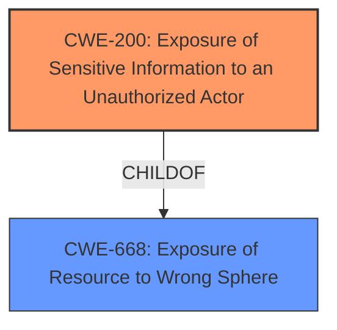

# Analysis for CVE-2022-1911

# Summary
| CWE ID  | CWE Name                                                        | Confidence | CWE Abstraction Level | CWE Vulnerability Mapping Label | CWE-Vulnerability Mapping Notes |
| :-------- | :-------------------------------------------------------------- | :--------- | :---------------------- | :------------------------------ | :------------------------------ |
| CWE-200 | Exposure of Sensitive Information to an Unauthorized Actor     | 0.9        | Class                   | Primary CWE                     | Discouraged                    |

## Evidence and Confidence

*   **Confidence Score:** 0.9
*   **Evidence Strength:** HIGH

## Relationship Analysis
The primary relationship influencing the selection was the parent-child relationship between CWE-668 (Exposure of Resource to Wrong Sphere) and CWE-200 (Exposure of Sensitive Information to an Unauthorized Actor). While CWE-668 is a broader class, CWE-200 more specifically captures the **exposure of sensitive information**, aligning with the **impact** of the vulnerability. The retriever results also suggested considering CWE-23 and CWE-22 for path traversal, but these did not fit the vulnerability description, which mentioned information about the operating system, not file access.

## Vulnerability Chain
The chain of events is: **Error in parser function** leading to unauthenticated access to some information of the underlying operating system.
  - **Root Cause:** **Error in parser function**
  - **Weakness/Impact:** Exposure of sensitive information

## Summary of Analysis
The initial analysis focused on the **root cause**, which is an **"Error in parser function"**. The vulnerability description and CVE reference summary clearly state that this error leads to "unauthenticated access to some information of the underlying operating system." This points to the **impact** being the **exposure of sensitive information**.

The retriever results listed CWE-200 (Exposure of Sensitive Information to an Unauthorized Actor) as the top candidate. While CWE-200 is a Class-level CWE and is generally discouraged, the vulnerability description and CVE reference summary indicate that the primary **impact** is indeed the **exposure of sensitive information**.

The CVE Reference Links Content Summary states:
- "The parser function allowed unauthenticated access to sensitive information."
- "Exposure of sensitive information to unauthorized actors (CWE-200)."
- "An unauthenticated attacker could query information about the underlying operating system, specifically details regarding some of the applications installed on the system."

Given this direct evidence and the high relevance score from the retriever, CWE-200 is chosen as the primary CWE.

CWE-23 (Relative Path Traversal) and CWE-22 (Improper Limitation of a Pathname to a Restricted Directory ('Path Traversal')) were also considered due to their presence in the Retriever Results, but these were deemed inappropriate because the vulnerability does not involve file system traversal or access. The description specifically mentions information about the operating system being exposed, not access to files or directories. Therefore, path traversal CWEs are not applicable.

CWE-266 (Incorrect Privilege Assignment) and CWE-269 (Improper Privilege Management) were also considered, but they are less relevant because the primary issue is the **exposure of information** due to a parsing error, rather than an explicit privilege management flaw. While the unauthenticated access implies a privilege issue, the core problem is the information exposure.

I am overriding the general mapping guidance that discourages the use of class level CWEs because in this case, the evidence strongly supports the direct **impact** of the vulnerability being the exposure of sensitive information, which is best represented by CWE-200. The **root cause** is a parser error, but without further information, it is difficult to assign a more specific CWE. Therefore, focusing on the **impact** of the exposed sensitive information is appropriate.