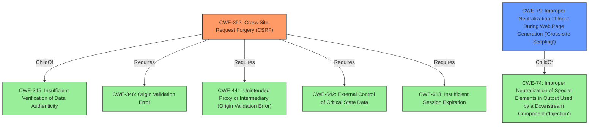

# Enhanced Analysis for CVE-2022-1913

# Summary
| CWE ID | CWE Name | Confidence | CWE Abstraction Level | CWE Vulnerability Mapping Label | CWE-Vulnerability Mapping Notes |
|---|---|---|---|---|---|
| CWE-352 | Cross-Site Request Forgery (CSRF) | 1.0 | Compound | Primary | Allowed |
| CWE-79 | Improper Neutralization of Input During Web Page Generation ('Cross-site Scripting') | 1.0 | Base | Secondary | Allowed |

## Evidence and Confidence

*   **Confidence Score:** 1.0
*   **Evidence Strength:** HIGH

## Relationship Analysis
The primary weakness is CWE-352 [CWE-352: Cross-Site Request Forgery (CSRF)], which stems from the **lack of CSRF protection** in the plugin's settings update functionality. CWE-352 is a compound weakness that requires multiple conditions to be met. The secondary weakness is CWE-79 [CWE-79: Improper Neutralization of Input During Web Page Generation ('Cross-site Scripting')], which is caused by the **lack of sanitisation and escaping**. CWE-79 is a base weakness.

The relationships that influenced this decision:
  - CWE-352 [CWE-352: Cross-Site Request Forgery (CSRF)] is a compound weakness.
  - CWE-79 [CWE-79: Improper Neutralization of Input During Web Page Generation ('Cross-site Scripting')] is a base weakness.
  - CWE-79 [CWE-79: Improper Neutralization of Input During Web Page Generation ('Cross-site Scripting')] can be a consequence of CWE-352 [CWE-352: Cross-Site Request Forgery (CSRF)] because an attacker can use CSRF to trick the victim into submitting requests to the server in which the requests contain an XSS payload.



## Vulnerability Chain
The vulnerability chain starts with the **lack of CSRF protection** (CWE-352) that allows an attacker to trick a logged-in administrator into unknowingly submitting a malicious settings update request. Due to the **lack of sanitisation and escaping** (CWE-79), the malicious input is then stored, leading to Stored Cross-Site Scripting.

## Summary of Analysis
The analysis concludes that the primary weakness is CWE-352 [CWE-352: Cross-Site Request Forgery (CSRF)], due to the **lack of CSRF protection** when updating the plugin settings. The secondary weakness is CWE-79 [CWE-79: Improper Neutralization of Input During Web Page Generation ('Cross-site Scripting')], because there's a **lack of sanitisation and escaping**.

Evidence:
- **Vulnerability Description Key Phrases**: **rootcause:** **lack of CSRF protection**
- **CVE Reference Links Content Summary**: The WordPress plugin "Add Post URL" **lacks CSRF (Cross-Site Request Forgery) protection** when updating its settings. Additionally, it **does not properly sanitize or escape** user-supplied input when saving settings.

The retriever results and the CWE specifications support the choice of CWE-352 and CWE-79. The graph relationships show how these vulnerabilities relate to each other.

CWE-352 is the most specific representation of the primary vulnerability, and CWE-79 is the most specific representation of the secondary vulnerability.

Relevant CWE Information:
- CWE-352 [CWE-352: Cross-Site Request Forgery (CSRF)]: The web application does not sufficiently verify whether a well-formed, valid, consistent request was intentionally provided by the user who submitted the request.
- CWE-79 [CWE-79: Improper Neutralization of Input During Web Page Generation ('Cross-site Scripting')]: The product does not neutralize or incorrectly neutralizes user-controllable input before it is placed in output that is used as a web page that is served to other users.

Other CWEs Considered:
- CWE-116 [CWE-116: Improper Encoding or Escaping of Output]: This CWE is similar to CWE-79, but CWE-79 is more specific to Cross-Site Scripting, which aligns with the vulnerability's impact.
- CWE-434 [CWE-434: Unrestricted Upload of File with Dangerous Type]: This CWE does not apply because the vulnerability does not involve unrestricted file uploads.
- CWE-862 [CWE-862: Missing Authorization]: This CWE does not apply because the vulnerability is specifically related to CSRF, not a general lack of authorization.
- CWE-472 [CWE-472: External Control of Assumed-Immutable Web Parameter]: This CWE does not apply because the vulnerability is about CSRF and XSS, not the modification of assumed-immutable web parameters.


## CWE Relationship Analysis

Current CWEs represent these abstraction levels: .


### Vulnerability Chain Analysis

**Chain starting from CWE-862:**
- 862 (Missing Authorization) - ROOT


**Chain starting from CWE-472:**
- 472 (External Control of Assumed-Immutable Web Parameter) - ROOT


### CWE Relationship Diagram

```mermaid
graph TD
    classDef primary fill:#f96,stroke:#333,stroke-width:2px
    classDef secondary fill:#69f,stroke:#333
    classDef tertiary fill:#9e9,stroke:#333
```