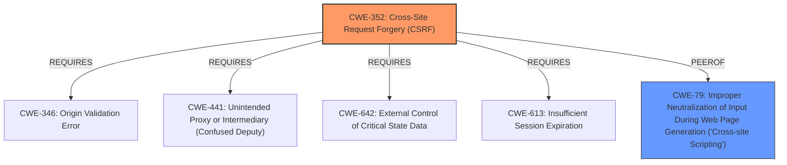

# Raw Analyzer Response for CVE-2022-1914

# Summary
| CWE ID | CWE Name | Confidence | CWE Abstraction Level | CWE Vulnerability Mapping Label | CWE-Vulnerability Mapping Notes |
|---|---|---|---|---|---|
| CWE-352 | Cross-Site Request Forgery (CSRF) | 1.0 | Compound | Allowed | Primary CWE |
| CWE-79 | Improper Neutralization of Input During Web Page Generation ('Cross-site Scripting') | 1.0 | Base | Allowed | Secondary CWE |

## Evidence and Confidence

*   **Confidence Score:** 1.0
*   **Evidence Strength:** HIGH

## Relationship Analysis
The primary weakness is the **lack of CSRF protection**, represented by CWE-352, which is a compound weakness requiring multiple conditions to be met. A secondary weakness stems from the **lack of sanitization and escaping**, leading to Stored XSS (CWE-79). CWE-352 can lead to further vulnerabilities, including XSS when combined with **improper input handling**.

## Vulnerability Chain
The vulnerability chain starts with the **lack of CSRF protection**, allowing attackers to modify settings. This leads to the injection of malicious code due to the **lack of sanitization and escaping**, resulting in Stored XSS.

## Summary of Analysis
The initial assessment identified CWE-352 as the primary issue due to the **lack of CSRF protection**. The supporting evidence is strong, highlighting how the absence of CSRF checks allows attackers to modify settings. Additionally, the **lack of input sanitization** leads to Stored XSS (CWE-79).

The vulnerability description states: "The Clean-Contact WordPress plugin through 1.6 does not have CSRF check in place when updating its settings, which could allow attackers to make a logged in admin change them via a CSRF attack and lead to Stored XSS due to the lack of sanitisation and escaping as well."

The graph relationships influenced the selection by clarifying how CWE-352 (CSRF) requires specific conditions (CWE-346, CWE-441, CWE-642, CWE-613) to be exploitable. The selection of CWE-352 and CWE-79 provides the optimal level of specificity, addressing both the **CSRF vulnerability** and the resulting **Stored XSS**.

Relevant CWE Information:

# Enhanced Context (25 CWEs)

## CWE-472: External Control of Assumed-Immutable Web Parameter
**Abstraction Level**: Base
**Similarity Score**: 0.77
**Source**: dense

**Description**:
The web application does not sufficiently verify inputs that are assumed to be immutable but are actually externally controllable, such as hidden form fields.

**Mapping Guidance**:
- Usage: Allowed
- Rationale: This CWE entry is at the Base level of abstraction, which is a preferred level of abstraction for mapping to the root causes of vulnerabilities.

**Analysis:** This CWE was considered but not selected as the primary weakness, because the main issue is the **lack of CSRF protection**, rather than the modification of assumed-immutable parameters.

## CWE-807: Reliance on Untrusted Inputs in a Security Decision
**Abstraction Level**: Base
**Similarity Score**: 0.76
**Source**: dense

**Description**:
The product uses a protection mechanism that relies on the existence or values of an input, but the input can be modified by an untrusted actor in a way that bypasses the protection mechanism.

**Mapping Guidance**:
- Usage: Allowed
- Rationale: This CWE entry is at the Base level of abstraction, which is a preferred level of abstraction for mapping to the root causes of vulnerabilities.

**Analysis:** This CWE was considered but not selected as the primary weakness because the core issue is the **absence of CSRF protection**, not the reliance on untrusted inputs in a security decision.

## CWE-639: Authorization Bypass Through User-Controlled Key
**Abstraction Level**: Base
**Similarity Score**: 0.76
**Source**: dense

**Description**:
The system's authorization functionality does not prevent one user from gaining access to another user's data or record by modifying the key value identifying the data.

**Mapping Guidance**:
- Usage: Allowed
- Rationale: This CWE entry is at the Base level of abstraction, which is a preferred level of abstraction for mapping to the root causes of vulnerabilities.

**Analysis:** This CWE was considered but not selected as the primary weakness, because the main issue is the **lack of CSRF protection**, not an authorization bypass through a user-controlled key.

## CWE-1289: Improper Validation of Unsafe Equivalence in Input
**Abstraction Level**: Base
**Similarity Score**: 0.75
**Source**: dense

**Description**:
The product receives an input value that is used as a resource identifier or other type of reference, but it does not validate or incorrectly validates that the input is equivalent to a potentially-unsafe value.

**Mapping Guidance**:
- Usage: Allowed
- Rationale: This CWE entry is at the Base level of abstraction, which is a preferred level of abstraction for mapping to the root causes of vulnerabilities.

**Analysis:** This CWE was considered but not selected as the primary weakness, because the core issue is the **absence of CSRF protection**, not the improper validation of unsafe equivalence in input.

## CWE-184: Incomplete List of Disallowed Inputs
**Abstraction Level**: Base
**Similarity Score**: 0.75
**Source**: dense

**Description**:
The product implements a protection mechanism that relies on a list of inputs (or properties of inputs) that are not allowed by policy or otherwise require other action to neutralize before additional processing takes place, but the list is incomplete.

**Mapping Guidance**:
- Usage: Allowed
- Rationale: This CWE entry is at the Base level of abstraction, which is a preferred level of abstraction for mapping to the root causes of vulnerabilities.

**Analysis:** This CWE was considered but not selected as the primary weakness, because the core issue is the **absence of CSRF protection**, not an incomplete list of disallowed inputs.

## CWE-425: Direct Request ('Forced Browsing')
**Abstraction Level**: Base
**Similarity Score**: 0.74
**Source**: dense

**Description**:
The web application does not adequately enforce appropriate authorization on all restricted URLs, scripts, or files.

**Mapping Guidance**:
- Usage: Allowed
- Rationale: This CWE entry is at the Base level of abstraction, which is a preferred level of abstraction for mapping to the root causes of vulnerabilities.

**Analysis:** This CWE was considered but not selected as the primary weakness, because the main issue is the **lack of CSRF protection**, not a direct request or forced browsing issue.

## CWE-74: Improper Neutralization of Special Elements in Output Used by a Downstream Component ('Injection')
**Abstraction Level**: Class
**Similarity Score**: 0.74
**Source**: dense

**Description**:
The product constructs all or part of a command, data structure, or record using externally-influenced input from an upstream component, but it does not neutralize or incorrectly neutralizes special elements that could modify how it is parsed or interpreted when it is sent to a downstream component.

**Mapping Guidance**:
- Usage: Discouraged
- Rationale: CWE-74 is high-level and often misused when lower-level weaknesses are more appropriate.

**Analysis:** This CWE was considered but not selected as the primary weakness, because the main issue is the **lack of CSRF protection**. While the **lack of sanitization** leads to XSS, CWE-79 is a better fit.

## CWE-1220: Insufficient Granularity of Access Control
**Abstraction Level**: Base
**Similarity Score**: 0.74
**Source**: dense

**Description**:
The product implements access controls via a policy or other feature with the intention to disable or restrict accesses (reads and/or writes) to assets in a system from untrusted agents. However, implemented access controls lack required granularity, which renders the control policy too broad because it allows accesses from unauthorized agents to the security-sensitive assets.

**Mapping Guidance**:
-