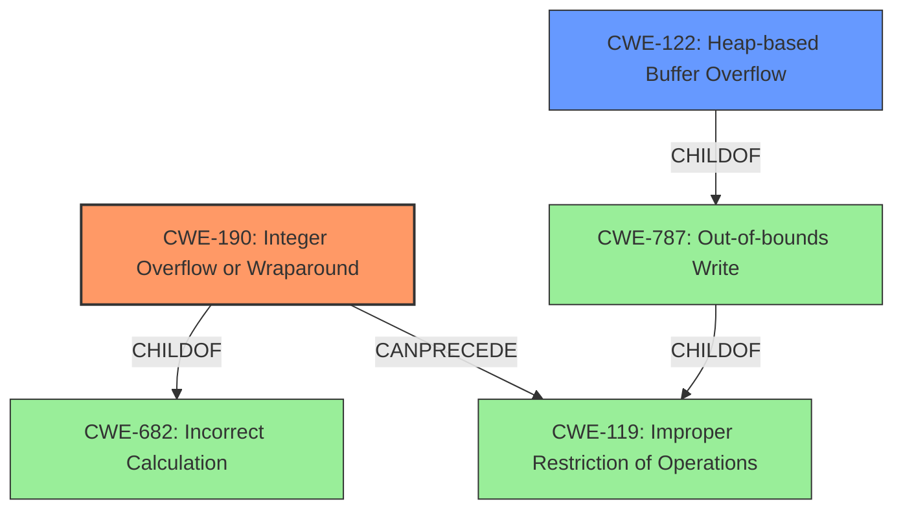

# Raw Analyzer Response for CVE-2022-1922

# Summary
| CWE ID | CWE Name | Confidence | CWE Abstraction Level | CWE Vulnerability Mapping Label | CWE-Vulnerability Mapping Notes |
|---|---|---|---|---|---|
| CWE-190 | Integer Overflow or Wraparound | 1.0 | Base | Allowed | Primary CWE |
| CWE-122 | Heap-based Buffer Overflow | 0.7 | Variant | Allowed | Secondary Candidate |

## Evidence and Confidence

*   **Confidence Score:** 0.85
*   **Evidence Strength:** HIGH

## Relationship Analysis
The primary weakness is CWE-190 **Integer Overflow or Wraparound**, which can lead to a secondary weakness, CWE-122 **Heap-based Buffer Overflow**. CWE-190 is a child of CWE-682, indicating that it is a specific type of numeric error. The relationship CANPRECEDE -> CWE-119 (Improper Restriction of Operations within the Bounds of a Memory Buffer) exists for CWE-190, suggesting that an integer overflow can lead to memory corruption issues. CWE-122 is a child of CWE-787 (Out-of-bounds Write) which in turn is a child of CWE-119. This indicates that the heap-based buffer overflow is a specific type of out-of-bounds write that occurs in the heap memory region.

## Vulnerability Chain
The vulnerability chain starts with an **integer overflow** (CWE-190) in the `gst_matroska_decompress_data` function. This leads to an incorrect calculation of the buffer size, which can then result in a heap overwrite (CWE-122) depending on the libc implementation and OS capabilities.

## Summary of Analysis
The initial analysis identified CWE-190 as the primary weakness due to the **integer overflow** in the `gst_matroska_decompress_data` function. The analysis was further refined by considering the potential impact of the overflow, which could lead to a heap overwrite. This is conditional and depends on the libc and OS.

The evidence from the "**Vulnerability Description Key Phrases**" section and "**CVE Reference Links Content Summary**" indicates that the root cause is an **integer overflow**. The "**Vulnerability Description**" states "Integer overflow in matroskademux element in gst_matroska_decompress_data function which causes a segfault, or could cause a heap overwrite". The "**CVE Reference Links Content Summary**" also confirms that an integer overflow in the `gst_matroska_decompress_data` function is the root cause and can lead to a heap overflow.

The graph relationships show that CWE-190 can lead to CWE-119, which is a parent of CWE-787 (Out-of-bounds Write), and CWE-122 (Heap-based Buffer Overflow) is a child of CWE-787.

CWE-190 is selected as the primary CWE because it directly represents the root cause of the vulnerability, which is the **integer overflow**. CWE-122 is included as a secondary CWE because the heap overwrite is a potential consequence of the overflow, depending on certain conditions. Both CWEs are at appropriate levels of specificity (Base and Variant, respectively).

Relevant CWE Information:

# Enhanced Context (25 CWEs)
The following CWEs were identified as potentially relevant to this vulnerability:

## CWE-191: Integer Underflow (Wrap or Wraparound)
**Abstraction Level**: Base
**Similarity Score**: 0.79
**Source**: dense

**Description**:
The product subtracts one value from another, such that the result is less than the minimum allowable integer value, which produces a value that is not equal to the correct result.

**Mapping Guidance**:
- Usage: Allowed
- Rationale: This CWE entry is at the Base level of abstraction, which is a preferred level of abstraction for mapping to the root causes of vulnerabilities.

## CWE-125: Out-of-bounds Read
**Abstraction Level**: Base
**Similarity Score**: 0.79
**Source**: dense

**Description**:
The product reads data past the end, or before the beginning, of the intended buffer.

**Mapping Guidance**:
- Usage: Allowed
- Rationale: This CWE entry is at the Base level of abstraction, which is a preferred level of abstraction for mapping to the root causes of vulnerabilities.

## CWE-197: Numeric Truncation Error
**Abstraction Level**: Base
**Similarity Score**: 0.79
**Source**: dense

**Description**:
Truncation errors occur when a primitive is cast to a primitive of a smaller size and data is lost in the conversion.

**Mapping Guidance**:
- Usage: Allowed
- Rationale: This CWE entry is at the Base level of abstraction, which is a preferred level of abstraction for mapping to the root causes of vulnerabilities.

## CWE-131: Incorrect Calculation of Buffer Size
**Abstraction Level**: Base
**Similarity Score**: 0.78
**Source**: dense

**Description**:
The product does not correctly calculate the size to be used when allocating a buffer, which could lead to a buffer overflow.

**Mapping Guidance**:
- Usage: Allowed
- Rationale: This CWE entry is at the Base level of abstraction, which is a preferred level of abstraction for mapping to the root causes of vulnerabilities.

## CWE-193: Off-by-one Error
**Abstraction Level**: Base
**Similarity Score**: 0.78
**Source**: dense

**Description**:
A product calculates or uses an incorrect maximum or minimum value that is 1 more, or 1 less, than the correct value.

**Mapping Guidance**:
- Usage: Allowed
- Rationale: This CWE entry is at the Base level of abstraction, which is a preferred level of abstraction for mapping to the root causes of vulnerabilities.

## CWE-1289: Improper Validation of Unsafe Equivalence in Input
**Abstraction Level**: Base
**Similarity Score**: 0.78
**Source**: dense

**Description**:
The product receives an input value that is used as a resource identifier or other type of reference, but it does not validate or incorrectly validates that the input is equivalent to a potentially-unsafe value.

**Mapping Guidance**:
- Usage: Allowed
- Rationale: This CWE entry is at the Base level of abstraction, which is a preferred level of abstraction for mapping to the root causes of vulnerabilities.

## CWE-754: Improper Check for Unusual or Exceptional Conditions
**Abstraction Level**: Class
**Similarity Score**: 0.78
**Source**: dense

**Description**:
The product does not check or incorrectly checks for unusual or exceptional conditions that are not expected to occur frequently during day to day operation of the product.

**Mapping Guidance**:
- Usage: Allowed-with-Review
- Rationale: This CWE entry is a Class and might have Base-level children that would be more appropriate

## CWE-681: Incorrect Conversion between Numeric Types
**Abstraction Level**: Base
**Similarity Score**: 0.78
**Source**: dense

**Description**:
When converting from one data type to another, such as long to integer, data can be omitted or translated in a way that produces unexpected values. If the resulting values are used in a sensitive context, then dangerous behaviors may occur.

**Mapping Guidance**:
- Usage: Allowed
- Rationale: This CWE entry is at the Base level of abstraction, which is a preferred level of abstraction for mapping to the root causes of vulnerabilities.

## CWE-703: Improper Check or Handling of Exceptional Conditions
**Abstraction Level**: Pillar
**Similarity Score**: 0.77
**Source**: dense

**Description**:
The product does not properly anticipate or handle exceptional conditions that rarely occur during normal operation of the product.

**Mapping Guidance**:
- Usage: Discouraged
- Rationale: This CWE entry is extremely high-level, a Pillar.

## CWE-667: Improper Locking
**Abstraction Level**: Class
**Similarity Score**: 0.77
**Source**: dense

**Description**:
The product does not properly acquire or release a lock on a resource, leading to unexpected resource state