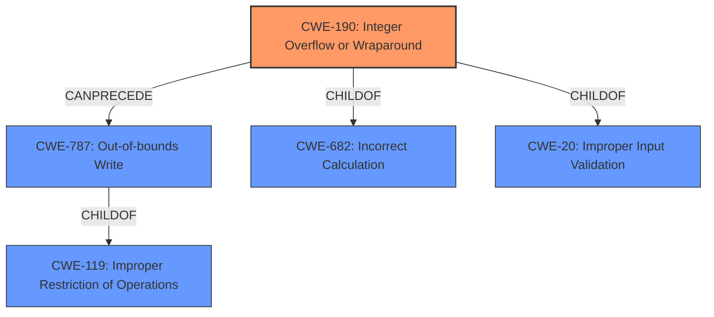

# Analysis for CVE-2022-1924

# Summary
| CWE ID | CWE Name | Confidence | CWE Abstraction Level | CWE Vulnerability Mapping Label | CWE-Vulnerability Mapping Notes |
|---|---|---|---|---|---|
| CWE-190 | Integer Overflow or Wraparound | 1.0 | Base | Primary | Allowed |
| CWE-787 | Out-of-bounds Write | 0.7 | Base | Secondary | Allowed |

## Evidence and Confidence

*   **Confidence Score:** 0.9
*   **Evidence Strength:** HIGH

## Relationship Analysis
The primary weakness is an **integer overflow** (CWE-190) that can lead to an out-of-bounds write (CWE-787). CWE-190 is a ChildOf CWE-682 (Incorrect Calculation) and CWE-20 (Improper Input Validation). CWE-787 is a parent of CWE-124 (Buffer Underwrite) and a child of CWE-119 (Improper Restriction of Operations Within the Bounds of a Memory Buffer). The integer overflow is the root cause, and the out-of-bounds write is a potential consequence depending on the system configuration.

## Vulnerability Chain
The vulnerability chain starts with a crafted MKV file containing a zlib-compressed data block.

1.  The `gst_matroska_decompress_data` function attempts to decompress the data.
2.  An **integer overflow** (CWE-190) occurs in the `new_size` variable due to the use of 32-bit integers when a large decompressed size (0x100000000) is encountered.
3.  This leads to an incorrect allocation size calculation.
4.  Depending on the libc implementation and OS support for memory mapping, this results in either a segmentation fault or a heap memory corruption/overwrite (**out-of-bounds write**, CWE-787).

## Summary of Analysis
The analysis is based on the provided vulnerability description and the CVE reference links content summary, which clearly indicates an **integer overflow** as the **root cause**. The vulnerability description key phrases also highlight the **integer overflow**. The "CWE for similar CVE Descriptions" section lists CWE-190 as the primary match. The CVE reference links content summary mentions the overflow in the `new_size` variable and its potential to cause a heap overflow/overwrite.

The graph relationships support the selection of CWE-190 as the primary cause, potentially leading to CWE-787.

CWE-190 is selected as the most specific and accurate representation of the vulnerability's root cause. While other CWEs like CWE-787 (Out-of-bounds Write), CWE-122 (Heap-based Buffer Overflow), and CWE-125 (Out-of-bounds Read) describe potential consequences, the **integer overflow** is the triggering event.

The evidence from the "Vulnerability Description Key Phrases" section:
- **rootcause:** **integer overflow**

The evidence from the "CVE Reference Links Content Summary" section:
- The vulnerability stems from an **integer overflow** during the decoding of zlib-encoded data within the `gst_matroska_decompress_data` function of the GStreamer's Matroska demuxer.
- Specifically, the `zstream` data counters use 64-bit integers, while the `gst_matroska_decompress_data` function uses 32-bit integers to store the size, causing a potential overflow when a large decompressed size is encountered.
- **Integer Overflow:** The primary weakness is an integer overflow in the `new_size` variable within the `gst_matroska_decompress_data` function.
- **Heap Overflow/Overwrite:** When a large decompressed size is encountered, the overflow leads to an incorrect allocation size calculation.

**CWE Considerations:**

*   **CWE-190: Integer Overflow or Wraparound:** The vulnerability description explicitly mentions an **integer overflow** as the root cause, making this the most appropriate primary CWE. The "CWE for similar CVE Descriptions" section also lists CWE-190 as the primary match.
*   **CWE-787: Out-of-bounds Write:** The vulnerability description mentions the possibility of a heap overwrite, which is a form of out-of-bounds write. Depending on the system configuration, the **integer overflow** can lead to an **out-of-bounds write**. I am rating the confidence lower as it is conditional.
*   **CWE-1284: Improper Validation of Specified Quantity in Input:** Considered but not selected because, while the size calculation is incorrect, the root cause is the overflow, not the validation itself.
*   **CWE-789: Memory Allocation with Excessive Size Value:** Considered but not selected because the excessive size is a result of the **integer overflow**, not a direct allocation with an excessive value.
*   **CWE-125: Out-of-bounds Read:** Not directly mentioned in the description, the vulnerability talks about write not read.
*   **CWE-131: Incorrect Calculation of Buffer Size**: Considered, but the root cause is the **integer overflow** not the calculation.

Relevant CWE Information: