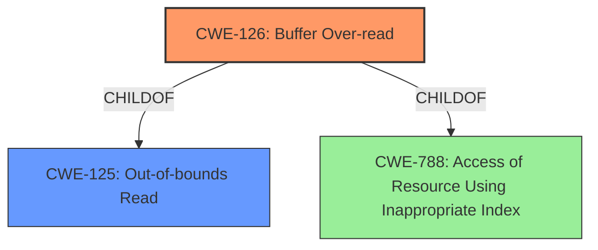

# Analysis for CVE-2022-1927

# Summary
| CWE ID  | CWE Name                                                       | Confidence | CWE Abstraction Level | CWE Vulnerability Mapping Label | CWE-Vulnerability Mapping Notes |
| ------- | ------------------------------------------------------------- | ---------- | ----------------------- | ------------------------------- | ------------------------------- |
| CWE-126 | Buffer Over-read                                              | 1          | Variant                 | Primary                         | Allowed                         |

## Evidence and Confidence

*   **Confidence Score:** 1
*   **Evidence Strength:** HIGH

## Relationship Analysis
The primary relationship influencing the decision is the ChildOf relationship between CWE-126 and CWE-125 (Out-of-bounds Read). CWE-126 is a variant of CWE-125, specifying that the out-of-bounds read occurs *after* the targeted buffer, which aligns perfectly with the vulnerability description.

## Vulnerability Chain
The vulnerability chain starts with the program attempting to read a UTF-8 character using `utf_ptr2char()`. Due to an **improper bounds check**, this function reads beyond the allocated buffer, resulting in a **buffer over-read**. This can lead to denial of service and potentially information disclosure.

## Summary of Analysis
The initial analysis focused on identifying the root cause and the specific type of buffer access violation. The vulnerability description clearly states a "**buffer over-read**" condition. The CVE Reference Links Content Summary confirms that the root cause is an **improper bounds check** within the `utf_ptr2char()` function, leading to an out-of-bounds read when processing UTF-8 characters.

The primary CWE match suggested by similar CVE descriptions is CWE-125 (Out-of-bounds Read), and the Retriever Results also list CWE-126 (Buffer Over-read) as the top match.

Given that the vulnerability involves reading past the end of the buffer, CWE-126 (Buffer Over-read) is the more precise and appropriate choice. CWE-126 is a Variant of CWE-125, making it a more specific classification.

The final decision is based on the following evidence:
- Vulnerability Description Key Phrases: "**weakness: buffer over-read**"
- CVE Reference Links Content Summary: "The root cause is an **improper bounds check** within the `utf_ptr2char()` function when handling UTF-8 characters... The primary vulnerability is an **out-of-bounds read**."
- CWE specifications: The description of CWE-126 clearly states that the product reads from a buffer using mechanisms that reference memory locations **after** the targeted buffer.

CWE-125 was considered but not used because it is a more general classification of out-of-bounds reads and the vulnerability description specifies that the read occurs *after* the buffer.
CWE-124 (Buffer Underwrite ('Buffer Underflow')), CWE-127 (Buffer Under-read) and CWE-786 (Access of Memory Location Before Start of Buffer) were considered but not used because the vulnerability involves reading past the *end* of the buffer, not before the beginning.
CWE-805 (Buffer Access with Incorrect Length Value) and CWE-130 (Improper Handling of Length Parameter Inconsistency) were not chosen because the core issue is the out-of-bounds read itself, not the length value or its handling.

Relevant CWE Information:

# Enhanced Context (25 CWEs)
The following CWEs were identified as potentially relevant to this vulnerability:

## CWE-805: Buffer Access with Incorrect Length Value
**Abstraction Level**: Base
**Similarity Score**: 0.81
**Source**: dense

**Description**:
The product uses a sequential operation to read or write a buffer, but it uses an incorrect length value that causes it to access memory that is outside of the bounds of the buffer.

**Mapping Guidance**:
- Usage: Allowed
- Rationale: This CWE entry is at the Base level of abstraction, which is a preferred level of abstraction for mapping to the root causes of vulnerabilities.

## CWE-124: Buffer Underwrite ('Buffer Underflow')
**Abstraction Level**: Base
**Similarity Score**: 0.80
**Source**: dense

**Description**:
The product writes to a buffer using an index or pointer that references a memory location prior to the beginning of the buffer.

**Mapping Guidance**:
- Usage: Allowed
- Rationale: This CWE entry is at the Base level of abstraction, which is a preferred level of abstraction for mapping to the root causes of vulnerabilities.

## CWE-131: Incorrect Calculation of Buffer Size
**Abstraction Level**: Base
**Similarity Score**: 0.79
**Source**: dense

**Description**:
The product does not correctly calculate the size to be used when allocating a buffer, which could lead to a buffer overflow.

**Mapping Guidance**:
- Usage: Allowed
- Rationale: This CWE entry is at the Base level of abstraction, which is a preferred level of abstraction for mapping to the root causes of vulnerabilities.

## CWE-126: Buffer Over-read
**Abstraction Level**: Variant
**Similarity Score**: 0.79
**Source**: dense

**Description**:
The product reads from a buffer using buffer access mechanisms such as indexes or pointers that reference memory locations after the targeted buffer.

**Mapping Guidance**:
- Usage: Allowed
- Rationale: This CWE entry is at the Variant level of abstraction, which is a preferred level of abstraction for mapping to the root causes of vulnerabilities.

## CWE-130: Improper Handling of Length Parameter Inconsistency
**Abstraction Level**: Base
**Similarity Score**: 0.78
**Source**: dense

**Description**:
The product parses a formatted message or structure, but it does not handle or incorrectly handles a length field that is inconsistent with the actual length of the associated data.

**Mapping Guidance**:
- Usage: Allowed
- Rationale: This CWE entry is at the Base level of abstraction, which is a preferred level of abstraction for mapping to the root causes of vulnerabilities.

## CWE-191: Integer Underflow (Wrap or Wraparound)
**Abstraction Level**: Base
**Similarity Score**: 0.78
**Source**: dense

**Description**:
The product subtracts one value from another, such that the result is less than the minimum allowable integer value, which produces a value that is not equal to the correct result.

**Mapping Guidance**:
- Usage: Allowed
- Rationale: This CWE entry is at the Base level of abstraction, which is a preferred level of abstraction for mapping to the root causes of vulnerabilities.

## CWE-127: Buffer Under-read
**Abstraction Level**: Variant
**Similarity Score**: 0.77
**Source**: dense

**Description**:
The product reads from a buffer using buffer access mechanisms such as indexes or pointers that reference memory locations prior to the targeted buffer.

**Mapping Guidance**:
- Usage: Allowed
- Rationale: This CWE entry is at the Variant level of abstraction, which is a preferred level of abstraction for mapping to the root causes of vulnerabilities.

## CWE-786: Access of Memory Location Before Start of Buffer
**Abstraction Level**: Base
**Similarity Score**: 0.76
**Source**: dense

**Description**:
The product reads or writes to a buffer using an index or pointer that references a memory location prior to the beginning of the buffer.

**Mapping Guidance**:
- Usage: Discouraged
- Rationale: The CWE entry might be misused when lower-level CWE entries might be available. It also overlaps existing CWE entries and might be deprecated in the future.

## CWE-125: Out-of-bounds Read
**Abstraction Level**: Base
**Similarity Score**: 0.76
**Source**: dense

**Description**:
The product reads data past the end, or before the beginning, of the intended buffer.

**Mapping Guidance**:
- Usage: Allowed
- Rationale: This CWE entry is at the Base level of abstraction, which is a preferred level of abstraction for mapping to the root causes of vulnerabilities.

## CWE-193: Off-by-one Error
**Abstraction Level**: Base
**Similarity Score**: 0.75
**Source**: dense

**Description**:
A product calculates or uses an incorrect maximum or minimum value that is 1 more, or 1 less, than the correct value.

**Mapping Guidance**:
- Usage: Allowed
- Rationale: This CWE entry is at the Base level of abstraction, which is a preferred level of abstraction for mapping to the root causes of vulnerabilities.

## CWE-124: Buffer