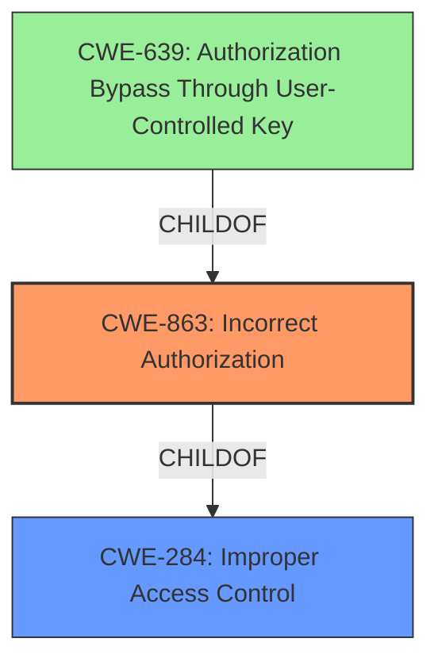

# Analysis Report for CVE-2022-1936

# Vulnerability Analysis Report: CVE-2022-1936

## Description


## Analysis (with Relationship Data)

# Summary
| CWE ID | CWE Name | Confidence | CWE Abstraction Level | CWE Vulnerability Mapping Label | CWE-Vulnerability Mapping Notes |
|---|---|---|---|---|---|
| CWE-863 | Incorrect Authorization | 0.9 | Class | Primary | Allowed-with-Review |
| CWE-284 | Improper Access Control | 0.5 | Pillar | Secondary | Discouraged |

## Evidence and Confidence

*   **Confidence Score:** 0.9
*   **Evidence Strength:** HIGH

## Relationship Analysis
The primary CWE selected is CWE-863, Incorrect Authorization. This CWE is a child of CWE-284 (Improper Access Control), indicating a hierarchical relationship where CWE-863 is a more specific type of access control issue. CWE-284 is a high-level Pillar, while CWE-863 is a Class, making it a more appropriate level of abstraction. The relationship influenced the decision to choose CWE-863 over its parent, as it better describes the specific authorization flaw.



## Vulnerability Chain
The vulnerability chain starts with the **incorrect authorization** of Project Deploy Tokens, leading to the **impact** of attackers misusing these tokens from any location, even when IP address restrictions are configured.
- **Root Cause:** Incorrect Authorization (CWE-863)
- **Impact:** Misuse of Project Deploy Tokens, Bypass of IP Address Restrictions.

## Summary of Analysis
The initial analysis focused on the provided vulnerability description, which explicitly states "**incorrect authorization**". The Retriever Results listed CWE-863 (Incorrect Authorization) as a candidate. The primary CWE match from the similar CVE Descriptions section was also CWE-863.

The evidence from the vulnerability description key phrases, particularly "**rootcause: Incorrect authorization**," strongly supports the selection of CWE-863. The CVE Reference Links Content Summary does not provide further details on the root cause.

The graph relationships influenced the final selection by highlighting the hierarchical relationship between CWE-863 and CWE-284. While CWE-284 (Improper Access Control) could be considered, it is a more general category. The mapping guidance for CWE-284 discourages its use when more specific CWEs are available.

The selection of CWE-863 is at the optimal level of specificity, as it directly addresses the **incorrect authorization** mechanism that is the root cause of the vulnerability.

Relevant CWE Information:

# Enhanced Context (25 CWEs)
The following CWEs were identified as potentially relevant to this vulnerability:

## CWE-405: Asymmetric Resource Consumption (Amplification)
**Abstraction Level**: Class
**Similarity Score**: 0.75
**Source**: dense
## CWE-799: Improper Control of Interaction Frequency
**Abstraction Level**: Class
**Similarity Score**: 0.74
**Source**: dense
## CWE-668: Exposure of Resource to Wrong Sphere
**Abstraction Level**: Class
**Similarity Score**: 0.74
**Source**: dense
## CWE-407: Inefficient Algorithmic Complexity
**Abstraction Level**: Class
**Similarity Score**: 0.73
**Source**: dense
## CWE-404: Improper Resource Shutdown or Release
**Abstraction Level**: Class
**Similarity Score**: 0.73
**Source**: dense
## CWE-664: Improper Control of a Resource Through its Lifetime
**Abstraction Level**: Pillar
**Similarity Score**: 0.73
**Source**: dense
## CWE-226: Sensitive Information in Resource Not Removed Before Reuse
**Abstraction Level**: Base
**Similarity Score**: 0.73
**Source**: dense
## CWE-41: Improper Resolution of Path Equivalence
**Abstraction Level**: Base
**Similarity Score**: 0.72
**Source**: dense
## CWE-1289: Improper Validation of Unsafe Equivalence in Input
**Abstraction Level**: Base
**Similarity Score**: 0.72
**Source**: dense
## CWE-639: Authorization Bypass Through User-Controlled Key
**Abstraction Level**: Base
**Similarity Score**: 0.72
**Source**: dense
## CWE-639: Authorization Bypass Through User-Controlled Key
**Abstraction Level**: Base
**Similarity Score**: 6628.20
**Source**: sparse
## CWE-863: Incorrect Authorization
**Abstraction Level**: Class
**Similarity Score**: 6430.67
**Source**: sparse
## CWE-285: Improper Authorization
**Abstraction Level**: Class
**Similarity Score**: 6283.13
**Source**: sparse
## CWE-1390: Weak Authentication
**Abstraction Level**: Class
**Similarity Score**: 6081.74
**Source**: sparse
## CWE-287: Improper Authentication
**Abstraction Level**: Class
**Similarity Score**: 5981.91
**Source**: sparse
## CWE-22: Improper Limitation of a Pathname to a Restricted Directory ('Path Traversal')
**Abstraction Level**: base
**Similarity Score**: 4.33
**Source**: graph
## CWE-410: Insufficient Resource Pool
**Abstraction Level**: base
**Similarity Score**: 4.33
**Source**: graph
## CWE-770: Allocation of Resources Without Limits or Throttling
**Abstraction Level**: base
**Similarity Score**: 4.33
**Source**: graph
## CWE-1284: Improper Validation of Specified Quantity in Input
**Abstraction Level**: base
**Similarity Score**: 4.33
**Source**: graph
## CWE-178: Improper Handling of Case Sensitivity
**Abstraction Level**: base
**Similarity Score**: 3.76
**Source**: graph
## CWE-190: Integer Overflow or Wraparound
**Abstraction Level**: base
**Similarity Score**: 3.65
**Source**: graph
## CWE-73: External Control of File Name or Path
**Abstraction Level**: base
**Similarity Score**: 3.36
**Source**: graph
## CWE-1325: Improperly Controlled Sequential Memory Allocation
**Abstraction Level**: base
**Similarity Score**: 3.04
**Source**: graph
## CWE-1339: Insufficient Precision or Accuracy of a Real Number
**Abstraction Level**: base
**Similarity Score**: 2.91
**Source**: graph
## CWE-252: Unchecked Return Value
**Abstraction Level**: base
**Similarity Score**: 2.87
**Source**: graph

Other CWEs Considered and Rejected:

*   CWE-284: Improper Access Control - Rejected because it is a high-level Pillar, and CWE-863 provides a more specific classification. The mapping guidance for CWE-284 discourages its use when more specific CWEs are available.
*   CWE-1390: Weak Authentication - Rejected because the vulnerability is related to authorization, not authentication. The attacker already possesses a valid token.
*   CWE-285: Improper Authorization - Rejected because it's a class-level CWE, and CWE-863 is more descriptive of the **incorrect** aspect of the authorization.
*   CWE-639: Authorization Bypass Through User-Controlled Key - Rejected because, while it involves authorization bypass, the primary issue isn't about user-controlled keys but the **incorrect authorization** logic allowing misuse of valid tokens from unauthorized locations.


## CWE Relationship Analysis

Current CWEs represent these abstraction levels: .


### Vulnerability Chain Analysis

**Chain starting from CWE-41:**
- 41 (Improper Resolution of Path Equivalence) - ROOT


**Chain starting from CWE-668:**
- 668 (Exposure of Resource to Wrong Sphere) - ROOT


### CWE Relationship Diagram

```mermaid
graph TD
    classDef primary fill:#f96,stroke:#333,stroke-width:2px
    classDef secondary fill:#69f,stroke:#333
    classDef tertiary fill:#9e9,stroke:#333
```


*Report generated on 2025-03-31 10:07:45*
