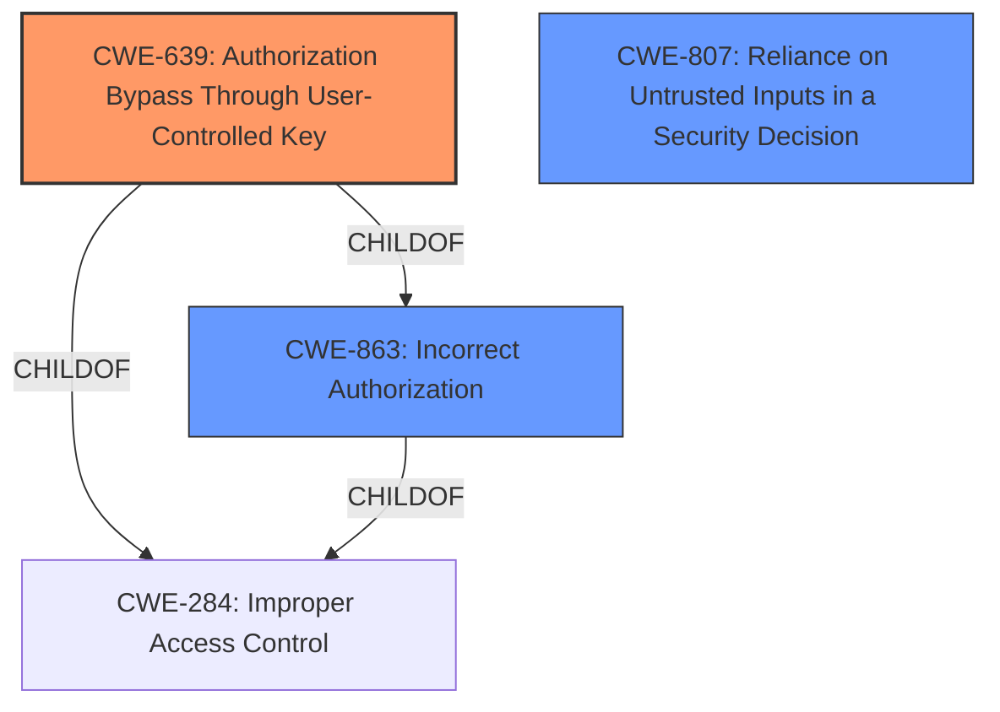

# Raw Analyzer Response for CVE-2022-1949

# Summary
| CWE ID | CWE Name | Confidence | CWE Abstraction Level | CWE Vulnerability Mapping Label | CWE-Vulnerability Mapping Notes |
|---|---|---|---|---|---|
| CWE-639 | Authorization Bypass Through User-Controlled Key | 0.9 | Base | Allowed | Primary CWE. The **access control bypass** occurs because the filter mishandling allows unauthorized access to data. The key that identifies the data being accessed is effectively user-controlled due to the **mishandling of the filter**. |
| CWE-863 | Incorrect Authorization | 0.7 | Class | Allowed-with-Review | Secondary CWE. The authorization check is performed incorrectly due to the **mishandling of the filter**, leading to an **access control bypass**. |
| CWE-807 | Reliance on Untrusted Inputs in a Security Decision | 0.6 | Base | Allowed | Secondary CWE. The system relies on a filter as input, but the **mishandling of the filter** leads to an **access control bypass**, allowing unauthorized access to data. The filter can be modified by an untrusted actor. |

## Evidence and Confidence

*   **Confidence Score:** 0.9
*   **Evidence Strength:** HIGH

## Relationship Analysis
The primary CWE is CWE-639, which is a base-level weakness describing authorization bypass through a user-controlled key. CWE-863 is a parent class of CWE-639, representing incorrect authorization more broadly. CWE-807 highlights that the system relies on untrusted inputs (the filter), which, when mishandled, lead to the bypass. All three CWEs are related to authorization and access control, with CWE-639 being the most specific to the vulnerability.

## Vulnerability Chain
The chain of events is as follows:
1.  The system **mishandles the filter** used for access control (root cause).
2.  This **mishandling** leads to an **access control bypass**.
3.  A remote, unauthenticated user can then search for database items they do not have access to, including sensitive data (impact).

## Summary of Analysis
The initial assessment focused on the **access control bypass** due to the **mishandling of the filter**. The evidence from the vulnerability description and CVE reference links confirms that the **mishandling** allows unauthorized access to sensitive data.

The CVE Reference Links Content Summary states: "The filter optimization logic in 389-ds-base did not correctly handle access control checks...This could lead to the server incorrectly reducing entries, and in some cases, prematurely returning results which led to an access control bypass."

The selection of CWE-639 is based on the fact that the **mishandling of the filter** effectively makes the key (the filter itself) user-controlled, as the user can craft a filter that bypasses intended access controls. CWE-639 aligns with the vulnerability description because the filter logic, intended to restrict access, is flawed, allowing users to manipulate the key to gain unauthorized access.

CWE-863 is considered because the authorization check itself is performed incorrectly. However, it's less specific than CWE-639, which focuses on the user-controlled key aspect.

CWE-807 is considered because the vulnerability stems from the system's reliance on an untrusted input (the filter) for security decisions.

The chosen CWEs are at the optimal level of specificity, with CWE-639 being a base-level CWE directly addressing the root cause. The confidence is high (0.9) due to the clear evidence of **access control bypass** and the **mishandling of the filter**.

Relevant CWE Information:
- CWE-639: The **access control bypass** is directly related to the system's authorization functionality not preventing one user from gaining access to data they shouldn't have access to. The filter acts as the key in this scenario.
- CWE-863: The authorization check is performed incorrectly due to the **mishandling of the filter**.
- CWE-807: The system relies on a filter that is then mishandled, leading to an authorization bypass.

Other CWEs Considered but Not Used:
- CWE-287 (Improper Authentication): This was considered but deemed less relevant because the issue is an **authorization bypass**, not a failure of authentication. The user is assumed to be unauthenticated in the description.
- CWE-306 (Missing Authentication for Critical Function): Similar to CWE-287, this is less relevant as the vulnerability is not about missing authentication, but about incorrect authorization.
- CWE-923 (Improper Restriction of Communication Channel to Intended Endpoints): This CWE is too broad, as the vulnerability does not involve issues with the communication channel itself, but with the **mishandling of the filter** that leads to an **authorization bypass**.
- CWE-184 (Incomplete List of Disallowed Inputs): While the **mishandling of the filter** could be seen as an incomplete list of disallowed inputs, it's more accurately described as an authorization bypass.