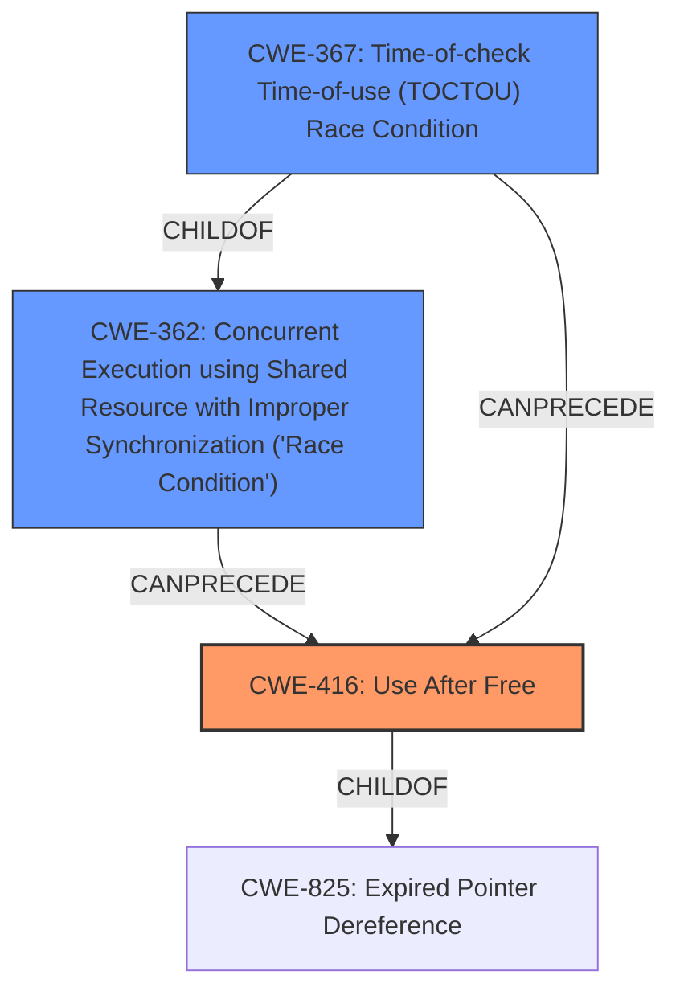

# Enhanced Analysis for CVE-2022-1974

# Summary
| CWE ID  | CWE Name   | Confidence | CWE Abstraction Level | CWE Vulnerability Mapping Label | CWE-Vulnerability Mapping Notes |
|-----------------|------------------------------------------------------------------------------------------------------------------|---------------------|------------------------|-----------------------------------------------------------------------------------|-------------------------------------------------------------------------------------------------------------------------------------------------------------------------------------------------------------------------------------------------------------------------------------------------------------------------------------------------------------------------------------------------------------------------------------------------|
| CWE-416 | Use After Free | 1.0 | Variant | Allowed | The vulnerability description explicitly mentions a **use-after-free** flaw, which aligns directly with the description of CWE-416. This is the primary weakness. |
| CWE-362 | Concurrent Execution using Shared Resource with Improper Synchronization ('Race Condition') | 0.9 | Class | Allowed-with-Review | The vulnerability description mentions a **race condition** between kobject creation and delete, which is a concurrent execution issue. CWE-362 is a good fit as a contributing factor.|
| CWE-367 | Time-of-check Time-of-use (TOCTOU) Race Condition | 0.7 | Base | Allowed | The CVE reference summary indicates a TOCTOU **race condition** due to unsynchronized access to device state, making CWE-367 a relevant, though less direct, mapping. |

## Evidence and Confidence

*   **Confidence Score:** 0.9
*   **Evidence Strength:** HIGH

## Relationship Analysis
The relationship analysis significantly influenced the selection of CWEs, particularly in understanding how the race condition leads to the use-after-free vulnerability.

*   **Parent-child hierarchical relationships:** CWE-416 (Use After Free) is a variant and child of CWE-825 (Expired Pointer Dereference), indicating a specific type of memory safety issue. CWE-362 (Concurrent Execution using Shared Resource with Improper Synchronization) is a class, suggesting a higher-level view of concurrency issues. CWE-367 (Time-of-check Time-of-use (TOCTOU) Race Condition) is a child of CWE-362, indicating a specific type of race condition.
*   **Chain relationships showing progression of vulnerability:** The race condition (CWE-362 or CWE-367) *CanPrecede* the use-after-free (CWE-416). This means the race condition sets the stage for the memory corruption that leads to the use-after-free.
*   **Peer relationships that offered alternative classifications:** CWE-415 (Double Free) is a peer of CWE-416, but the description explicitly mentions use-after-free, making CWE-416 a better fit.
*   **How abstraction levels influenced your selection:** CWE-416 was chosen as a Variant, providing a more specific description of the memory safety issue. CWE-362 was chosen as a Class, which gives a more generic description of the concurrency issue.



## Vulnerability Chain
The vulnerability chain starts with a **race condition** that occurs because `kobject_del()` is not protected by `device_lock`. This **race condition** leads to a state where memory is freed while another thread still holds a reference to it. The final result is a **use-after-free** vulnerability.
  - The root cause is the improper synchronization, leading to the race condition.
  - The weakness is the use-after-free.
  - The impact is the potential for information leak and kernel crash.

## Summary of Analysis
The initial assessment identified a **use-after-free** vulnerability due to a **race condition**. The detailed analysis of the CVE reference links content confirmed the **race condition** between `device_del()` and `device_is_registered()`, leading to the **use-after-free**.

The selection of CWEs is based on the evidence provided in the vulnerability description and the CVE reference links content summary. The primary weakness is the **use-after-free** (CWE-416), which is a direct consequence of the **race condition** (CWE-362 and CWE-367).

*   **CWE-416:** This is the most direct match for the stated vulnerability. The vulnerability description explicitly mentions a **use-after-free** flaw.
    > Vulnerability Description: A **use-after-free** flaw was found in the Linux kernels NFC core functionality due to a **race condition** between kobject creation and delete.
*   **CWE-362:** The **race condition** is a contributing factor to the **use-after-free**. The CVE reference links content summary confirms the presence of a **race condition** related to device registration and deletion.
    > CVE Reference Links Content Summary: The content describes a **race condition** vulnerability in the Linux kernel's NFC (Near Field Communication) subsystem.
*   **CWE-367:** The CVE reference summary also indicates the **race condition** is a Time-of-check Time-of-use.
    > CVE Reference Links Content Summary: The core issue is a time-of-check to time-of-use (TOCTOU) race condition.

The graph relationships influenced the final selection by clarifying the chain of events: the **race condition** *CanPrecede* the **use-after-free**.

The selected CWEs are at the optimal level of specificity because they directly address the root cause and the resulting weakness described in the vulnerability. CWE-416 is a Variant that accurately describes the memory safety issue, while CWE-362 is a Class that highlights the concurrency aspect and CWE-367 narrows the concurrency issue to a TOCTOU.

CWEs considered but not used:

*   CWE-667 (Improper Locking) and CWE-662 (Improper Synchronization): These were considered because the **race condition** implies a synchronization issue. However, the description doesn't explicitly mention improper locking mechanisms, so these were deemed less relevant than CWE-362, which directly addresses the **race condition**.
*   CWE-415 (Double Free): This was considered as a peer of CWE-416. However, the vulnerability description specifically mentions **use-after-free**, making CWE-416 a better fit.
*   CWE-909 (Missing Initialization of Resource) and CWE-908 (Use of Uninitialized Resource): While resource management is involved, the primary issue is not a missing initialization, but rather a **race condition** leading to memory being freed prematurely.


## CWE Relationship Analysis

Current CWEs represent these abstraction levels: .


### Vulnerability Chain Analysis

**Chain starting from CWE-825:**
- 825 (Expired Pointer Dereference) - ROOT


**Chain starting from CWE-908:**
- 908 (Use of Uninitialized Resource) - ROOT


### CWE Relationship Diagram

```mermaid
graph TD
    classDef primary fill:#f96,stroke:#333,stroke-width:2px
    classDef secondary fill:#69f,stroke:#333
    classDef tertiary fill:#9e9,stroke:#333
```