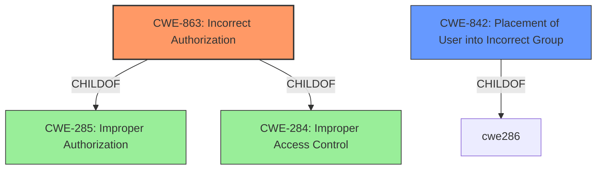

# Enhanced Analysis for CVE-2022-1981

# Summary
| CWE ID | CWE Name | Confidence | CWE Abstraction Level | CWE Vulnerability Mapping Label | CWE-Vulnerability Mapping Notes |
|---|---|---|---|---|---|
| CWE-863 | Incorrect Authorization | 0.9 | Class | Primary | Allowed-with-Review |
| CWE-842 | Placement of User into Incorrect Group | 0.7 | Base | Secondary | Allowed |

## Evidence and Confidence

*   **Confidence Score:** 0.8
*   **Evidence Strength:** HIGH

## Relationship Analysis
The primary relationship influencing the CWE selection is the hierarchical relationship between CWE-863 (Incorrect Authorization) and its potential child CWEs. The analysis considered whether a more specific child CWE would be a better fit, but ultimately, CWE-863 captures the core issue of an authorization check being performed incorrectly, leading to unauthorized access. CWE-842 (Placement of User into Incorrect Group) is related as this is how the Authorization is bypassed.



## Vulnerability Chain
The vulnerability chain starts with the **insufficient access control** in GitLab's "Invite a Group" feature. This leads to an **incorrect authorization** where users are placed into incorrect groups, ultimately resulting in the **bypass of domain allow-list restrictions**.

## Summary of Analysis
Initially, the analysis considered several CWEs related to authorization and access control, including CWE-285 (Improper Authorization) and CWE-639 (Authorization Bypass Through User-Controlled Key). However, based on the vulnerability description and the CVE reference summary, the core issue is that the authorization check for group invitations is performed incorrectly. The "Invite a Group" feature doesn't properly validate whether the members of the invited group comply with the email domain restrictions, leading to a bypass of the intended security control. This aligns well with the description of CWE-863 (Incorrect Authorization), which states that "The product performs an authorization check when an actor attempts to access a resource or perform an action, but it does not correctly perform the check." This is further facilitated by CWE-842 (Placement of User into Incorrect Group), the mechanism by which the bypass is achieved.

The decision to select CWE-863 is based on the evidence from the CVE reference summary, which explicitly mentions "Insufficient Access Control" and "Bypass of Intended Restriction." The vulnerability description key phrases also highlight the "**impact:** bypass allow-list" and "**vector:** Invite a group feature," further supporting this classification.

The choice of CWE-863 at the Class level is appropriate because while there might be more specific reasons for the incorrect authorization (e.g., missing validation), the overarching problem is that the authorization check itself is flawed.

Relevant CWE Information:

# Enhanced Context (25 CWEs)
The following CWEs were identified as potentially relevant to this vulnerability:

## CWE-405: Asymmetric Resource Consumption (Amplification)
**Abstraction Level**: Class
**Similarity Score**: 0.79

## CWE-404: Improper Resource Shutdown or Release
**Abstraction Level**: Class
**Similarity Score**: 0.77

## CWE-664: Improper Control of a Resource Through its Lifetime
**Abstraction Level**: Pillar
**Similarity Score**: 0.77

## CWE-799: Improper Control of Interaction Frequency
**Abstraction Level**: Class
**Similarity Score**: 0.77

## CWE-668: Exposure of Resource to Wrong Sphere
**Abstraction Level**: Class
**Similarity Score**: 0.76

## CWE-639: Authorization Bypass Through User-Controlled Key
**Abstraction Level**: Base
**Similarity Score**: 0.75
This CWE was considered but deemed not the best fit as it focuses on user-controlled keys, which isn't the primary issue here. The problem is with the authorization logic itself when inviting groups, not manipulation of a key.

## CWE-226: Sensitive Information in Resource Not Removed Before Reuse
**Abstraction Level**: Base
**Similarity Score**: 0.75

## CWE-1220: Insufficient Granularity of Access Control
**Abstraction Level**: Base
**Similarity Score**: 0.75

## CWE-274: Improper Handling of Insufficient Privileges
**Abstraction Level**: Base
**Similarity Score**: 0.74

## CWE-280: Improper Handling of Insufficient Permissions or Privileges
**Abstraction Level**: Base
**Similarity Score**: 0.74

## CWE-639: Authorization Bypass Through User-Controlled Key
**Abstraction Level**: Base
**Similarity Score**: 7131.32

## CWE-863: Incorrect Authorization
**Abstraction Level**: Class
**Similarity Score**: 7007.18

## CWE-285: Improper Authorization
**Abstraction Level**: Class
**Similarity Score**: 6826.66
CWE-285 (Improper Authorization) was considered but deemed too high-level. The analysis favored the more specific CWE-863.

## CWE-425: Direct Request ('Forced Browsing')
**Abstraction Level**: Base
**Similarity Score**: 6659.40
This CWE was considered, but it doesn't accurately reflect the vulnerability since it involves bypassing authorization checks through direct requests, which is not the case here.

## CWE-1390: Weak Authentication
**Abstraction Level**: Class
**Similarity Score**: 6558.45
CWE-1390 (Weak Authentication) was considered, but it focuses on the authentication mechanism itself, which is not the primary issue. The vulnerability lies in the authorization process after authentication.

## CWE-22: Improper Limitation of a Pathname to a Restricted Directory ('Path Traversal')
**Abstraction Level**: base
**Similarity Score**: 4.33

## CWE-471: Modification of Assumed-Immutable Data (MAID)
**Abstraction Level**: base
**Similarity Score**: 4.33

## CWE-410: Insufficient Resource Pool
**Abstraction Level**: base
**Similarity Score**: 4.33

## CWE-770: Allocation of Resources Without Limits or Throttling
**Abstraction Level**: base
**Similarity Score**: 4.33

## CWE-1284: Improper Validation of Specified Quantity in Input
**Abstraction Level**: base
**Similarity Score**: 4.33

## CWE-98: Improper Control of Filename for Include/Require Statement in PHP Program ('PHP Remote File Inclusion')
**Abstraction Level**: variant
**Similarity Score**: 3.88

## CWE-190: Integer Overflow or Wraparound
**Abstraction Level**: base
**Similarity Score**: 3.65

## CWE-178: Improper Handling of Case Sensitivity
**Abstraction Level**: base
**Similarity Score**: 3.64

## CWE-1289: Improper Validation of Unsafe Equivalence in Input
**Abstraction Level**: base
**Similarity Score**: 3.64

## CWE-73: External Control of File Name or Path
**Abstraction Level**: base
**Similarity Score**: 3.36


## CWE Relationship Analysis

Current CWEs represent these abstraction levels: .


### Vulnerability Chain Analysis

**Chain starting from CWE-668:**
- 668 (Exposure of Resource to Wrong Sphere) - ROOT


**Chain starting from CWE-410:**
- 410 (Insufficient Resource Pool) - ROOT


### CWE Relationship Diagram

```mermaid
graph TD
    classDef primary fill:#f96,stroke:#333,stroke-width:2px
    classDef secondary fill:#69f,stroke:#333
    classDef tertiary fill:#9e9,stroke:#333
```