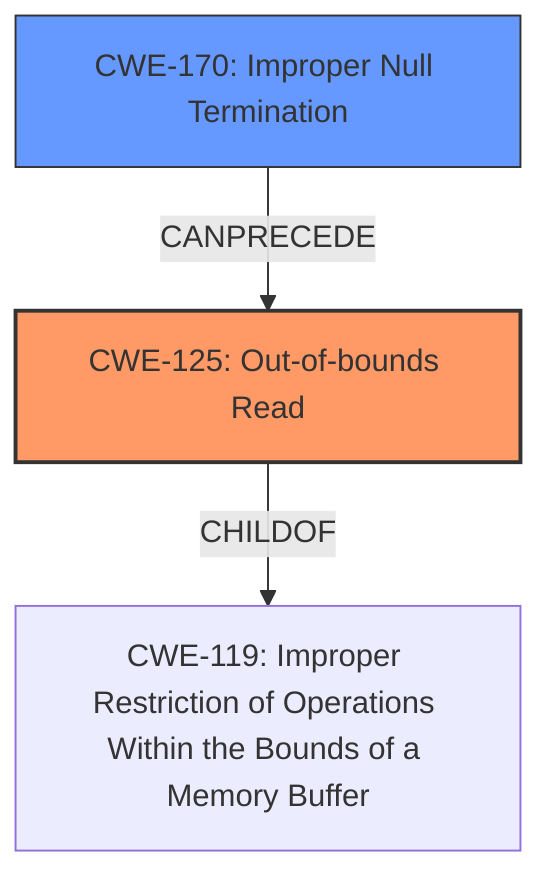

# Enhanced Analysis for CVE-2022-1987

# Summary
| CWE ID | CWE Name | Confidence | CWE Abstraction Level | CWE Vulnerability Mapping Label | CWE-Vulnerability Mapping Notes |
|---|---|---|---|---|---|
| CWE-125 | Out-of-bounds Read | 0.9 | Base | Allowed | Primary CWE |
| CWE-170 | Improper Null Termination | 0.7 | Base | Allowed | Secondary Candidate |

## Evidence and Confidence

*   **Confidence Score:** 0.8
*   **Evidence Strength:** HIGH

## Relationship Analysis
The primary CWE, CWE-125, is a child of CWE-119 (Improper Restriction of Operations Within the Bounds of a Memory Buffer). CWE-170 (Improper Null Termination) can precede CWE-125, indicating a potential chain where missing null termination leads to out-of-bounds reads. The abstraction levels are appropriate, with both CWEs being at the Base level.



## Vulnerability Chain
The vulnerability chain starts with a **missing null termination** (CWE-170), which leads to an **out-of-bounds read** (CWE-125). The impact is memory corruption and potential crash or arbitrary code execution.

## Summary of Analysis
The initial assessment based on the **Vulnerability Description Key Phrases**, identified **Buffer Over-read** which aligned directly with CWE-125. The **CVE Reference Links Content Summary** confirms that the root cause is indeed related to **missing null-termination**, potentially leading to a buffer over-read condition. The commit fixes this by ensuring null termination.

The graph relationships highlight that CWE-170 can precede CWE-125, supporting the mapping of both CWEs. CWE-125 accurately represents the direct consequence of the missing null termination, which causes the program to read beyond the intended buffer.

The selected CWEs are at the optimal level of specificity because they directly address the **root cause** (missing null termination) and the resulting vulnerability (out-of-bounds read). The evidence clearly supports this classification, with the fix explicitly addressing the lack of null termination.

Relevant CWE Information:

# Enhanced Context (25 CWEs)
The following CWEs were identified as potentially relevant to this vulnerability:

## CWE-170: Improper Null Termination
**Abstraction Level**: Base
**Similarity Score**: 0.78
**Source**: dense

**Description**:
The product does not terminate or incorrectly terminates a string or array with a null character or equivalent terminator.

**Mapping Guidance**:
- Usage: Allowed
- Rationale: This CWE entry is at the Base level of abstraction, which is a preferred level of abstraction for mapping to the root causes of vulnerabilities.

## CWE-125: Out-of-bounds Read
**Abstraction Level**: Base
**Similarity Score**: 6154.92
**Source**: sparse

**Description**:
The product reads data past the end, or before the beginning, of the intended buffer.

**Mapping Guidance**:
- Usage: Allowed
- Rationale: This CWE entry is at the Base level of abstraction, which is a preferred level of abstraction for mapping to the root causes of vulnerabilities.

### CWE Details and Justification:

*   **CWE-125: Out-of-bounds Read**
    *   **Technical Explanation:** The `mobi_indx_get_label` function **fails** to guarantee null-termination of the output string. When the label length equals the maximum allowed size, the function copies the maximum bytes into the buffer without adding a null terminator. This leads to reading beyond the buffer's intended boundary when the code later treats it as a null-terminated string.
    *   **Security Implications:** Memory corruption can lead to a program crash, and in severe cases, arbitrary code execution.
    *   **Relationship:** This is a direct consequence of the missing null termination. CWE-125 is a child of CWE-119 (Improper Restriction of Operations Within the Bounds of a Memory Buffer).
    *   **Mapping Guidance:** The "Usage: Allowed" guidance supports using this CWE.
    *   **Evidence:** "The root cause is that the `mobi_indx_get_label` function...did not guarantee null-termination of the output string...This lack of null-termination could lead to a buffer overflow if the label length was equal to the maximum allowed size."
    *   **Confidence:** 0.9
*   **CWE-170: Improper Null Termination**
    *   **Technical Explanation:** The vulnerability description states the **lack of null-termination** as the underlying issue. When the input data provides a label length equal to the maximum allowed size, the function copies that many bytes without null-terminating it.
    *   **Security Implications:** Missing null termination leads to potential buffer over-reads and memory corruption.
    *   **Relationship:** CWE-170 can precede CWE-125 in a vulnerability chain.
    *   **Mapping Guidance:** The "Usage: Allowed" guidance supports using this CWE.
    *   **Evidence:** "Missing Null-termination: The primary vulnerability is the absence of null termination for the label string after reading it using `mobi_indx_get_label` function, which could cause a buffer overflow."
    *   **Confidence:** 0.7

### CWEs Considered But Not Used:

*   **CWE-126: Buffer Over-read:** While the vulnerability is initially described as a **Buffer Over-read**, the root cause analysis reveals that the primary issue is missing null termination, leading to the over-read. CWE-125 is more specific to the actual read operation, making it a better fit.
*   **CWE-120: Buffer Copy without Checking Size of Input ('Classic Buffer Overflow'):** Although a buffer overflow is mentioned, it's a consequence of the missing null termination, not a direct unchecked buffer copy.
*   **CWE-787: Out-of-bounds Write:** The primary issue leads to an over-read, not an out-of-bounds write. The fix involves adding space for a null terminator, indicating that the read operation is the direct concern.
*   **CWE-130: Improper Handling of Length Parameter Inconsistency:** There is no direct evidence the length parameter is inconsistent with the data. The problem is that the code copies the full amount of data without adding a null terminator.
*   **CWE-193: Off-by-one Error:** While related to boundary conditions, the core issue is the missing null termination, not an incorrect calculation of the buffer size.


## CWE Relationship Analysis

Current CWEs represent these abstraction levels: .


### Vulnerability Chain Analysis

**Chain starting from CWE-130:**
- 130 (Improper Handling of Length Parameter Inconsistency) - ROOT


**Chain starting from CWE-170:**
- 170 (Improper Null Termination) - ROOT


### CWE Relationship Diagram

```mermaid
graph TD
    classDef primary fill:#f96,stroke:#333,stroke-width:2px
    classDef secondary fill:#69f,stroke:#333
    classDef tertiary fill:#9e9,stroke:#333
```