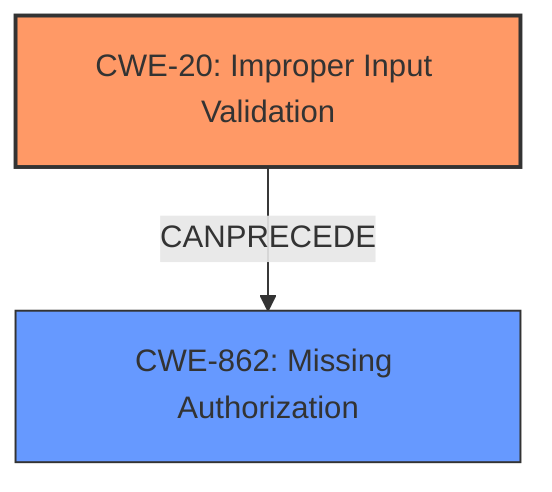

# Raw Analyzer Response for CVE-2022-20004

# Summary
| CWE ID | CWE Name | Confidence | CWE Abstraction Level | CWE Vulnerability Mapping Label | CWE-Vulnerability Mapping Notes |
|---|---|---|---|---|---|
| CWE-20 [Improper Input Validation](https://cwe.mitre.org/data/definitions/20.html) | Improper Input Validation | 0.8 | Class | Allowed-with-Review | The vulnerability is due to **improper input validation** in the `SliceManagerService.java` component. |
| CWE-862 [Missing Authorization](https://cwe.mitre.org/data/definitions/862.html) | Missing Authorization | 0.7 | Class | Allowed-with-Review | The `SliceManagerService#checkSlicePermission` method lacks proper caller identity verification. |

## Evidence and Confidence

*   **Confidence Score:** 0.75
*   **Evidence Strength:** MEDIUM

## Relationship Analysis
The primary CWE is CWE-20 [Improper Input Validation](https://cwe.mitre.org/data/definitions/20.html), which is a class-level CWE. CWE-862 [Missing Authorization](https://cwe.mitre.org/data/definitions/862.html) is a related CWE that specifies the missing authorization check. CWE-20 [Improper Input Validation](https://cwe.mitre.org/data/definitions/20.html) can lead to CWE-862 [Missing Authorization](https://cwe.mitre.org/data/definitions/862.html).

## Vulnerability Chain
The chain of root cause and weaknesses for the Vulnerability Description are:
1.  **Improper Input Validation (CWE-20)**: The `SliceManagerService.java` does not properly validate the input, allowing access to any slice URI.
2.  **Missing Authorization (CWE-862)**: The `SliceManagerService#checkSlicePermission` lacks proper caller identity verification before granting slice access, leading to privilege escalation.

## Summary of Analysis
The initial analysis identified **improper input validation** as the primary root cause. The CVE description states "**improper input validation**" as the rootcause and "**access any slice URI**" as the impact. The `SliceManagerService#checkSlicePermission` method **does not verify the caller's identity** before granting access.

Based on the provided evidence, CWE-20 [Improper Input Validation](https://cwe.mitre.org/data/definitions/20.html) is the primary CWE because the vulnerability description states "**improper input validation**". However, the lack of caller identity verification in `SliceManagerService#checkSlicePermission` is a missing authorization check, which falls under CWE-862 [Missing Authorization](https://cwe.mitre.org/data/definitions/862.html).

The selected CWEs are at the optimal level of specificity because CWE-20 [Improper Input Validation](https://cwe.mitre.org/data/definitions/20.html) is a class-level CWE, and CWE-862 [Missing Authorization](https://cwe.mitre.org/data/definitions/862.html) is also a class-level CWE. Both are relevant, but the description focuses more on the **improper input validation** aspect.

Relevant CWE Information:

# Enhanced Context (25 CWEs)
The following CWEs were identified as potentially relevant to this vulnerability:

## CWE-667: Improper Locking
**Abstraction Level**: Class
**Similarity Score**: 0.77
**Source**: dense

**Description**:
The product does not properly acquire or release a lock on a resource, leading to unexpected resource state changes and behaviors.

**Mapping Guidance**:
- Usage: Allowed-with-Review
- Rationale: This CWE entry is a Class and might have Base-level children that would be more appropriate

## CWE-662: Improper Synchronization
**Abstraction Level**: Class
**Similarity Score**: 0.77
**Source**: dense

**Description**:
The product utilizes multiple threads or processes to allow temporary access to a shared resource that can only be exclusive to one process at a time, but it does not properly synchronize these actions, which might cause simultaneous accesses of this resource by multiple threads or processes.

**Mapping Guidance**:
- Usage: Discouraged
- Rationale: This CWE entry is a level-1 Class (i.e., a child of a Pillar). It might have lower-level children that would be more appropriate

## CWE-366: Race Condition within a Thread
**Abstraction Level**: Base
**Similarity Score**: 0.77
**Source**: dense

**Description**:
If two threads of execution use a resource simultaneously, there exists the possibility that resources may be used while invalid, in turn making the state of execution undefined.

**Mapping Guidance**:
- Usage: Allowed
- Rationale: This CWE entry is at the Base level of abstraction, which is a preferred level of abstraction for mapping to the root causes of vulnerabilities.

## CWE-362: Concurrent Execution using Shared Resource with Improper Synchronization ('Race Condition')
**Abstraction Level**: Class
**Similarity Score**: 0.76
**Source**: dense

**Description**:
The product contains a concurrent code sequence that requires temporary, exclusive access to a shared resource, but a timing window exists in which the shared resource can be modified by another code sequence operating concurrently.

**Mapping Guidance**:
- Usage: Allowed-with-Review
- Rationale: This CWE entry is a Class and might have Base-level children that would be more appropriate

## CWE-367: Time-of-check Time-of-use (TOCTOU) Race Condition
**Abstraction Level**: Base
**Similarity Score**: 0.76
**Source**: dense

**Description**:
The product checks the state of a resource before using that resource, but the resource's state can change between the check and the use in a way that invalidates the results of the check. This can cause the product to perform invalid actions when the resource is in an unexpected state.

**Mapping Guidance**:
- Usage: Allowed
- Rationale: This CWE entry is at the Base level of abstraction, which is a preferred level of abstraction for mapping to the root causes of vulnerabilities.

## CWE-1289: Improper Validation of Unsafe Equivalence in Input
**Abstraction Level**: Base
**Similarity Score**: 0.76
**Source**: dense

**Description**:
The product receives an input value that is used as a resource identifier or other type of reference, but it does not validate or incorrectly validates that the input is equivalent to a potentially-unsafe value.

**Mapping Guidance**:
- Usage: Allowed
- Rationale: This CWE entry is at the Base level of abstraction, which is a preferred level of abstraction for mapping to the root causes of vulnerabilities.

## CWE-404: Improper Resource Shutdown or Release
**Abstraction Level**: Class
**Similarity Score**: 0.75
**Source**: dense

**Description**:
The product does not release or incorrectly releases a resource before it is made available for re-use.

**Mapping Guidance**:
- Usage: Allowed-with-Review
- Rationale: This CWE entry is a Class and might have Base-level children that would be more appropriate

## CWE-754: Improper Check for Unusual or Exceptional Conditions
**Abstraction Level**: Class
**Similarity Score**: 0.74
**Source**: dense

**Description**:
The product does not check or incorrectly checks for unusual or exceptional conditions that are not expected to occur frequently during day to day operation of the product.

**Mapping Guidance**:
- Usage: Allowed-with-Review
- Rationale: This CWE entry is a Class and might have Base-level children that would be more appropriate

## CWE-653: Improper Isolation or Compartmentalization
**Abstraction Level**: Class
**Similarity Score**: 0.73
**Source**: dense

**Description**:
The product does not properly compartmentalize or isolate functionality, processes, or resources that require different privilege levels, rights, or permissions.

**Mapping Guidance**:
- Usage: Allowed
- Rationale: This CWE entry is at the Base level of abstraction, which is a preferred level of abstraction for mapping to the root causes of vulnerabilities.

## CWE-703: Improper Check or Handling of Exceptional Conditions
**Abstraction Level**: Pillar
**Similarity Score**: 0.73
**Source**: dense

**Description**:
The product does not properly anticipate or handle exceptional conditions that rarely occur during normal operation of the product.

**Mapping Guidance**:
- Usage: Discouraged
- Rationale: This CWE entry is extremely high-level, a Pillar.

## CWE-1284: Improper Validation of Specified Quantity in Input
**Abstraction Level**: Base
**Similarity