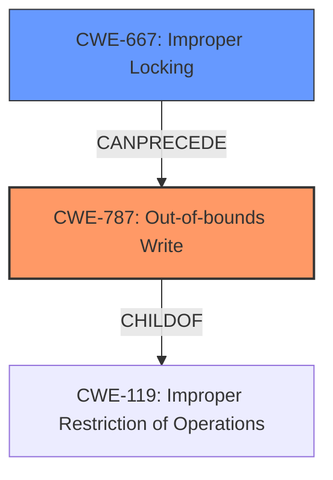

# Enhanced Analysis for CVE-2022-20016

# Summary
| CWE ID | CWE Name | Confidence | CWE Abstraction Level | CWE Vulnerability Mapping Label | CWE-Vulnerability Mapping Notes |
|---|---|---|---|---|---|
| CWE-787 | Out-of-bounds Write | 0.9 | Base | Primary | Allowed |
| CWE-667 | Improper Locking | 0.7 | Class | Secondary | Allowed-with-Review |

## Evidence and Confidence

*   **Confidence Score:** 0.8
*   **Evidence Strength:** HIGH

## Relationship Analysis
The primary weakness is **memory corruption** due to **improper locking**. The **improper locking** (CWE-667) can lead to a variety of issues, including race conditions and data corruption. In this specific case, the **memory corruption** is manifested as an Out-of-bounds Write (CWE-787), which is a more specific type of **memory corruption**. CWE-787 is a ChildOf CWE-119 (Improper Restriction of Operations within the Bounds of a Memory Buffer). CWE-667 is a Class-level CWE, while CWE-787 is a Base-level CWE. Therefore, CWE-787 is more specific and preferred.



## Vulnerability Chain
The vulnerability chain starts with **improper locking** (CWE-667), which leads to **memory corruption** manifested as out-of-bounds write (CWE-787). This **memory corruption** can then lead to local escalation of privilege.

## Summary of Analysis
The vulnerability description indicates that there is **memory corruption** caused by **improper locking**. The "CVE Reference Links Content Summary" confirms this, stating "Improper locking in vow driver" as the root cause and "Improper restriction of operations within the bounds of a memory buffer" as a weakness, which aligns with CWE-119 and its child CWE-787.

The retriever results suggest CWE-787 (Out-of-bounds Write) and CWE-667 (Improper Locking) as potential candidates. Given the evidence and the hierarchical relationship, CWE-787 is chosen as the primary CWE because it describes the specific type of **memory corruption**, whereas CWE-667 represents the root cause, a more general class of error.

CWE-662 (Improper Synchronization) and CWE-362 (Concurrent Execution using Shared Resource with Improper Synchronization ('Race Condition')) were also considered because improper locking often leads to synchronization issues and race conditions. However, the description doesn't explicitly mention concurrent execution or race conditions, so they are not chosen.

CWE-123 (Write-what-where Condition) was considered but it is less specific than CWE-787 and the description does not explicitly indicate that the attacker has the ability to write an arbitrary value to an arbitrary location.

CWE-413 (Improper Resource Locking) was considered but CWE-667 is a more general Class that encompasses **improper locking**, making it a more suitable representation of the root cause.

CWE-908 (Use of Uninitialized Resource), CWE-1260 (Improper Handling of Overlap Between Protected Memory Ranges), CWE-131 (Incorrect Calculation of Buffer Size), and CWE-704 (Incorrect Type Conversion or Cast) were considered but do not directly apply to the vulnerability based on the available information.

The chosen CWEs are at the optimal level of specificity, with CWE-787 describing the specific **memory corruption** and CWE-667 representing the root cause of **improper locking**.

Relevant CWE Information:
# Enhanced Context (25 CWEs)
The following CWEs were identified as potentially relevant to this vulnerability:

## CWE-704: Incorrect Type Conversion or Cast
**Abstraction Level**: Class
**Similarity Score**: 0.78
**Source**: dense

**Description**:
The product does not correctly convert an object, resource, or structure from one type to a different type.

**Mapping Guidance**:
- Usage: Allowed-with-Review
- Rationale: This CWE entry is a Class and might have Base-level children that would be more appropriate

## CWE-667: Improper Locking
**Abstraction Level**: Class
**Similarity Score**: 0.77
**Source**: dense

**Description**:
The product does not properly acquire or release a lock on a resource, leading to unexpected resource state changes and behaviors.

**Mapping Guidance**:
- Usage: Allowed-with-Review
- Rationale: This CWE entry is a Class and might have Base-level children that would be more appropriate

## CWE-681: Incorrect Conversion between Numeric Types
**Abstraction Level**: Base
**Similarity Score**: 0.77
**Source**: dense

**Description**:
When converting from one data type to another, such as long to integer, data can be omitted or translated in a way that produces unexpected values. If the resulting values are used in a sensitive context, then dangerous behaviors may occur.

**Mapping Guidance**:
- Usage: Allowed
- Rationale: This CWE entry is at the Base level of abstraction, which is a preferred level of abstraction for mapping to the root causes of vulnerabilities.

## CWE-404: Improper Resource Shutdown or Release
**Abstraction Level**: Class
**Similarity Score**: 0.77
**Source**: dense

**Description**:
The product does not release or incorrectly releases a resource before it is made available for re-use.

**Mapping Guidance**:
- Usage: Allowed-with-Review
- Rationale: This CWE entry is a Class and might have Base-level children that would be more appropriate

## CWE-131: Incorrect Calculation of Buffer Size
**Abstraction Level**: Base
**Similarity Score**: 0.76
**Source**: dense

**Description**:
The product does not correctly calculate the size to be used when allocating a buffer, which could lead to a buffer overflow.

**Mapping Guidance**:
- Usage: Allowed
- Rationale: This CWE entry is at the Base level of abstraction, which is a preferred level of abstraction for mapping to the root causes of vulnerabilities.

## CWE-682: Incorrect Calculation
**Abstraction Level**: Pillar
**Similarity Score**: 0.76
**Source**: dense

**Description**:
The product performs a calculation that generates incorrect or unintended results that are later used in security-critical decisions or resource management.

**Mapping Guidance**:
- Usage: Discouraged
- Rationale: This CWE entry is extremely high-level, a Pillar. In many cases, lower-level children or descendants are more appropriate. However, sometimes this weakness is forced to be used due to the lack of in-depth weakness research. See Research Gaps.

## CWE-843: Access of Resource Using Incompatible Type ('Type Confusion')
**Abstraction Level**: Base
**Similarity Score**: 0.75
**Source**: dense

**Description**:
The product allocates or initializes a resource such as a pointer, object, or variable using one type, but it later accesses that resource using a type that is incompatible with the original type.

**Mapping Guidance**:
- Usage: Allowed
- Rationale: This CWE entry is at the Base level of abstraction, which is a preferred level of abstraction for mapping to the root causes of vulnerabilities.

## CWE-1289: Improper Validation of Unsafe Equivalence in Input
**Abstraction Level**: Base
**Similarity Score**: 0.75
**Source**: dense

**Description**:
The product receives an input value that is used as a resource identifier or other type of reference, but it does not validate or incorrectly validates that the input is equivalent to a potentially-unsafe value.

**Mapping Guidance**:
- Usage: Allowed
- Rationale: This CWE entry is at the Base level of abstraction, which is a preferred level of abstraction for mapping to the root causes of vulnerabilities.

## CWE-226: Sensitive Information in Resource Not Removed Before Reuse
**Abstraction Level**: Base
**Similarity Score**: 0.75
**Source**: dense

**Description**:
The product releases a resource such as memory or a file so that it can be made available for reuse, but it does not clear or "zeroize" the information contained in the resource before the product performs a critical state transition or makes the resource available for reuse by other entities.

**Mapping Guidance**:
- Usage: Allowed
- Rationale: This CWE entry is at the Base level of abstraction, which is a preferred level of abstraction for mapping to the root causes of vulnerabilities.

## CWE-662: Improper Synchronization
**Abstraction Level**: Class
**Similarity Score**: 0.75
**Source**: dense

**Description**:
The product utilizes multiple threads or processes to allow temporary access to


## CWE Relationship Analysis

Current CWEs represent these abstraction levels: .


### Vulnerability Chain Analysis

**Chain starting from CWE-413:**
- 413 (Improper Resource Locking) - ROOT


**Chain starting from CWE-131:**
- 131 (Incorrect Calculation of Buffer Size) - ROOT


### CWE Relationship Diagram

```mermaid
graph TD
    classDef primary fill:#f96,stroke:#333,stroke-width:2px
    classDef secondary fill:#69f,stroke:#333
    classDef tertiary fill:#9e9,stroke:#333
```