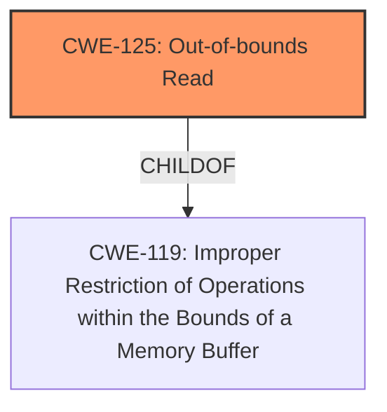

# Raw Analyzer Response for CVE-2022-20019

# Summary
| CWE ID | CWE Name | Confidence | CWE Abstraction Level | CWE Vulnerability Mapping Label | CWE-Vulnerability Mapping Notes |
|---|---|---|---|---|---|
| CWE-125 | Out-of-bounds Read | 0.9 | Base | Allowed | Primary CWE |

## Evidence and Confidence

*   **Confidence Score:** 0.9
*   **Evidence Strength:** HIGH

## Relationship Analysis
The primary relationship influencing the decision is the parent-child relationship between CWE-125 and CWE-119 (Improper Restriction of Operations within the Bounds of a Memory Buffer). CWE-125 is a more specific case of CWE-119, where the operation is specifically a read. The vulnerability description explicitly mentions an **incorrect bounds check** leading to information disclosure, directly aligning with an out-of-bounds read scenario.

## Vulnerability Chain
The vulnerability chain is relatively simple:
1.  **Root Cause:** **Incorrect bounds check**.
2.  **Weakness:** Out-of-bounds read (CWE-125).
3.  **Impact:** Information disclosure.

## Summary of Analysis
The analysis is strongly based on the provided evidence, particularly the vulnerability description and CVE reference links. The description explicitly mentions an **incorrect bounds check**, which is a clear indicator of a memory safety issue. The consequence of this **incorrect bounds check** is information disclosure.

The retriever results suggest several CWEs, but the most relevant one is CWE-125 (Out-of-bounds Read), which directly aligns with the vulnerability's root cause and impact.

The choice of CWE-125 is at the optimal level of specificity because it accurately reflects the nature of the vulnerability, which involves reading data beyond the intended buffer boundaries due to an **incorrect bounds check**.

Relevant CWE Information:

# Enhanced Context (25 CWEs)
The following CWEs were identified as potentially relevant to this vulnerability:

## Vulnerability Description
In libMtkOmxGsmDec, there is a possible information disclosure due to an **incorrect bounds check**. This could lead to local information disclosure with no additional execution privileges needed. User interaction is not needed for exploitation. Patch ID ALPS05917620 Issue ID ALPS05917620.

### Vulnerability Description Key Phrases
- **rootcause:** **incorrect bounds check**
- **impact:** information disclosure
- **product:** libMtkOmxGsmDec

## CVE Reference Links Content Summary
- **Root cause:** Incorrect bounds check in `libMtkOmxGsmDec`
- **Weaknesses/vulnerabilities:** Information disclosure due to an incorrect bounds check.
- **Impact of exploitation:** Local information disclosure.
- **Attack vectors:** Local access to the vulnerable device.
- **Required attacker capabilities/position:** No additional execution privileges needed, user interaction is not required.

## Retriever Results

### Top Combined Results

| Rank | CWE ID | Name | Abstraction | Usage  | Retrievers | Individual Scores |
|------|--------|------|-------------|-------|------------|-------------------|
| 1 | 908 | Use of Uninitialized Resource | Base | Allowed | sparse | 0.315 |
| 2 | 862 | Missing Authorization | Class | Allowed-with-Review | sparse | 0.306 |
| 3 | 131 | Incorrect Calculation of Buffer Size | Base | Allowed | sparse | 0.306 |
| 4 | 191 | Integer Underflow (Wrap or Wraparound) | Base | Allowed | sparse | 0.306 |
| 5 | 362 | Concurrent Execution using Shared Resource with Improper Synchronization ('Race Condition') | Class | Allowed-with-Review | sparse | 0.292 |
| 6 | 126 | Buffer Over-read | Variant | Allowed | dense | 0.573 |
| 7 | 1272 | Sensitive Information Uncleared Before Debug/Power State Transition | Base | Allowed | graph | 0.002 |
| 8 | 20 | Improper Input Validation | Class | Discouraged | sparse | 0.286 |
| 9 | 514 | Covert Channel | Class | Allowed-with-Review | sparse | 0.284 |
| 10 | 667 | Improper Locking | Class | Allowed-with-Review | sparse | 0.282 |

## CWEs Considered But Not Used:

*   **CWE-908 (Use of Uninitialized Resource):** While uninitialized resources can lead to information disclosure, the primary cause here is an **incorrect bounds check**, not the use of an uninitialized resource.
*   **CWE-862 (Missing Authorization):** Authorization issues are not mentioned in the description. The problem stems from improper memory access control, not a lack of authorization.
*   **CWE-131 (Incorrect Calculation of Buffer Size):** This could be related, but the description focuses on bounds checking, not the initial size calculation. It's possible an incorrect size calculation led to the bounds check failure, but the evidence does not support this directly.
*   **CWE-191 (Integer Underflow (Wrap or Wraparound)):** Integer underflow is not directly implicated. The issue is with the bounds check itself, not with integer arithmetic.
*   **CWE-362 (Concurrent Execution using Shared Resource with Improper Synchronization ('Race Condition')):** Concurrency issues are not mentioned in the description.
*   **CWE-126 (Buffer Over-read):** This is a closely related CWE, but the description doesn't explicitly say that it's reading past the end of the buffer, it's more generic as a bounds check issue. It's possible the read is *before* the buffer as well, making CWE-125 the better overall match. The information disclosure could come from either under-read or over-read.
*   **CWE-1272 (Sensitive Information Uncleared Before Debug/Power State Transition):** This CWE is not related to the described vulnerability. It focuses on sensitive data leakage during state transitions, which is not the case here.
*   **CWE-20 (Improper Input Validation):** While a bounds check can be considered a form of input validation, CWE-20 is too general. The problem is specifically with the bounds check logic, making CWE-125 a more precise fit.
*   **CWE-514 (Covert Channel):** Covert channels are not relevant to this vulnerability. The information disclosure is a direct result of a memory access error, not a hidden communication path.
*   **CWE-667 (Improper Locking):** Locking and synchronization issues are not mentioned in the description.