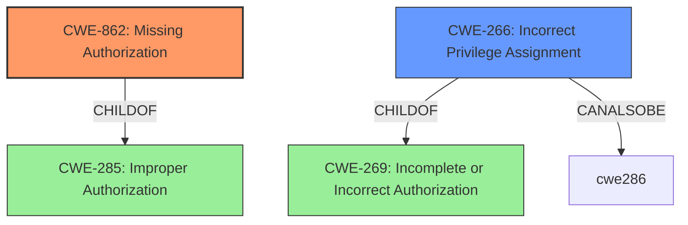

# Analysis Report for CVE-2022-20024

# Vulnerability Analysis Report: CVE-2022-20024

## Description


## Analysis (with Relationship Data)

# Summary
| CWE ID | CWE Name | Confidence | CWE Abstraction Level | CWE Vulnerability Mapping Label | CWE-Vulnerability Mapping Notes |
|---|---|---|---|---|---|
| CWE-862 | Missing Authorization | 1.0 | Class | Allowed-with-Review | Primary CWE |
| CWE-266 | Incorrect Privilege Assignment | 0.7 | Base | Allowed | Secondary Candidate |

## Evidence and Confidence

*   **Confidence Score:** 0.9
*   **Evidence Strength:** HIGH

## Relationship Analysis
The primary relationship influencing my decision is the hierarchical structure where CWE-862 (Missing Authorization) is a class-level CWE. It's a child of CWE-285 (Improper Authorization), indicating that authorization issues are the broader category. CWE-266 (Incorrect Privilege Assignment) is a base-level CWE and a child of CWE-269 (Incomplete or Incorrect Authorization). The relationships show that the vulnerability stems from problems related to authorization and privilege management.



## Vulnerability Chain
The vulnerability chain starts with the **missing permission check** (CWE-862) in the system service, leading to a permission bypass. This bypass then leads to a local escalation of privilege. The root cause is the **missing permission check**, and the impact is the local escalation of privilege.

## Summary of Analysis
The initial analysis identified the **missing permission check** as the root cause of the vulnerability, leading to a permission bypass and local escalation of privilege. The CVE description states: "In system service, there is a possible permission bypass due to a **missing permission check**. This could lead to local escalation of privilege...". The **Vulnerability Description Key Phrases** also highlight "**missing permission check**" as the root cause. The "CVE Reference Links Content Summary" confirms the root cause: "**Missing permission check** in system service."

CWE-862 (Missing Authorization) is the primary CWE because the vulnerability description explicitly states a "**missing permission check**." CWE-862's description is: "The product does not perform an authorization check when an actor attempts to access a resource or perform an action." This aligns perfectly with the vulnerability.

CWE-266 (Incorrect Privilege Assignment) was considered as a secondary CWE because the bypass leads to unintended privileges. However, the root cause is the **missing check**, not the incorrect assignment, making it a less direct fit.

I am confident in this assessment, as the evidence directly supports the selection of CWE-862 as the primary weakness. The graph relationships and mapping guidance further reinforce this choice. The selected CWE is at the optimal level of specificity, as it accurately represents the root cause of the vulnerability.


## CWE Relationship Analysis

Current CWEs represent these abstraction levels: .


### Vulnerability Chain Analysis

**Chain starting from CWE-862:**
- 862 (Missing Authorization) - ROOT


**Chain starting from CWE-285:**
- 285 (Improper Authorization) - ROOT


### CWE Relationship Diagram

```mermaid
graph TD
    classDef primary fill:#f96,stroke:#333,stroke-width:2px
    classDef secondary fill:#69f,stroke:#333
    classDef tertiary fill:#9e9,stroke:#333
```


*Report generated on 2025-03-30 12:12:52*
