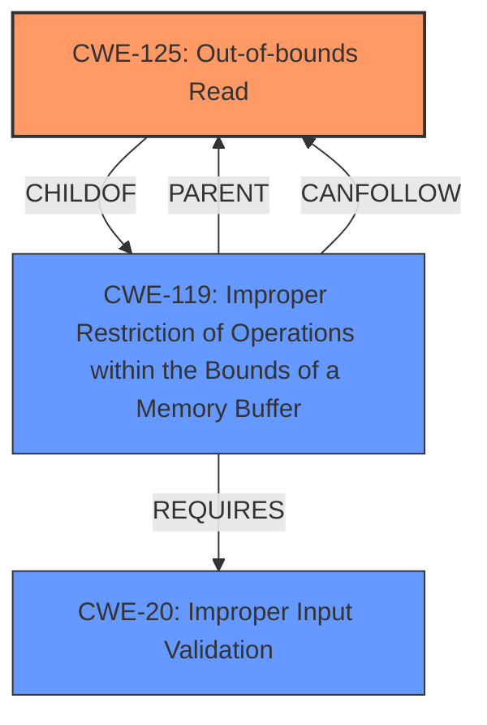

# Enhanced Analysis for CVE-2022-20037

# Summary
| CWE ID  | CWE Name                        | Confidence | CWE Abstraction Level | CWE Vulnerability Mapping Label | CWE-Vulnerability Mapping Notes |
| :------- | :------------------------------- | :--------- | :-------------------- | :------------------------------ | :---------------------------- |
| CWE-125  | Out-of-bounds Read             | 0.9        | Base                  | Primary CWE                   | Allowed                      |
| CWE-20   | Improper Input Validation         | 0.4        | Class                 | Secondary Candidate             | Discouraged                 |

## Evidence and Confidence

*   **Confidence Score:** 0.9
*   **Evidence Strength:** HIGH

## Relationship Analysis
The primary relationship influencing the CWE selection is the parent-child relationship between CWE-119 (Improper Restriction of Operations within the Bounds of a Memory Buffer) and CWE-125 (Out-of-bounds Read). CWE-125 is a more specific case of CWE-119, where the **incorrect bounds check** leads to reading data outside the intended buffer. The **incorrect bounds check** is a form of **improper input validation** as well. The relationship between these CWEs suggests that the **incorrect bounds check** is the root cause, leading to an out-of-bounds read.



## Vulnerability Chain
The vulnerability chain begins with the **incorrect bounds check** and results in an **information disclosure**. This can be represented as follows:

1.  **Root Cause:** **Incorrect bounds check** during data processing.
2.  **Weakness:** Out-of-bounds Read (CWE-125) due to the **incorrect bounds check**.
3.  **Impact:** Information Disclosure, where sensitive data outside the intended buffer is exposed.

## Summary of Analysis
Initially, CWE-787 (Out-of-bounds Write) was considered due to its prevalence in similar CVE descriptions. However, the vulnerability description clearly indicates an **information disclosure**, resulting from reading data past the buffer's boundaries, not writing. This distinction is crucial because CWE-787 involves writing outside the intended buffer, potentially leading to code execution or corruption, while the described vulnerability only involves reading, leading to **information disclosure**.

The retriever results suggested other CWEs like CWE-908 (Use of Uninitialized Resource), CWE-131 (Incorrect Calculation of Buffer Size), and CWE-191 (Integer Underflow). While these might be indirectly related, the core issue is the **incorrect bounds check** leading to reading outside the buffer. Therefore, CWE-125 is the most accurate representation of the vulnerability based on the provided evidence.

CWE-20 (Improper Input Validation) was also considered as a secondary weakness, since the **incorrect bounds check** is a form of **improper input validation**. However, CWE-20 is a very broad class, and the more specific CWE-125 is a better fit for the described vulnerability.

The final decision to assign CWE-125 is based on the following:

*   The vulnerability description explicitly mentions an **incorrect bounds check**, leading to **information disclosure**.
*   The CVE Reference Links Content Summary confirms the **incorrect bounds check** as the root cause.
*   CWE-125 directly addresses the issue of reading data outside the intended buffer.
*   The relationship analysis shows CWE-125 as a specific type of CWE-119, providing a more accurate classification than its parent.

Relevant CWE Information:

# Enhanced Context (25 CWEs)

## CWE-191: Integer Underflow (Wrap or Wraparound)
**Abstraction Level**: Base
**Similarity Score**: 0.79
**Source**: dense

**Description**:
The product subtracts one value from another, such that the result is less than the minimum allowable integer value, which produces a value that is not equal to the correct result.

**Mapping Guidance**:
- Usage: Allowed
- Rationale: This CWE entry is at the Base level of abstraction, which is a preferred level of abstraction for mapping to the root causes of vulnerabilities.

## CWE-197: Numeric Truncation Error
**Abstraction Level**: Base
**Similarity Score**: 0.77
**Source**: dense

**Description**:
Truncation errors occur when a primitive is cast to a primitive of a smaller size and data is lost in the conversion.

**Mapping Guidance**:
- Usage: Allowed
- Rationale: This CWE entry is at the Base level of abstraction, which is a preferred level of abstraction for mapping to the root causes of vulnerabilities.

## CWE-681: Incorrect Conversion between Numeric Types
**Abstraction Level**: Base
**Similarity Score**: 0.76
**Source**: dense

**Description**:
When converting from one data type to another, such as long to integer, data can be omitted or translated in a way that produces unexpected values. If the resulting values are used in a sensitive context, then dangerous behaviors may occur.

**Mapping Guidance**:
- Usage: Allowed
- Rationale: This CWE entry is at the Base level of abstraction, which is a preferred level of abstraction for mapping to the root causes of vulnerabilities.

## CWE-680: Integer Overflow to Buffer Overflow
**Abstraction Level**: Compound
**Similarity Score**: 0.76
**Source**: dense

**Description**:
The product performs a calculation to determine how much memory to allocate, but an integer overflow can occur that causes less memory to be allocated than expected, leading to a buffer overflow.

**Mapping Guidance**:
- Usage: Discouraged
- Rationale: This CWE entry is a named chain, which combines multiple weaknesses.

## CWE-190: Integer Overflow or Wraparound
**Abstraction Level**: Base
**Similarity Score**: 0.76
**Source**: dense

**Description**:
The product performs a calculation that can
         produce an integer overflow or wraparound when the logic
         assumes that the resulting value will always be larger than
         the original value. This occurs when an integer value is
         incremented to a value that is too large to store in the
         associated representation. When this occurs, the value may
         become a very small or negative number.

**Mapping Guidance**:
- Usage: Allowed
- Rationale: This CWE entry is at the Base level of abstraction, which is a preferred level of abstraction for mapping to the root causes of vulnerabilities.

## CWE-131: Incorrect Calculation of Buffer Size
**Abstraction Level**: Base
**Similarity Score**: 0.75
**Source**: dense

**Description**:
The product does not correctly calculate the size to be used when allocating a buffer, which could lead to a buffer overflow.

**Mapping Guidance**:
- Usage: Allowed
- Rationale: This CWE entry is at the Base level of abstraction, which is a preferred level of abstraction for mapping to the root causes of vulnerabilities.

## CWE-1289: Improper Validation of Unsafe Equivalence in Input
**Abstraction Level**: Base
**Similarity Score**: 0.74
**Source**: dense

**Description**:
The product receives an input value that is used as a resource identifier or other type of reference, but it does not validate or incorrectly validates that the input is equivalent to a potentially-unsafe value.

**Mapping Guidance**:
- Usage: Allowed
- Rationale: This CWE entry is at the Base level of abstraction, which is a preferred level of abstraction for mapping to the root causes of vulnerabilities.

## CWE-667: Improper Locking
**Abstraction Level**: Class
**Similarity Score**: 0.74
**Source**: dense

**Description**:
The product does not properly acquire or release a lock on a resource, leading to unexpected resource state changes and behaviors.

**Mapping Guidance**:
- Usage: Allowed-with-Review
- Rationale: This CWE entry is a Class and might have Base-level children that would be more appropriate

## CWE-682: Incorrect Calculation
**Abstraction Level**: Pillar
**Similarity Score**: 0.74
**Source**: dense

**Description**:
The product performs a calculation that generates incorrect or unintended results that are later used in security-critical decisions or resource management.

**Mapping Guidance**:
- Usage: Discouraged
- Rationale: This CWE entry is extremely high-level, a Pillar. In many cases, lower-level children or descendants are more appropriate. However, sometimes this weakness is forced to be used due to the lack of in-depth weakness research. See


## CWE Relationship Analysis

Current CWEs represent these abstraction levels: .


### Vulnerability Chain Analysis

**Chain starting from CWE-131:**
- 131 (Incorrect Calculation of Buffer Size) - ROOT


**Chain starting from CWE-190:**
- 190 (Integer Overflow or Wraparound) - ROOT


### CWE Relationship Diagram

```mermaid
graph TD
    classDef primary fill:#f96,stroke:#333,stroke-width:2px
    classDef secondary fill:#69f,stroke:#333
    classDef tertiary fill:#9e9,stroke:#333
```