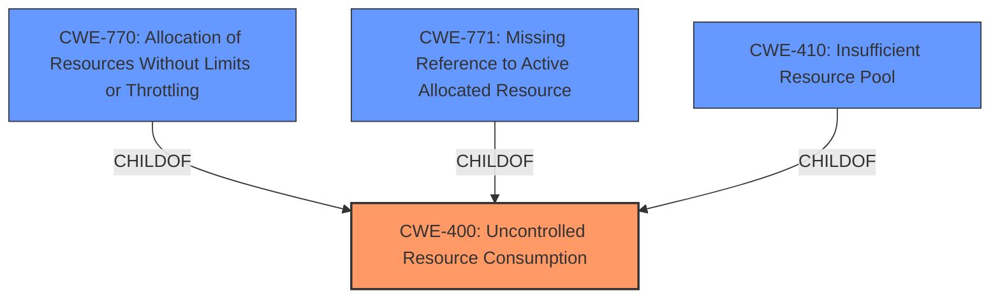

# Analysis for CVE-2022-2004

# Summary
| CWE ID | CWE Name | Confidence | CWE Abstraction Level | CWE Vulnerability Mapping Label | CWE-Vulnerability Mapping Notes |
|---|---|---|---|---|---|
| CWE-400 | Uncontrolled Resource Consumption | 1.0 | Class | Primary | Allowed |

## Evidence and Confidence

*   **Confidence Score:** 1.0
*   **Evidence Strength:** HIGH

## Relationship Analysis
The primary CWE is CWE-400, which is a Class-level CWE. This CWE has several children, such as CWE-770 (Allocation of Resources Without Limits or Throttling), CWE-771 (Missing Reference to Active Allocated Resource), and CWE-410 (Insufficient Resource Pool). While these child CWEs are more specific, the description provided does not offer enough details to pinpoint the exact type of resource consumption issue. Therefore, the Class-level CWE-400 is the most appropriate choice.

## Vulnerability Chain
The vulnerability chain starts with the receipt of a specially crafted packet. The system's failure to properly manage this packet leads to uncontrolled resource consumption. This, in turn, results in a denial-of-service condition, preventing legitimate access and operation.

## Summary of Analysis
The analysis is based on the provided evidence, specifically the "CVE Reference Links Content Summary" section, which states: "A specially crafted packet sent continuously to the PLC can prevent access from DirectSoft and other devices... **Weakness:** Uncontrolled Resource Consumption (CWE-400)... **Impact:** Denial-of-service (DoS) condition." This statement directly maps the vulnerability to CWE-400. The retriever results also list CWE-400 as the top combined result, although it is discouraged. Given the direct mapping and the lack of more specific information, CWE-400 is the most appropriate choice.

The MITRE mapping guidance for CWE-400 suggests analyzing the specific mistake causing the resource consumption and considering children/descendants such as CWE-770, CWE-771, CWE-410, and others. However, the vulnerability description does not provide enough detail to determine the exact nature of the resource consumption issue. Therefore, the more general CWE-400 is selected.
Relevant CWE Information:

# Enhanced Context (25 CWEs)
The following CWEs were identified as potentially relevant to this vulnerability:

## CWE-131: Incorrect Calculation of Buffer Size
**Abstraction Level**: Base
**Similarity Score**: 0.76
**Source**: dense

**Description**:
The product does not correctly calculate the size to be used when allocating a buffer, which could lead to a buffer overflow.
**Rationale:** This CWE entry is at the Base level of abstraction, which is a preferred level of abstraction for mapping to the root causes of vulnerabilities.
**Why it was not selected**: There is no evidence in the vulnerability description that relates to an incorrect calculation of buffer size.

## CWE-191: Integer Underflow (Wrap or Wraparound)
**Abstraction Level**: Base
**Similarity Score**: 0.76
**Source**: dense

**Description**:
The product subtracts one value from another, such that the result is less than the minimum allowable integer value, which produces a value that is not equal to the correct result.
**Rationale:** This CWE entry is at the Base level of abstraction, which is a preferred level of abstraction for mapping to the root causes of vulnerabilities.
**Why it was not selected**: There is no evidence in the vulnerability description that relates to an integer underflow.

## CWE-126: Buffer Over-read
**Abstraction Level**: Variant
**Similarity Score**: 0.75
**Source**: dense

**Description**:
The product reads from a buffer using buffer access mechanisms such as indexes or pointers that reference memory locations after the targeted buffer.
**Rationale:** This CWE entry is at the Variant level of abstraction, which is a preferred level of abstraction for mapping to the root causes of vulnerabilities.
**Why it was not selected**: There is no evidence in the vulnerability description that relates to a buffer over-read.

## CWE-805: Buffer Access with Incorrect Length Value
**Abstraction Level**: Base
**Similarity Score**: 0.75
**Source**: dense

**Description**:
The product uses a sequential operation to read or write a buffer, but it uses an incorrect length value that causes it to access memory that is outside of the bounds of the buffer.
**Rationale**: This CWE entry is at the Base level of abstraction, which is a preferred level of abstraction for mapping to the root causes of vulnerabilities.
**Why it was not selected**: There is no evidence in the vulnerability description that relates to an incorrect length value.

## CWE-119: Improper Restriction of Operations within the Bounds of a Memory Buffer
**Abstraction Level**: Class
**Similarity Score**: 0.75
**Source**: dense

**Description**:
The product performs operations on a memory buffer, but it reads from or writes to a memory location outside the buffer's intended boundary. This may result in read or write operations on unexpected memory locations that could be linked to other variables, data structures, or internal program data.
**Rationale**: CWE-119 is commonly misused in low-information vulnerability reports when lower-level CWEs could be used instead, or when more details about the vulnerability are available.
**Why it was not selected**: There is no evidence of memory buffer operations, or read/write operations on unexpected memory locations.

## CWE-789: Memory Allocation with Excessive Size Value
**Abstraction Level**: Variant
**Similarity Score**: 0.75
**Source**: dense

**Description**:
The product allocates memory based on an untrusted, large size value, but it does not ensure that the size is within expected limits, allowing arbitrary amounts of memory to be allocated.
**Rationale**: This CWE entry is at the Variant level of abstraction, which is a preferred level of abstraction for mapping to the root causes of vulnerabilities.
**Why it was not selected**: There is no evidence in the vulnerability description that relates to an excessive size value.

## CWE-124: Buffer Underwrite ('Buffer Underflow')
**Abstraction Level**: Base
**Similarity Score**: 0.75
**Source**: dense

**Description**:
The product writes to a buffer using an index or pointer that references a memory location prior to the beginning of the buffer.
**Rationale**: This CWE entry is at the Base level of abstraction, which is a preferred level of abstraction for mapping to the root causes of vulnerabilities.
**Why it was not selected**: There is no evidence in the vulnerability description that relates to a buffer underwrite.

## CWE-193: Off-by-one Error
**Abstraction Level**: Base
**Similarity Score**: 0.75
**Source**: dense

**Description**:
A product calculates or uses an incorrect maximum or minimum value that is 1 more, or 1 less, than the correct value.
**Rationale**: This CWE entry is at the Base level of abstraction, which is a preferred level of abstraction for mapping to the root causes of vulnerabilities.
**Why it was not selected**: There is no evidence in the vulnerability description that relates to an off-by-one error.

## CWE-125: Out-of-bounds Read
**Abstraction Level**: Base
**Similarity Score**: 0.75
**Source**: dense

**Description**:
The product reads data past the end, or before the beginning, of the intended buffer.
**Rationale**: This CWE entry is at the Base level of abstraction, which is a preferred level of abstraction for mapping to the root causes of vulnerabilities.
**Why it was not selected**: There is no evidence in the vulnerability description that relates to an out-of-bounds read.

## CWE-252: Unchecked Return Value
**Abstraction Level**: Base
**Similarity Score**: 0.74
**Source**: dense

**Description**:
The product does not check the return value from a method or function, which can prevent it from detecting unexpected states and conditions.
**Rationale**: This CWE entry is at the Base level of abstraction, which is a preferred level of abstraction for mapping to the root causes of vulnerabilities.
**Why it was not selected**: There is no evidence in the vulnerability description that relates to an unchecked return value.

## CWE-190: Integer Overflow or Wraparound
**Abstraction Level**: Base
**Similarity Score**: 7334.46
**Source**: sparse

**Description**:
The product performs a