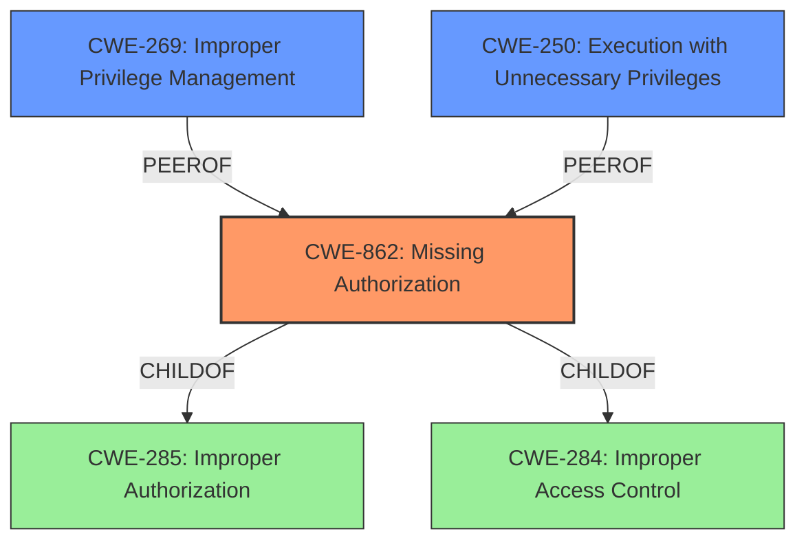

# Raw Analyzer Response for CVE-2022-20041

# Summary
| CWE ID  | CWE Name                                                                                                  | Confidence | CWE Abstraction Level | CWE Vulnerability Mapping Label | CWE-Vulnerability Mapping Notes |
| ------- | --------------------------------------------------------------------------------------------------------- | ---------- | --------------------- | ------------------------------- | ----------------------------- |
| CWE-862 | Missing Authorization                                                                                     | 0.9        | Class                 | Primary CWE                     | Allowed-with-Review           |
| CWE-269 | Improper Privilege Management                                                                              | 0.7        | Class                 | Secondary Candidate             | Allowed                       |
| CWE-250 | Execution with Unnecessary Privileges                                                                   | 0.6        | Base                  | Secondary Candidate             | Allowed                       |

## Evidence and Confidence

*   **Confidence Score:** 0.9
*   **Evidence Strength:** HIGH

## Relationship Analysis
The primary CWE is CWE-862 (**Missing Authorization**), which is a Class-level CWE. It directly addresses the **missing permission check** described in the vulnerability. While CWE-862 is a Class, the provided evidence does not point to a more specific Base or Variant, making it the most appropriate choice.

CWE-862 is a child of CWE-285 (**Improper Authorization**) and CWE-284 (**Improper Access Control**). These parent CWEs are broader, covering general authorization and access control issues. CWE-862 is more specific, focusing on the absence of an authorization check.

CWE-269 (**Improper Privilege Management**) and CWE-250 (**Execution with Unnecessary Privileges**) are also considered as secondary candidates because of the privilege escalation impact.

## Vulnerability Chain
The vulnerability chain starts with the **missing permission check** (CWE-862), which leads to a local escalation of privilege.

## Summary of Analysis
The initial assessment is based on the vulnerability description that explicitly states a "**missing permission check**". The "CVE Reference Links Content Summary" confirms that the root cause is a "Missing permission check in Bluetooth" and also specifies "CWE-269 Improper Privilege Management" as a weakness.

The retriever results suggest CWE-862 (**Missing Authorization**) as the top candidate. Given the root cause evidence "**missing permission check**" and the direct impact of "escalation of privilege", CWE-862 is a strong fit.

CWE-269 (**Improper Privilege Management**) is also relevant, as the vulnerability leads to privilege escalation, but the root cause is the **missing check**, making CWE-862 the more precise mapping. CWE-250 (**Execution with Unnecessary Privileges**) is less directly applicable, as there's no specific indication that the code is running with unnecessary privileges beyond the **missing permission check**.

The selection of CWE-862 is at the Class level, as the available information does not allow for a more specific Base or Variant mapping.

Relevant CWE Information:

# Enhanced Context (25 CWEs)

## CWE-862: Missing Authorization
**Abstraction:** Class
**Status:** Incomplete

### Description
The product does not perform an authorization check when an actor attempts to access a resource or perform an action.

### Extended Description
Not provided

### Observed Examples
- **CVE-2022-24730:** Go-based continuous deployment product does not check that a user has certain privileges to update or create an app, allowing adversaries to read sensitive repository information
- **CVE-2009-3168:** Web application does not restrict access to admin scripts, allowing authenticated users to reset administrative passwords.
- **CVE-2009-3597:** Web application stores database file under the web root with insufficient access control (CWE-219), allowing direct request.