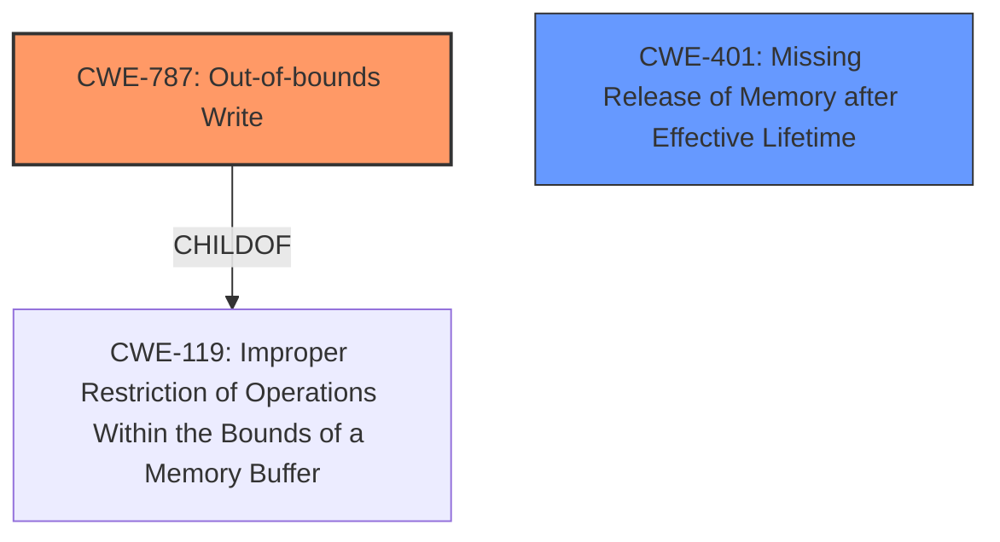

# Enhanced Analysis for CVE-2022-20046

# Summary

| CWE ID  | CWE Name                                                                                     | Confidence | CWE Abstraction Level | CWE Vulnerability Mapping Label | CWE-Vulnerability Mapping Notes |
| ------- | -------------------------------------------------------------------------------------------- | ---------- | ----------------------- | ------------------------------- | ------------------------------- |
| CWE-787 | Out-of-bounds Write                                                                          | 0.9        | Base                    | Primary                         | Allowed                        |
| CWE-401 | Missing Release of Memory after Effective Lifetime                                         | 0.7        | Base                    | Secondary                         | Allowed                        |

## Evidence and Confidence

*   **Confidence Score:** 0.8
*   **Evidence Strength:** MEDIUM

## Relationship Analysis

The primary CWE is CWE-787, which is a base-level CWE that describes writing data outside the intended buffer. It is a child of CWE-119 (Improper Restriction of Operations Within the Bounds of a Memory Buffer). CWE-401 represents a related issue where memory is not released, which can lead to memory corruption.



## Vulnerability Chain

The vulnerability chain starts with a **logic error** that leads to **memory corruption**. The **memory corruption** results in a denial of service. The chain can be summarized as: **Logic Error** -> **Memory Corruption** (Out-of-bounds Write) -> Denial of Service.

## Summary of Analysis

The primary weakness is **memory corruption** due to a **logic error**, leading to a local denial of service. The CVE description mentions "**memory corruption** due to a **logic error**."

The "CVE Reference Links Content Summary" indicates:
*   **Root Cause**: Logic error leading to memory corruption.
*   **Weakness**: CWE-401: Missing Release of Memory after Effective Lifetime

Based on the description, and the retriever results showing CWE-787 as the top result, the primary CWE is CWE-787 (Out-of-bounds Write). Although the summary also lists CWE-401, the description focuses on **memory corruption**, which is a direct consequence of an out-of-bounds write. CWE-787 has "Memory Corruption" as an alternative term.

CWE-787 is a base-level CWE and accurately represents the weakness. The MITRE mapping guidance allows its usage.

CWE-401 is a plausible secondary weakness, especially as the summary mentions it, but it is less descriptive of the actual **memory corruption**.

I am selecting CWE-787 as the primary CWE because it directly addresses the **memory corruption** aspect of the vulnerability, aligning well with the provided description and supporting information.

Relevant CWE Information:

# Enhanced Context (25 CWEs)

## CWE-703: Improper Check or Handling of Exceptional Conditions
**Abstraction Level**: Pillar
**Similarity Score**: 0.79
**Source**: dense
- Not selected. This is a high-level pillar.

## CWE-667: Improper Locking
**Abstraction Level**: Class
**Similarity Score**: 0.79
**Source**: dense
- Not selected. Locking doesn't appear to be the issue.

## CWE-754: Improper Check for Unusual or Exceptional Conditions
**Abstraction Level**: Class
**Similarity Score**: 0.79
**Source**: dense
- Not selected. This is a class-level CWE and doesn't directly relate to **memory corruption**.

## CWE-404: Improper Resource Shutdown or Release
**Abstraction Level**: Class
**Similarity Score**: 0.78
**Source**: dense
- Not selected. While related to resource management, the specific issue is memory corruption.

## CWE-226: Sensitive Information in Resource Not Removed Before Reuse
**Abstraction Level**: Base
**Similarity Score**: 0.78
**Source**: dense
- Not selected. This is not relevant to the **memory corruption** in the description.

## CWE-665: Improper Initialization
**Abstraction Level**: Class
**Similarity Score**: 0.77
**Source**: dense
- Not selected. Initialization issues aren't the focus.

## CWE-662: Improper Synchronization
**Abstraction Level**: Class
**Similarity Score**: 0.77
**Source**: dense
- Not selected. Synchronization doesn't appear to be the issue.

## CWE-755: Improper Handling of Exceptional Conditions
**Abstraction Level**: Class
**Similarity Score**: 0.77
**Source**: dense
- Not selected. Similar to CWE-754, it's not specific enough.

## CWE-824: Access of Uninitialized Pointer
**Abstraction Level**: Base
**Similarity Score**: 0.76
**Source**: dense
- Not selected. While possible, the primary issue is writing out of bounds.

## CWE-664: Improper Control of a Resource Through its Lifetime
**Abstraction Level**: Pillar
**Similarity Score**: 0.76
**Source**: dense
- Not selected. High-level pillar.

## CWE-667: Improper Locking
**Abstraction Level**: Class
**Similarity Score**: 5541.40
**Source**: sparse
- Not selected. Not relevant.

## CWE-662: Improper Synchronization
**Abstraction Level**: Class
**Similarity Score**: 5456.58
**Source**: sparse
- Not selected. Not relevant.

## CWE-362: Concurrent Execution using Shared Resource with Improper Synchronization ('Race Condition')
**Abstraction Level**: Class
**Similarity Score**: 5249.74
**Source**: sparse
- Not selected. Not relevant.

## CWE-367: Time-of-check Time-of-use (TOCTOU) Race Condition
**Abstraction Level**: Base
**Similarity Score**: 4991.67
**Source**: sparse
- Not selected. Not relevant.

## CWE-364: Signal Handler Race Condition
**Abstraction Level**: Base
**Similarity Score**: 4985.39
**Source**: sparse
- Not selected. Not relevant.

## CWE-787: Out-of-bounds Write
**Abstraction Level**: base
**Similarity Score**: 4.33
**Source**: graph
- Selected as the primary CWE.

## CWE-825: Expired Pointer Dereference
**Abstraction Level**: base
**Similarity Score**: 4.33
**Source**: graph
- Not selected. Not relevant.

## CWE-125: Out-of-bounds Read
**Abstraction Level**: base
**Similarity Score**: 4.33
**Source**: graph
- Not selected. The description indicates a write issue.

## CWE-364: Signal Handler Race Condition
**Abstraction Level**: base
**Similarity Score**: 4.33
**Source**: graph
- Not selected. Not relevant.

## CWE-190: Integer Overflow or Wraparound
**Abstraction Level**: base
**Similarity Score**: 4.33
**Source**: graph
- Not selected. This might contribute but is not the main issue.

## CWE-476: NULL Pointer Dereference
**Abstraction Level**: base
**Similarity Score**: 4.33
**Source**: graph
- Not selected. Not relevant.

## CWE-416: Use After Free
**Abstraction Level**: variant
**Similarity Score**: 3.88
**Source**: graph
- Not selected. Not relevant.

## CWE-789: Memory Allocation with Excessive Size Value
**Abstraction Level**: variant
**Similarity Score**: 3.75
**Source**: graph
- Not selected. Not relevant.

## CWE-128: Wrap-around Error
**Abstraction Level**: base
**Similarity Score**: 3.57
**Source**: graph
- Not selected. Not relevant.

## CWE-1339: Insufficient Precision or Accuracy of a Real Number
**Abstraction Level**: base
**Similarity Score**: 3.57
**Source**: graph
- Not selected. Not relevant.


## CWE Relationship Analysis

Current CWEs represent these abstraction levels: .


### Vulnerability Chain Analysis

**Chain starting from CWE-119:**
- 119 (Improper Restriction of Operations within the Bounds of a Memory Buffer) - ROOT


**Chain starting from CWE-754:**
- 754 (Improper Check for Unusual or Exceptional Conditions) - ROOT


### CWE Relationship Diagram

```mermaid
graph TD
    classDef primary fill:#f96,stroke:#333,stroke-width:2px
    classDef secondary fill:#69f,stroke:#333
    classDef tertiary fill:#9e9,stroke:#333
```