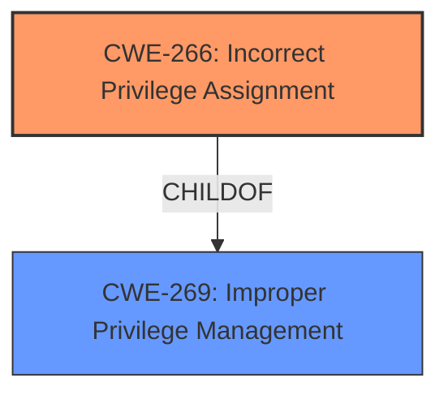

# Enhanced Analysis for CVE-2022-20051

# Summary
| CWE ID | CWE Name | Confidence | CWE Abstraction Level | CWE Vulnerability Mapping Label | CWE-Vulnerability Mapping Notes |
|---|---|---|---|---|---|
| CWE-266 | Incorrect Privilege Assignment | 1.0 | Base | Allowed | Primary CWE |

## Evidence and Confidence

*   **Confidence Score:** 1.0
*   **Evidence Strength:** HIGH

## Relationship Analysis
The primary relationship impacting this decision is the direct match of the vulnerability description to CWE-266, "Incorrect Privilege Assignment". The retriever results also strongly suggest this CWE. The relationships of CWE-266 to its parent, CWE-269 "Improper Privilege Management", and its peer, CWE-286 "Incorrectly Specified Componen" were considered, but CWE-266 provides the most specific and accurate classification.



## Vulnerability Chain
The vulnerability chain is straightforward: an **incorrect privilege assignment** (CWE-266) leads directly to a local denial of service. There are no other intermediate weaknesses.

## Summary of Analysis
The initial analysis strongly pointed towards CWE-266, "Incorrect Privilege Assignment", and further review confirmed this assessment. The vulnerability description clearly states that the root cause is an **incorrect privilege assignment**, leading to unexpected application behavior and a denial of service.

The evidence supporting this decision is explicit:
*   **Vulnerability Description:** "...there is a possible unexpected application behavior due to **incorrect privilege assignment**. This could lead to local denial of service..."
*   **Vulnerability Description Key Phrases:** "- **rootcause:** **incorrect privilege assignment**"
*   **CVE Reference Links Content Summary:** ""Root cause of vulnerability": "Incorrect privilege assignment""

The retriever results also ranked CWE-266 as the top candidate.

The selection of CWE-266 is at the optimal level of specificity because it directly reflects the root cause identified in the vulnerability description and related key phrases.

Relevant CWE Information:

# Enhanced Context (25 CWEs)
The following CWEs were identified as potentially relevant to this vulnerability:

## CWE-266: Incorrect Privilege Assignment
**Abstraction:** Base
**Status:** Draft

### Description
A product incorrectly assigns a privilege to a particular actor, creating an unintended sphere of control for that actor.

### Extended Description
Not provided

### Alternative Terms
None

### Relationships
ChildOf -> CWE-269
CanAlsoBe -> CWE-286

### Mapping Guidance
**Usage:** Allowed
**Rationale:** This CWE entry is at the Base level of abstraction, which is a preferred level of abstraction for mapping to the root causes of vulnerabilities.
**Comments:** Carefully read both the name and description to ensure that this mapping is an appropriate fit. Do not try to 'force' a mapping to a lower-level Base/Variant simply to comply with this preferred level of abstraction.
**Reasons:**
- Acceptable-Use

### Observed Examples
- **CVE-1999-1193:** untrusted user placed in unix "wheel" group
- **CVE-2005-2741:** Product allows users to grant themselves certain rights that can be used to escalate privileges.
- **CVE-2005-2496:** Product uses group ID of a user instead of the group, causing it to run with different privileges. This is resultant from some other unknown issue.


## CWE Relationship Analysis

Current CWEs represent these abstraction levels: .


### Vulnerability Chain Analysis

**Chain starting from CWE-269:**
- 269 (Improper Privilege Management) - ROOT


**Chain starting from CWE-266:**
- 266 (Incorrect Privilege Assignment) - ROOT


### CWE Relationship Diagram

```mermaid
graph TD
    classDef primary fill:#f96,stroke:#333,stroke-width:2px
    classDef secondary fill:#69f,stroke:#333
    classDef tertiary fill:#9e9,stroke:#333
```