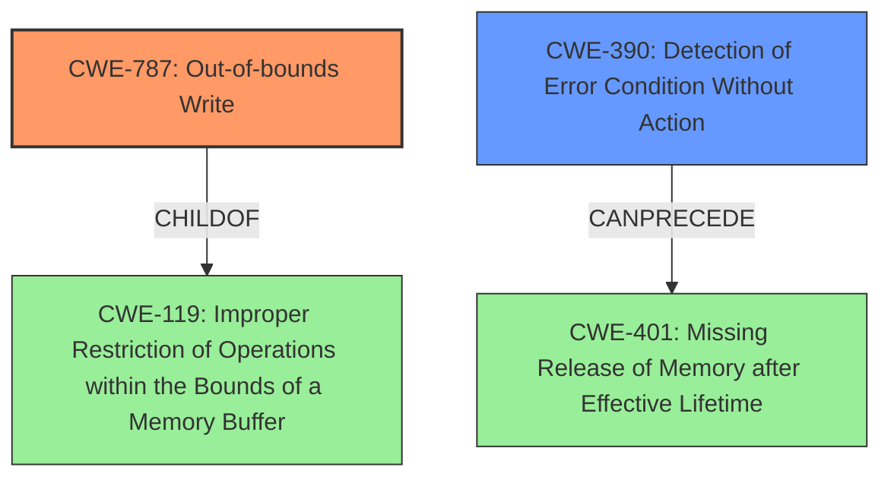

# Analysis Report for CVE-2022-20057

# Vulnerability Analysis Report: CVE-2022-20057

## Description


## Analysis (with Relationship Data)

# Summary
| CWE ID | CWE Name | Confidence | CWE Abstraction Level | CWE Vulnerability Mapping Label | CWE-Vulnerability Mapping Notes |
|---|---|---|---|---|---|
| CWE-787 | Out-of-bounds Write | 0.9 | Base | Allowed | Primary CWE |
| CWE-390 | Detection of Error Condition Without Action | 0.7 | Base | Allowed | Secondary Candidate |

## Evidence and Confidence

*   **Confidence Score:** 0.8
*   **Evidence Strength:** HIGH

## Relationship Analysis
The primary relationship impacting the decision is that CWE-787 **(Out-of-bounds Write)** is a child of CWE-119 **(Improper Restriction of Operations within the Bounds of a Memory Buffer)**, indicating a more specific type of memory corruption. CWE-390 **(Detection of Error Condition Without Action)** can precede CWE-401 **(Missing Release of Memory after Effective Lifetime)**, which could be a consequence of **incorrect error handling**. The abstraction levels were considered to choose the most specific applicable CWE.



## Vulnerability Chain
The vulnerability chain starts with **incorrect error handling**, leading to a **memory corruption**, specifically an out-of-bounds write, which then results in a local escalation of privilege.
  - **Root Cause:** **Incorrect error handling**
  - **Weakness:** **Memory corruption** (Out-of-bounds Write)
  - **Impact:** Local escalation of privilege

## Summary of Analysis
The initial analysis identified the **memory corruption** caused by **incorrect error handling** as the core vulnerability. The primary CWE selected is CWE-787 **(Out-of-bounds Write)** because the description mentions **memory corruption** and the retriever results listed CWE-787 **(Out-of-bounds Write)** as the top candidate. The phrase "writes data past the end, or before the beginning, of the intended buffer" from the CWE-787 description matches well with the general idea of **memory corruption**.

The "CVE Reference Links Content Summary" section supports this selection, stating that the root cause is "**Incorrect error handling** in btif leading to **memory corruption**."

CWE-390 **(Detection of Error Condition Without Action)** was considered as a possible CWE since the Root cause was "**Incorrect error handling**" and the "CVE Reference Links Content Summary" lists "CWE-390 Detection of Error Condition Without Action" as a weakness. CWE-390 is a reasonable secondary candidate because the **incorrect error handling** suggests that an error condition was detected, but no action was taken to handle it correctly.

The selected CWEs are at the optimal level of specificity because CWE-787 **(Out-of-bounds Write)** is a Base level CWE, and CWE-390 **(Detection of Error Condition Without Action)** is also a Base level CWE. The evidence supports these selections and there aren't more specific CWEs that can be used.

Relevant CWE Information:

# Enhanced Context (25 CWEs)

## CWE-787: Out-of-bounds Write
**Abstraction:** Base
**Status:** Draft

### Description
The product writes data past the end, or before the beginning, of the intended buffer.

### Extended Description
Not provided

### Alternative Terms
Memory Corruption: Often used to describe the consequences of writing to memory outside the bounds of a buffer, or to memory that is otherwise invalid.

### Relationships
ChildOf -> CWE-119
ChildOf -> CWE-119
ChildOf -> CWE-119
ChildOf -> CWE-119

### Mapping Guidance
**Usage:** Allowed
**Rationale:** This CWE entry is at the Base level of abstraction, which is a preferred level of abstraction for mapping to the root causes of vulnerabilities.
**Comments:** Carefully read both the name and description to ensure that this mapping is an appropriate fit. Do not try to 'force' a mapping to a lower-level Base/Variant simply to comply with this preferred level of abstraction.
**Reasons:**
- Acceptable-Use

### Observed Examples
- **CVE-2023-1017:** The reference implementation code for a Trusted Platform Module does not implement length checks on data, allowing for an attacker to write 2 bytes past the end of a buffer.
- **CVE-2021-21220:** Chain: insufficient input validation (CWE-20) in browser allows heap corruption (CWE-787), as exploited in the wild per CISA KEV.
- **CVE-2021-28664:** GPU kernel driver allows memory corruption because a user can obtain read/write access to read-only pages, as exploited in the wild per CISA KEV.

## CWE-390: Detection of Error Condition Without Action
**Abstraction:** Base
**Status:** Draft

### Description
The product detects a specific error, but takes no actions to handle the error.

### Extended Description
Not provided

### Alternative Terms
None

### Relationships
ChildOf -> CWE-755
CanPrecede -> CWE-401

### Mapping Guidance
**Usage:** Allowed
**Rationale:** This CWE entry is at the Base level of abstraction, which is a preferred level of abstraction for mapping to the root causes of vulnerabilities.
**Comments:** Carefully read both the name and description to ensure that this mapping is an appropriate fit. Do not try to 'force' a mapping to a lower-level Base/Variant simply to comply with this preferred level of abstraction.
**Reasons:**
- Acceptable-Use

### Observed Examples
- **CVE-2022-21820:** A GPU data center manager detects an error due to a malformed request but does not act on it, leading to memory corruption.


## CWE Relationship Analysis

Current CWEs represent these abstraction levels: .


### Vulnerability Chain Analysis

**Chain starting from CWE-755:**
- 755 (Improper Handling of Exceptional Conditions) - ROOT


**Chain starting from CWE-20:**
- 20 (Improper Input Validation) - ROOT


### CWE Relationship Diagram

```mermaid
graph TD
    classDef primary fill:#f96,stroke:#333,stroke-width:2px
    classDef secondary fill:#69f,stroke:#333
    classDef tertiary fill:#9e9,stroke:#333
```


*Report generated on 2025-03-31 03:01:08*
