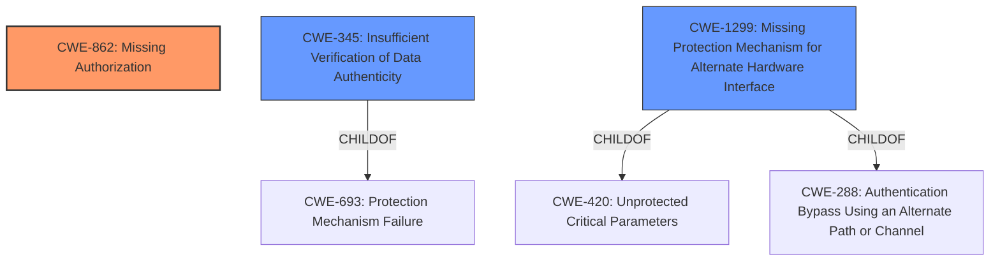

# Analysis Report for CVE-2022-20060

# Vulnerability Analysis Report: CVE-2022-20060

## Description


## Analysis (with Relationship Data)

# Summary
| CWE ID    | CWE Name                                                                                     | Confidence | CWE Abstraction Level | CWE Vulnerability Mapping Label | CWE-Vulnerability Mapping Notes |
| :--------- | :------------------------------------------------------------------------------------------- | :--------- | :---------------------- | :------------------------------ | :------------------------------ |
| CWE-862     | Missing Authorization                                                                        | 0.9        | Class                   | Primary                         | Allowed-with-Review             |
| CWE-345     | Insufficient Verification of Data Authenticity                                             | 0.7        | Class                   | Secondary                       | Discouraged                    |
| CWE-1299   | Missing Protection Mechanism for Alternate Hardware Interface                                | 0.6        | Base                    | Secondary                       | Allowed                        |

## Evidence and Confidence

*   **Confidence Score:** 0.8
*   **Evidence Strength:** HIGH

## Relationship Analysis
The primary CWE is CWE-862 **Missing Authorization**. This is a class-level CWE.
CWE-345 **Insufficient Verification of Data Authenticity** is a child of CWE-693 **Protection Mechanism Failure** and a peer of CWE-20 **Improper Input Validation**.
CWE-1299 **Missing Protection Mechanism for Alternate Hardware Interface** is a base-level CWE and a child of both CWE-420 **Unprotected Critical Parameters** and CWE-288 **Authentication Bypass Using an Alternate Path or Channel**.



## Vulnerability Chain
The vulnerability chain starts with a **missing proper image authentication** in the preloader. This leads to a permission bypass, which results in local escalation of privilege.

## Summary of Analysis
The vulnerability description clearly states the root cause as a **missing proper image authentication** in the preloader, leading to a permission bypass and local privilege escalation.

The initial retriever results suggested CWE-862 **Missing Authorization**, CWE-345 **Insufficient Verification of Data Authenticity** and CWE-1299 **Missing Protection Mechanism for Alternate Hardware Interface**.

The most appropriate CWE is CWE-862 **Missing Authorization** because the vulnerability stems from the lack of an authorization check for the image being loaded by the preloader. This allows an attacker with physical access to bypass intended permission restrictions. The description states "In preloader (usb), there is a possible permission bypass due to a **missing proper image authentication**". This directly indicates a **missing authorization** mechanism.

CWE-345 **Insufficient Verification of Data Authenticity** is also relevant because the **missing authentication** implies that the authenticity of the image is not being properly verified. However, since the core issue is the lack of an authorization check that relies on the **authentication**, CWE-862 is the more direct cause.

CWE-1299 **Missing Protection Mechanism for Alternate Hardware Interface** could apply since the USB preloader is an alternate hardware interface. The vulnerability allows bypassing protections on the primary path. However, the description focuses more on the **missing image authentication** rather than the interface itself being the primary problem.

Based on the evidence and relationship analysis, the selected CWEs are at the optimal level of specificity. CWE-862 directly addresses the **missing authorization**, while CWE-345 and CWE-1299 provide additional context.

The final decision is based on the vulnerability description and CVE Reference Links Content Summary, which highlights the **missing proper image authentication** as the root cause of the permission bypass and privilege escalation.


## CWE Relationship Analysis

Current CWEs represent these abstraction levels: .


### Vulnerability Chain Analysis

**Chain starting from CWE-862:**
- 862 (Missing Authorization) - ROOT


**Chain starting from CWE-693:**
- 693 (Protection Mechanism Failure) - ROOT


### CWE Relationship Diagram

```mermaid
graph TD
    classDef primary fill:#f96,stroke:#333,stroke-width:2px
    classDef secondary fill:#69f,stroke:#333
    classDef tertiary fill:#9e9,stroke:#333
```


*Report generated on 2025-03-30 18:39:28*
