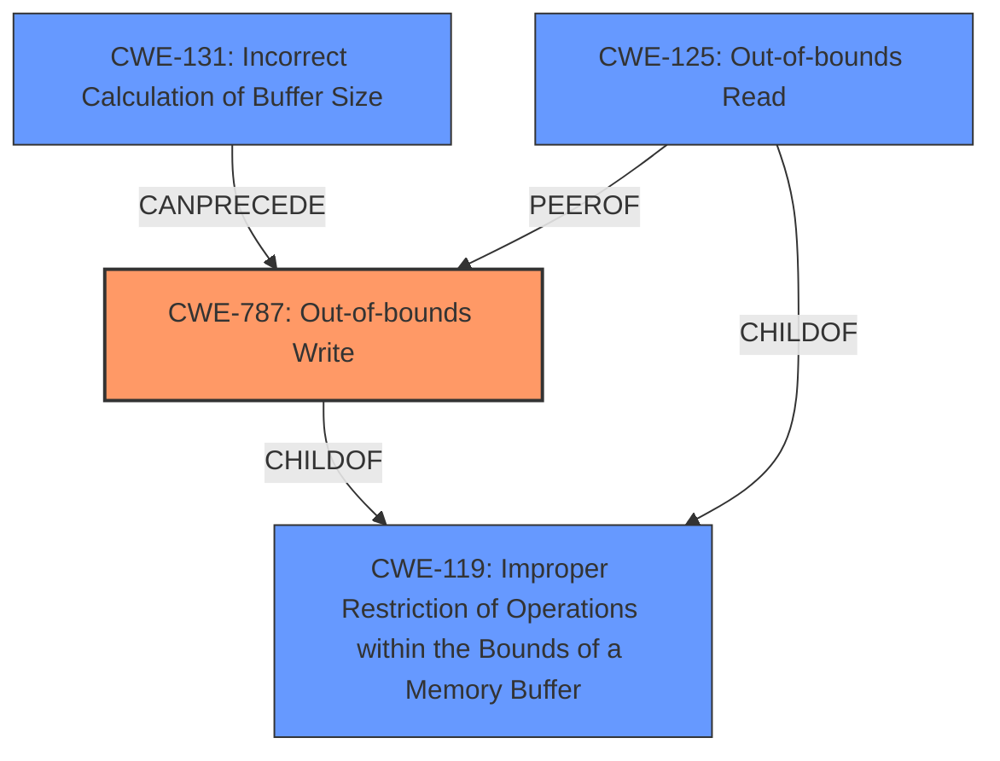

# Raw Analyzer Response for CVE-2022-20064

# Summary
| CWE ID  | CWE Name                                                                                               | Confidence | CWE Abstraction Level | CWE Vulnerability Mapping Label | CWE-Vulnerability Mapping Notes |
| :-------- | :------------------------------------------------------------------------------------------------------- | :---------- | :---------------------- | :------------------------------ | :------------------------------ |
| CWE-787   | Out-of-bounds Write                                                                                       | 0.95      | Base                    | Primary                        | Allowed                       |
| CWE-125   | Out-of-bounds Read                                                                                        | 0.80      | Base                    | Secondary                      | Allowed                       |
| CWE-131   | Incorrect Calculation of Buffer Size                                                                    | 0.70      | Base                    | Secondary                      | Allowed                       |

## Evidence and Confidence

*   **Confidence Score:** 0.90
*   **Evidence Strength:** HIGH

## Relationship Analysis
The primary CWE is CWE-787 **Out-of-bounds Write**. This is related to CWE-119 **Improper Restriction of Operations within the Bounds of a Memory Buffer**, as writing outside the bounds is a violation of proper memory restriction. Further, CWE-131 **Incorrect Calculation of Buffer Size** can lead to out-of-bounds writes if the allocated buffer size is not correctly computed. CWE-125 **Out-of-bounds Read** is a peer relationship since the **incorrect bounds check** could lead to reading out of bounds instead of writing.

## Vulnerability Chain
The vulnerability chain starts with an **incorrect bounds check**, potentially stemming from CWE-131, which leads to CWE-787 **Out-of-bounds Write** or CWE-125 **Out-of-bounds Read**. This, in turn, results in a leak of a kernel pointer and local information disclosure.

## Summary of Analysis
The initial assessment focused on the **incorrect bounds check** as the root cause, leading to either an out-of-bounds read or write. The evidence provided in the "CVE Reference Links Content Summary" explicitly mentions an out-of-bounds read due to the flawed bounds check. The vulnerability description mentions a leak of kernel pointer due to an **incorrect bounds check**. The retriever results also pointed to CWE-131, suggesting a potential cause for the **incorrect bounds check**.

The graph relationships influenced the selection by highlighting how CWE-131 can precede CWE-787 and the peer relationship between CWE-787 and CWE-125. Given the potential for either read or write, but with slightly stronger evidence for the write due to the impact, CWE-787 was chosen as the primary, with CWE-125 as a secondary consideration, and CWE-131 as a potential root cause.

The selected CWEs are at the base level, providing the optimal level of specificity. The evidence supports these selections, as the **incorrect bounds check** directly leads to memory access violations.

Relevant CWE Information:

# Enhanced Context (25 CWEs)
The following CWEs were identified as potentially relevant to this vulnerability:

## CWE-1289: Improper Validation of Unsafe Equivalence in Input
**Abstraction Level**: Base
**Similarity Score**: 0.78
**Source**: dense

**Description**:
The product receives an input value that is used as a resource identifier or other type of reference, but it does not validate or incorrectly validates that the input is equivalent to a potentially-unsafe value.
*This CWE was considered but deemed less relevant as the primary issue is the bounds check itself, not the validation of equivalence.*

## CWE-807: Reliance on Untrusted Inputs in a Security Decision
**Abstraction Level**: Base
**Similarity Score**: 0.77
**Source**: dense

**Description**:
The product uses a protection mechanism that relies on the existence or values of an input, but the input can be modified by an untrusted actor in a way that bypasses the protection mechanism.
*This CWE was considered but deemed less relevant as the primary issue is the bounds check itself, not the reliance on untrusted inputs.*

## CWE-653: Improper Isolation or Compartmentalization
**Abstraction Level**: Class
**Similarity Score**: 0.76
**Source**: dense

**Description**:
The product does not properly compartmentalize or isolate functionality, processes, or resources that require different privilege levels, rights, or permissions.
*This CWE was considered but deemed less relevant as the primary issue is the bounds check itself, not the isolation of resources.*

## CWE-274: Improper Handling of Insufficient Privileges
**Abstraction Level**: Base
**Similarity Score**: 0.76
**Source**: dense

**Description**:
The product does not handle or incorrectly handles when it has insufficient privileges to perform an operation, leading to resultant weaknesses.
*This CWE was considered but deemed less relevant as the primary issue is the bounds check itself, not the handling of insufficient privileges.*

## CWE-280: Improper Handling of Insufficient Permissions or Privileges
**Abstraction Level**: Base
**Similarity Score**: 0.75
**Source**: dense

**Description**:
The product does not handle or incorrectly handles when it has insufficient privileges to access resources or functionality as specified by their permissions. This may cause it to follow unexpected code paths that may leave the product in an invalid state.
*This CWE was considered but deemed less relevant as the primary issue is the bounds check itself, not the handling of insufficient privileges.*

## CWE-1220: Insufficient Granularity of Access Control
**Abstraction Level**: Base
**Similarity Score**: 0.75
**Source**: dense

**Description**:
The product implements access controls via a policy or other feature with the intention to disable or restrict accesses (reads and/or writes) to assets in a system from untrusted agents. However, implemented access controls lack required granularity, which renders the control policy too broad because it allows accesses from unauthorized agents to the security-sensitive assets.
*This CWE was considered but deemed less relevant as the primary issue is the bounds check itself, not the granularity of access control.*

## CWE-183: Permissive List of Allowed Inputs
**Abstraction Level**: Base
**Similarity Score**: 0.75
**Source**: dense

**Description**:
The product implements a protection mechanism that relies on a list of inputs (or properties of inputs) that are explicitly allowed by policy because the inputs are assumed to be safe, but the list is too permissive - that is, it allows an input that is unsafe, leading to resultant weaknesses.
*This CWE was considered but deemed less relevant as the primary issue is the bounds check itself, not the permissiveness of allowed inputs.*

## CWE-404: Improper Resource Shutdown or Release
**Abstraction Level**: Class
**Similarity Score**: 0.75
**Source**: dense

**Description**:
The product does not release or incorrectly releases a resource before it is made available for re-use.
*This CWE was considered but deemed less relevant as the primary issue is the bounds check itself, not the resource shutdown.*

## CWE-667: Improper Locking
**Abstraction Level**: Class
**Similarity Score**: 0.75
**Source**: dense

**Description**:
The product does not properly acquire or release a lock on a resource, leading to unexpected resource state changes and behaviors.
*This CWE was considered but deemed less relevant as the primary issue is the bounds check itself, not the locking mechanism.*

## CWE-657: Violation of Secure Design Principles
**Abstraction Level**: Class
**Similarity Score**: 0.75
**Source**: dense

**Description**:
The product violates well-established principles for secure design.
*This CWE was considered but deemed too general, and more specific CWEs related to bounds checking are more appropriate.*

## CWE-667: Improper Locking
**Abstraction Level**: Class
**Similarity Score**: 6405.76
**Source**: sparse

**Description**:
The product does not properly acquire or release a lock on a resource, leading to unexpected resource state changes and behaviors.
*This CWE was considered but deemed less relevant as the primary issue is the bounds check itself, not the locking mechanism.*

## CWE-1284: Improper Validation of Specified Quantity in Input
**Abstraction Level**: Base
**Similarity Score**: