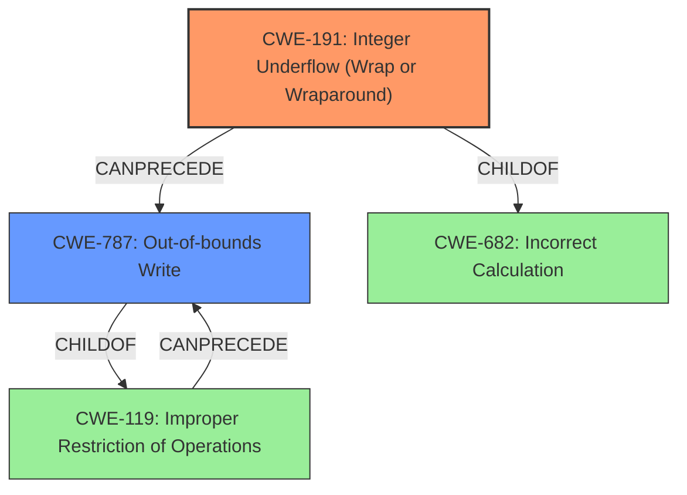

# Raw Analyzer Response for CVE-2022-20073

# Summary
| CWE ID | CWE Name | Confidence | CWE Abstraction Level | CWE Vulnerability Mapping Label | CWE-Vulnerability Mapping Notes |
|---|---|---|---|---|---|
| CWE-191 | Integer Underflow (Wrap or Wraparound) | 1.0 | Base | Allowed | Primary CWE: Directly reflects the root cause. |
| CWE-787 | Out-of-bounds Write | 1.0 | Base | Allowed | Secondary CWE: Represents the resulting weakness from the integer underflow. |

## Evidence and Confidence

*   **Confidence Score:** 1.0
*   **Evidence Strength:** HIGH

## Relationship Analysis
The primary relationship is a chain where **CWE-191** Integer Underflow leads to **CWE-787** Out-of-bounds Write. **CWE-191** is a ChildOf **CWE-682** (Incorrect Calculation) and can precede **CWE-119** (Improper Restriction of Operations within the Bounds of a Memory Buffer), which in turn can lead to Out-of-bounds Write. This hierarchical and chain relationship supports the selection of both CWEs, with **CWE-191** as the root cause and **CWE-787** as the direct consequence.

## Vulnerability Chain
The vulnerability chain starts with an **integer underflow** (**CWE-191**) in the preloader (USB) component. This leads to an **out-of-bounds write** (**CWE-787**). The impact is a local escalation of privilege, requiring physical access to the device and user interaction.

## Summary of Analysis
The analysis is based on the vulnerability description, which explicitly mentions an **"integer underflow"** leading to an **"out of bounds write"**. The CVE Reference Links Content Summary reinforces this, stating the root cause is **"Integer underflow in preloader (usb)"** and listing **"Integer Underflow (Wrap or Wraparound)"** and **"Out-of-bounds write"** as vulnerabilities.

The retriever results also support the choice of **CWE-191** as the best match, with a score of 1.0. The primary CWE match for similar CVE descriptions is **CWE-787**, which aligns with the resulting **"out of bounds write"**.

The graph relationships confirm that **CWE-191** can precede **CWE-787**, indicating a causal relationship. The chosen CWEs are at the Base level of abstraction, which is the preferred level for mapping root causes.

The selection of **CWE-191** and **CWE-787** is directly supported by the evidence: "In preloader (usb), there is a possible **out of bounds write** due to a **integer underflow**."

Other CWEs Considered:
*   **CWE-787**: Was considered and selected as the secondary CWE due to the **out of bounds write**.
*   **CWE-125 (Out-of-bounds Read)**, **CWE-190 (Integer Overflow or Wraparound)**, **CWE-823 (Use of Out-of-range Pointer Offset)**: These were considered based on retriever results and similar CVE descriptions, but **CWE-191** more accurately reflects the root cause. The description explicitly mentions **integer underflow**, making it the most specific and relevant CWE.
*   **CWE-20 (Improper Input Validation)**, **CWE-1284 (Improper Validation of Specified Quantity in Input)**, **CWE-1285 (Improper Validation of Specified Index, Position, or Offset in Input)**: These were considered because the vulnerability involves processing input without proper validation, but the core issue is the **integer underflow** leading to an out-of-bounds write, making **CWE-191** a more precise classification.
*   **CWE-770 (Allocation of Resources Without Limits or Throttling)**: While resource allocation might be indirectly involved, the primary weakness is the **integer underflow**.
*   **CWE-667 (Improper Locking)**, **CWE-362 (Race Condition)**: These are related to concurrency issues, but the vulnerability description doesn't indicate any concurrency problems. The focus is on the arithmetic error.
*   **CWE-73 (External Control of File Name or Path)**, **CWE-22 (Path Traversal)**: These are related to file path manipulation, which is not relevant to this vulnerability.

Relevant CWE Information:

# Enhanced Context (25 CWEs)
The following CWEs were identified as potentially relevant to this vulnerability:

## CWE-1289: Improper Validation of Unsafe Equivalence in Input
**Abstraction Level**: Base
**Similarity Score**: 0.81
**Source**: dense

**Description**:
The product receives an input value that is used as a resource identifier or other type of reference, but it does not validate or incorrectly validates that the input is equivalent to a potentially-unsafe value.

**Mapping Guidance**:
- Usage: Allowed
- Rationale: This CWE entry is at the Base level of abstraction, which is a preferred level of abstraction for mapping to the root causes of vulnerabilities.

## CWE-1288: Improper Validation of Consistency within Input
**Abstraction Level**: Base
**Similarity Score**: 0.78
**Source**: dense

**Description**:
The product receives a complex input with multiple elements or fields that must be consistent with each other, but it does not validate or incorrectly validates that the input is actually consistent.

**Mapping Guidance**:
- Usage: Allowed
- Rationale: This CWE entry is at the Base level of abstraction, which is a preferred level of abstraction for mapping to the root causes of vulnerabilities.

## CWE-606: Unchecked Input for Loop Condition
**Abstraction Level**: Base
**Similarity Score**: 0.77
**Source**: dense

**Description**:
The product does not properly check inputs that are used for loop conditions, potentially leading to a denial of service or other consequences because of excessive looping.

**Mapping Guidance**:
- Usage: Allowed
- Rationale: This CWE entry is at the Base level of abstraction, which is a preferred level of abstraction for mapping to the root causes of vulnerabilities.

## CWE-179: Incorrect Behavior Order: Early Validation
**Abstraction Level**: Base
**Similarity Score**: 0.77
**Source**: dense

**Description**:
The product validates input before applying protection mechanisms that modify the input, which could allow an attacker to bypass the validation via dangerous inputs that only arise after the modification.

**Mapping Guidance**:
- Usage: Allowed
- Rationale: This CWE entry is at the Base level of abstraction, which is a preferred level of abstraction for mapping to the root causes of vulnerabilities.

## CWE-807: Reliance on Untrusted Inputs in a Security Decision
**Abstraction Level**: Base
**Similarity Score**: 0.77
**Source**: dense

**Description**:
The product uses a protection mechanism that relies on the existence or values of an input, but the input can be modified by an untrusted actor in a way that bypasses the protection mechanism.

**Mapping Guidance**:
- Usage: Allowed
- Rationale: This CWE entry is at the Base level of abstraction, which is a preferred level of abstraction for mapping to the root causes of vulnerabilities.

## CWE-183: Permissive List of Allowed Inputs
**Abstraction Level**: Base
**Similarity Score**: 0.76
**Source**: dense

**Description**:
The product implements a protection mechanism that relies on a list of inputs (or properties of inputs) that are explicitly allowed by policy because the inputs are assumed to be safe, but the list is too permissive - that is, it allows an input that is unsafe, leading to resultant weaknesses.

**Mapping Guidance**:
- Usage: Allowed
- Rationale: This CWE entry is at the Base level of abstraction, which is a preferred level of abstraction for mapping to the root causes of vulnerabilities.

## CWE-667: Improper Locking
**Abstraction Level**: Class
**Similarity Score**: 0.76
**Source**: dense

**Description**:
The product does not properly acquire or release a