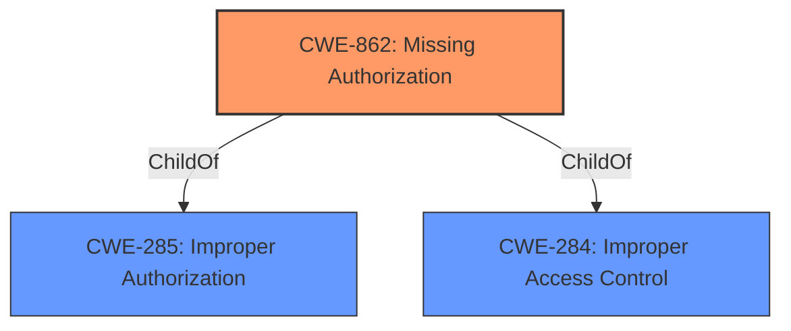

# Raw Analyzer Response for CVE-2022-20084

# Summary
| CWE ID | CWE Name | Confidence | CWE Abstraction Level | CWE Vulnerability Mapping Label | CWE-Vulnerability Mapping Notes |
|---|---|---|---|---|---|
| CWE-862 | Missing Authorization | 1.0 | Class | Allowed-with-Review | Primary CWE |

## Evidence and Confidence

*   **Confidence Score:** 1.0
*   **Evidence Strength:** HIGH

## Relationship Analysis
The primary CWE, CWE-862 [Missing Authorization], is a Class-level CWE. It is a child of CWE-285 [Improper Authorization] and CWE-284 [Improper Access Control]. There are no specified "CanPrecede" or "CanFollow" relationships for CWE-862, so no specific vulnerability chains apply. The abstraction level influenced the decision in that it is a Class, and the documentation suggests examining children for a better fit, but no child CWEs fit the description better than CWE-862.

## Vulnerability Chain
The vulnerability chain consists of a **missing permission check** which leads to the ability to disable receiving emergency broadcasts.

## Summary of Analysis
The initial analysis identified a **missing permission check** as the root cause, leading to the impact of disabling emergency broadcasts. The provided evidence from the vulnerability description and the CVE Reference Links Content Summary strongly supports this. The primary CWE match from similar CVE descriptions is CWE-862 [Missing Authorization], which aligns with the **missing permission check**.

The Retriever Results also list CWE-862 [Missing Authorization] as the top combined result. While it is a Class-level CWE, which the mapping guidance suggests reviewing for more specific children, none of the child CWEs of CWE-285 [Improper Authorization] or CWE-284 [Improper Access Control] provide a better fit. The vulnerability description explicitly states a **missing permission check**, which is a direct instance of missing authorization. The confidence in this assessment is high (1.0) due to the explicit evidence and the strong alignment with the CWE description.

The selection of CWE-862 [Missing Authorization] is at the optimal level of specificity because it directly reflects the **missing permission check** identified as the root cause. Although it is a Class-level CWE, no more specific Base or Variant CWE adequately captures the essence of the vulnerability.

CWE-927 [Use of Implicit Intent for Sensitive Communication], CWE-1021 [Improper Restriction of Rendered UI Layers or Frames], CWE-908 [Use of Uninitialized Resource], CWE-667 [Improper Locking], CWE-925 [Improper Verification of Intent by Broadcast Receiver], CWE-250 [Execution with Unnecessary Privileges], CWE-362 [Concurrent Execution using Shared Resource with Improper Synchronization ('Race Condition')], CWE-131 [Incorrect Calculation of Buffer Size], and CWE-20 [Improper Input Validation] were all considered but did not accurately describe the root cause. These CWEs describe different types of weaknesses.