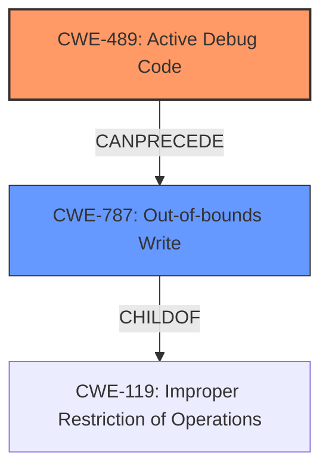

# Raw Analyzer Response for CVE-2022-20089

# Summary
| CWE ID | CWE Name | Confidence | CWE Abstraction Level | CWE Vulnerability Mapping Label | CWE-Vulnerability Mapping Notes |
|---|---|---|---|---|---|
| CWE-489 | Active Debug Code | 0.9 | Base | Allowed | Primary CWE |
| CWE-787 | Out-of-bounds Write | 0.6 | Base | Allowed | Secondary CWE |

## Evidence and Confidence

*   **Confidence Score:** 0.75
*   **Evidence Strength:** HIGH

## Relationship Analysis
The primary CWE is CWE-489, which represents the root cause of the vulnerability: the presence of active debug code in the deployed product. CWE-489 can precede CWE-215 (Insertion of Sensitive Information Into Debugging Code), however, this is not present in the description. The secondary CWE is CWE-787, which represents the memory corruption resulting from the active debug code. CWE-787 is a child of CWE-119 (Improper Restriction of Operations Within the Bounds of a Memory Buffer). There is a possible chain relationship where CWE-489 leads to CWE-787 if the debug code improperly handles memory. The abstraction levels are appropriate, with both CWEs at the Base level.

## Vulnerability Chain
The vulnerability chain starts with the **active debug code** (CWE-489), leading to **memory corruption** (CWE-787), and ultimately resulting in a local escalation of privilege.
  - The root cause is CWE-489
  - The weakness is CWE-787
  - The impact is local escalation of privilege, which is not a CWE.

## Summary of Analysis
The initial analysis identified the **active debug code** as the root cause and **memory corruption** as the resulting weakness. This maps directly to CWE-489 (Active Debug Code) and CWE-787 (Out-of-bounds Write), respectively. The Retriever results and vulnerability description key phrases support this assessment. The graph relationships confirm the potential chain from CWE-489 to CWE-787. The final selection is based on the provided evidence and aligns with the CWE specifications at the optimal level of specificity (Base). The vulnerability description clearly states "In aee driver, there is a possible **memory corruption** due to **active debug code**." The CVE Reference Links Content Summary confirms this: "root_cause": "Active debug code in the aee driver." and "vulnerabilities": ["Memory corruption due to active debug code."].

CWEs considered but not used:

*   CWE-667 (Improper Locking), CWE-662 (Improper Synchronization), and CWE-362 (Concurrent Execution using Shared Resource with Improper Synchronization ('Race Condition')): These CWEs relate to concurrency issues, but the vulnerability description does not mention any concurrent execution or synchronization problems. The root cause is the presence of debug code, not a synchronization error.
*   CWE-908 (Use of Uninitialized Resource): While uninitialized resources can lead to memory corruption, the description explicitly points to active debug code as the root cause.
*   CWE-1260 (Improper Handling of Overlap Between Protected Memory Ranges): This CWE relates to memory protection issues, but the description doesn't specify any overlap between protected memory ranges. The vulnerability is due to debug code causing memory corruption.
*   CWE-131 (Incorrect Calculation of Buffer Size): While an incorrect buffer size calculation could lead to memory corruption, the description does not mention this as the cause.
*   CWE-704 (Incorrect Type Conversion or Cast): This CWE is not directly related to the active debug code or the resulting memory corruption.
*   CWE-123 (Write-what-where Condition): This CWE is similar to CWE-787, but CWE-787 is more specific to out-of-bounds writes, which is the stated vulnerability.
*   CWE-190 (Integer Overflow or Wraparound): This CWE is not directly indicated in the description.
*   CWE-476 (NULL Pointer Dereference): This CWE is not directly indicated in the description.
*   CWE-416 (Use After Free): This CWE is not directly indicated in the description.

Relevant CWE Information:

# Enhanced Context (25 CWEs)
The following CWEs were identified as potentially relevant to this vulnerability:

## CWE-704: Incorrect Type Conversion or Cast
**Abstraction Level**: Class
**Similarity Score**: 0.79
**Source**: dense

**Description**:
The product does not correctly convert an object, resource, or structure from one type to a different type.

**Mapping Guidance**:
- Usage: Allowed-with-Review
- Rationale: This CWE entry is a Class and might have Base-level children that would be more appropriate

## CWE-681: Incorrect Conversion between Numeric Types
**Abstraction Level**: Base
**Similarity Score**: 0.78
**Source**: dense

**Description**:
When converting from one data type to another, such as long to integer, data can be omitted or translated in a way that produces unexpected values. If the resulting values are used in a sensitive context, then dangerous behaviors may occur.

**Mapping Guidance**:
- Usage: Allowed
- Rationale: This CWE entry is at the Base level of abstraction, which is a preferred level of abstraction for mapping to the root causes of vulnerabilities.

## CWE-667: Improper Locking
**Abstraction Level**: Class
**Similarity Score**: 0.77
**Source**: dense

**Description**:
The product does not properly acquire or release a lock on a resource, leading to unexpected resource state changes and behaviors.

**Mapping Guidance**:
- Usage: Allowed-with-Review
- Rationale: This CWE entry is a Class and might have Base-level children that would be more appropriate

## CWE-662: Improper Synchronization
**Abstraction Level**: Class
**Similarity Score**: 0.76
**Source**: dense

**Description**:
The product utilizes multiple threads or processes to allow temporary access to a shared resource that can only be exclusive to one process at a time, but it does not properly synchronize these actions, which might cause simultaneous accesses of this resource by multiple threads or processes.

**Mapping Guidance**:
- Usage: Discouraged
- Rationale: This CWE entry is a level-1 Class (i.e., a child of a Pillar). It might have lower-level children that would be more appropriate

## CWE-131: Incorrect Calculation of Buffer Size
**Abstraction Level**: Base
**Similarity Score**: 0.76
**Source**: dense

**Description**:
The product does not correctly calculate the size to be used when allocating a buffer, which could lead to a buffer overflow.

**Mapping Guidance**:
- Usage: Allowed
- Rationale: This CWE entry is at the Base level of abstraction, which is a preferred level of abstraction for mapping to the root causes of vulnerabilities.

## CWE-682: Incorrect Calculation
**Abstraction Level**: Pillar
**Similarity Score**: 0.76
**Source**: dense

**Description**:
The product performs a calculation that generates incorrect or unintended results that are later used in security-critical decisions or resource management.

**Mapping Guidance**:
- Usage: Discouraged
- Rationale: This CWE entry is extremely high-level, a Pillar. In many cases, lower-level children or descendants are more appropriate. However, sometimes this weakness is forced to be used due to the lack of in-depth weakness research. See Research Gaps.

## CWE-404: Improper Resource Shutdown or Release
**Abstraction Level**: Class
**Similarity Score**: 0.76
**Source**: dense

**Description**:
The product does not release or incorrectly releases a resource before it is made available for re-use.

**Mapping Guidance**:
- Usage: Allowed-with-Review
- Rationale: This CWE entry is a Class and might have Base-level children that would be more appropriate

## CWE-843: Access of Resource Using Incompatible Type ('Type Confusion')
**Abstraction Level**: Base
**Similarity Score**: 0.76
**Source**: dense

**Description**:
The product allocates or initializes a resource such as a pointer, object, or variable using one type, but it later accesses that resource using a type that is incompatible with the original type.

**Mapping Guidance**:
- Usage: Allowed
- Rationale: This CWE entry is at the Base level of abstraction, which is a preferred level of abstraction for mapping to the root causes of vulnerabilities.

## CWE