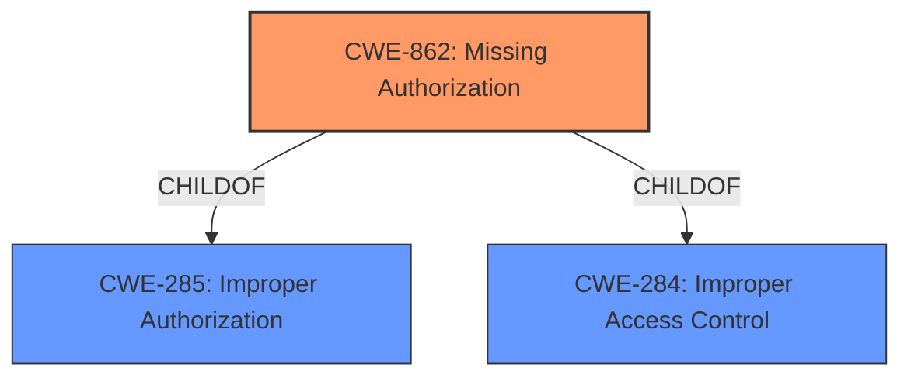

# Analysis for CVE-2022-20093

# Summary
| CWE ID | CWE Name | Confidence | CWE Abstraction Level | CWE Vulnerability Mapping Label | CWE-Vulnerability Mapping Notes |
|---|---|---|---|---|---|
| CWE-862 | Missing Authorization | 1.0 | Class | Primary | Allowed-with-Review |

## Evidence and Confidence

*   **Confidence Score:** 1.0
*   **Evidence Strength:** HIGH

## Relationship Analysis
The primary relationship impacting the decision is the ChildOf relationship between CWE-862 and its parents, CWE-285 and CWE-284. However, given the explicit mention of a **missing permission check** as the root cause, CWE-862 is the most appropriate. There are no chain relationships applicable here.

## Vulnerability Chain
The vulnerability chain is straightforward: a **missing permission check** (CWE-862) leads directly to the ability to disable receiving SMS messages, resulting in a local escalation of privilege.

## Summary of Analysis
The analysis is based heavily on the provided evidence, particularly the phrases "**missing permission check**" and "local escalation of privilege". The "CVE Reference Links Content Summary" confirms the **root cause** as "Missing permission check" and lists "Missing Authorization" as a weakness. This aligns perfectly with CWE-862 (Missing Authorization).

CWE-862 is chosen because it directly addresses the **root cause** described in the vulnerability description: the **missing permission check**. The impact, disabling SMS messages, is a direct consequence of this missing check.

The other CWEs were considered, but not selected:

*   CWE-1021 (Improper Restriction of Rendered UI Layers or Frames): This is related to UI redress attacks like clickjacking, which is not relevant to the described vulnerability.
*   CWE-927 (Use of Implicit Intent for Sensitive Communication): This is specific to Android applications and implicit intents, which isn't directly relevant to the generic description of the telephony vulnerability.
*   CWE-667 (Improper Locking) and CWE-662 (Improper Synchronization): These relate to concurrency issues, which are not mentioned or implied in the description.
*   CWE-908 (Use of Uninitialized Resource): This relates to using resources before initialization, which is not relevant to the **missing permission check**.
*   CWE-223 (Omission of Security-relevant Information): This is about not recording or displaying important security information, which is not the primary issue here.
*   CWE-250 (Execution with Unnecessary Privileges): This is about running with higher privileges than necessary, not a **missing permission check**.
*   CWE-362 (Concurrent Execution using Shared Resource with Improper Synchronization ('Race Condition')): This relates to race conditions, which are not mentioned in the description.
*   CWE-770 (Allocation of Resources Without Limits or Throttling): This is about resource exhaustion, which is not relevant here.

The selection of CWE-862 is at the optimal level of specificity. While it is a Class-level CWE, the provided evidence directly supports this classification, and there are no more specific Base or Variant-level CWEs that fit the description better. The MITRE mapping guidance suggests reviewing child entries, but none of them provide a more accurate representation of the vulnerability.